# Modul Organisationen {: #organisations}

Das Modul "Organisationen" ist optional in OpenOlat verfügbar und muss in der Administration aktiviert werden. 

!!! tip "Aktivierung"
	
	Kunden von frentix kontaktieren für die Aktivierung bitte [contact@frentix.com.](mailto:contact@frentix.com.) Nach der Aktivierung können diverse zusätzliche Einstellungen für die systemweite Konfiguration vorgenommen werden. Bei Systemen mit dem fx-Release werden diese Anpassung durch frentix vorgenommen.  
	
	:material-alert: **Nicht Hosting-Kunde von frentix?** Fragen Sie Ihren Systembetreiber!
	

## Tab Konfiguration {: #tab_configuration}

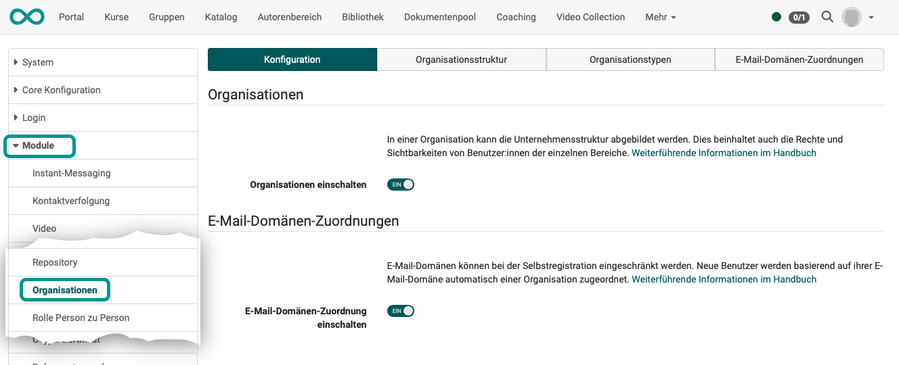{ class="shadow lightbox" }

Im Tab Konfiguration erfolgt

* die Aktivierung des Moduls Organisationsstrukturen
* die Aktivierung der E-Mail-Domänen-Zuordnung (verfügbar ab Release 20, nur aktivierbar bei aktiviertem Modul Organisationen)

Im Modul "Organisationen" kann die Unternehmensstruktur abgebildet werden. Anschliessend können Rollen, Rechte und Sichtbarkeit von Kursen und Inhalten von der Zugehörigkeit zu einer bestimmten Organisationseinheit abhängig gemacht werden.

Auch die Möglichkeit zur Selbstregistration von Kursteilnehmer:innen kann von der Zugehörigkeit zu einer bestimmten Organisationseinheit abhängig gemacht werden. Diese Einschränkung wird vorgenommen, indem die Mail-Adresse neuer Benutzer:innen mit den hinterlegten E-Mail-Domänen abgeglichen und automatisch einer bestimmten Organisationseinheit zugeordnet wird.

[Zum Seitenanfang ^](#organisations)

---

## Tab Organisationsstruktur {: #tab_structure}

Im Tab "Organisationsstruktur" finden sich die bereits erstellten Organisationen mit ihren Unterorganisationen als Baumstruktur dargestellt.

### Neue Organisationen erstellen und bearbeiten {: #create_and_edit}

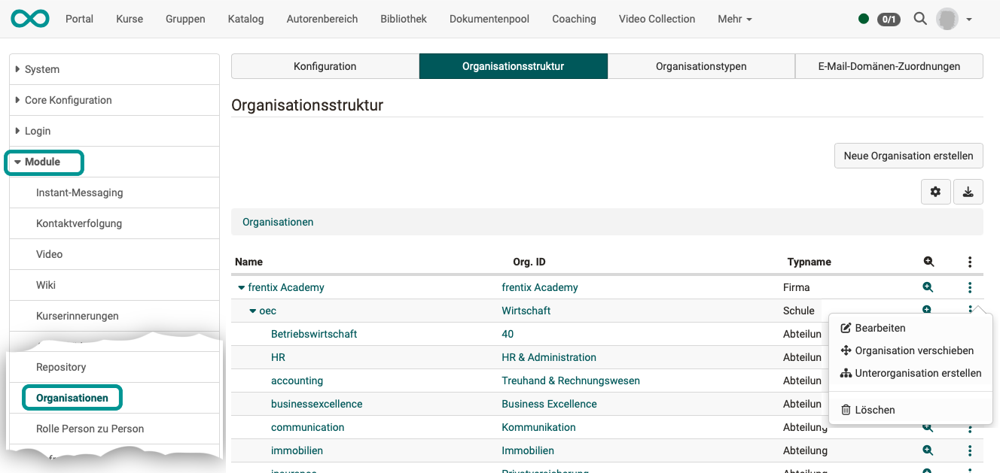{ class="shadow lightbox" }

Neue Organisationen können über den Button "Neue Organisation erstellen" rechts oben oder bei bestehenden Organisationen durch Klick auf die 3 Punkte und "Unterorganisation erstellen" hinzugefügt werden.  Es ist auch möglich, das Element im Organisationsbaum zu verschieben bzw. direkt eine neue Unterorganisation zu erstellen.

Wird in der Baumstruktur ein Organisationselement ausgewählt, können die Metadaten des Organisationselementes und weitere Zuordnungen angepasst oder ergänzt werden. 

### Metadaten {: #edit_metadata}

(Module > Organisationen > Tab "Organisationsstruktur" > Tab "Metadaten")
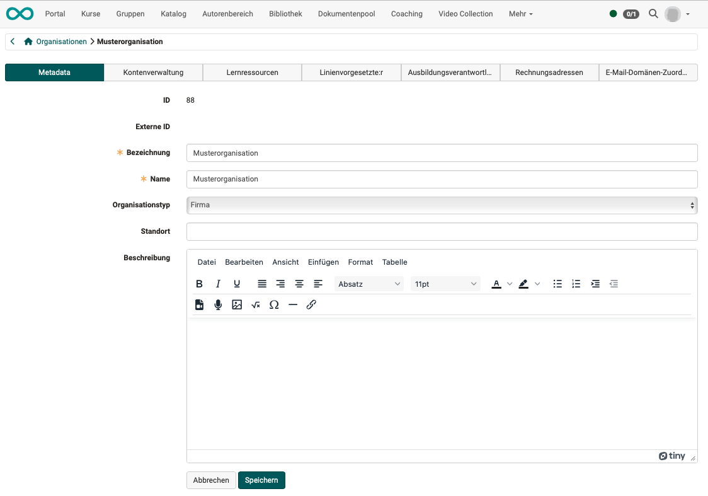{ class="shadow lightbox" }

Neben der Bezeichnung und dem Namen kann eine Beschreibung für das Element eingetragen werden.
Ausserdem erfolgt hier die Zuordnung des Organisationstyps (wie im Tab "Organisationstypen" definiert).
Wird bei der Erstellung jedes Organisationselement mit einem entsprechenden Organisationstyp verknüpft, kann so eine hierarchische Struktur aufgebaut werden. Damit ist die Abbildung von Ablauf- und Aufbauorganisationen möglich, eine Matrix-Organisation kann hingegen nicht dargestellt werden.

### Kontenverwaltung {: #edit_account_managment}

(Module > Organisationen > Tab "Organisationsstruktur" > Tab "Kontenverwaltung")
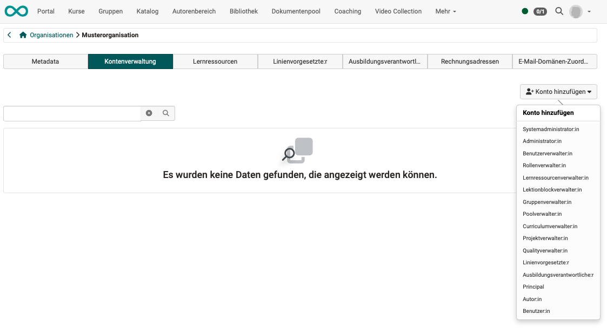{ class="shadow lightbox" }

Im Tab "Kontenverwaltung" erhält man eine Liste mit den aktuell dieser Organisationseinheit zugeordneten Benutzer:innen. Ebenso können bestehende Benutzer:innen wieder entfernt werden.

Mit dem Button "Konto hinzufügen" können weitere Benutzer:innen einer bestimmten Rolle hinzugefügt werden. Hierfür wird aus den aufgelisteten Rollen die gewünschte ausgewählt. Im anschliessenden Dialog kann nach Benutzer:innen gesucht werden.  Entsprechend der Auswahl können sie hinzugefügt werden. Auch das Hinzufügen von mehreren Benutzer:innen ist möglich.

Jeder Stufe der Organisation können Mitglieder verschiedenster Rollen zugeordnet werden. 

Die **Rollen-Zuordnung** ist möglich

  * auf einer spezifischen Organisation
  * auf einer spezifischen Organisation und allen dieser Organisation untergeordneten Organisationsstrukturen

### Lernressourcen {: #edit_learning_resources}

(Module > Organisationen > Tab "Organisationsstruktur" > Tab "Lernressourcen")
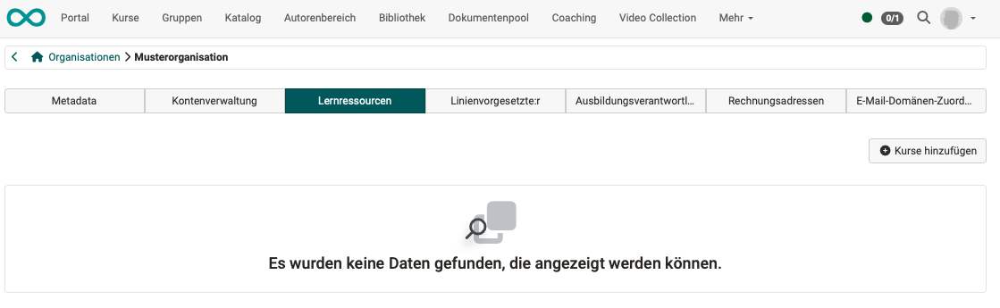{ class="shadow lightbox" }

Im Tab "Lernressourcen" werden dem Organisationselement direkt zugeordnete Kurse angezeigt. Diese können hier auch wieder entfernt werden. Über "Kurse hinzufügen" kann in einem Dialog nach weiteren eigenen und verfügbaren Kursen gesucht werden, um diese dem Organisationselement zuzuordnen.

Die **Zuordnung von Curricula** erfolgt in der Curriculumverwaltung am jeweiligen Curriculum.

### Linienvorgesetzte {: #edit_linemanager}

(Module > Organisationen > Tab "Organisationsstruktur" > Tab "Linienvorgesetzte")
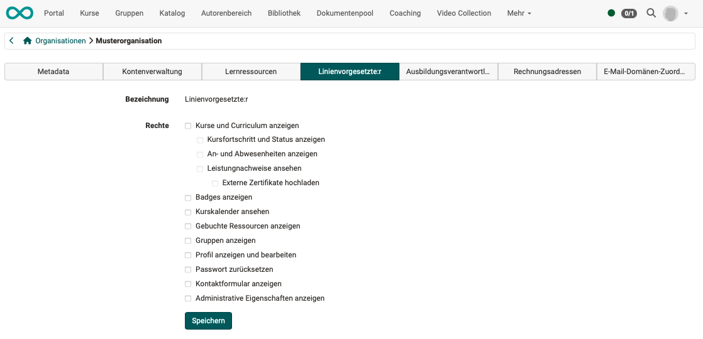{ class="shadow lightbox" }

Die Rechte, die Linienvorgesetzten zugeteilt werden, können für jede Organisationseinheit separat definiert werden. 

### Ausbildungsverantwortliche {: #edit_education_manager}

(Module > Organisationen > Tab "Organisationsstruktur" > Tab "Ausbildungsverantwortliche")
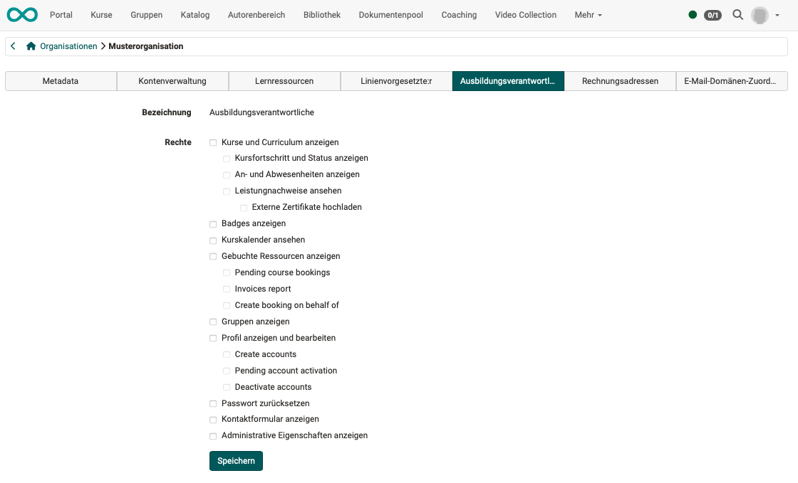{ class="shadow lightbox" }

Die Rechte, die Ausbildungsverantwortlichen zugeteilt werden, können für jede Organisationseinheit separat definiert werden. 

### Rechnungsadressen {: #edit_billing_adresses}

(Module > Organisationen > Tab "Organisationsstruktur" > Tab "Rechnungsadressen")
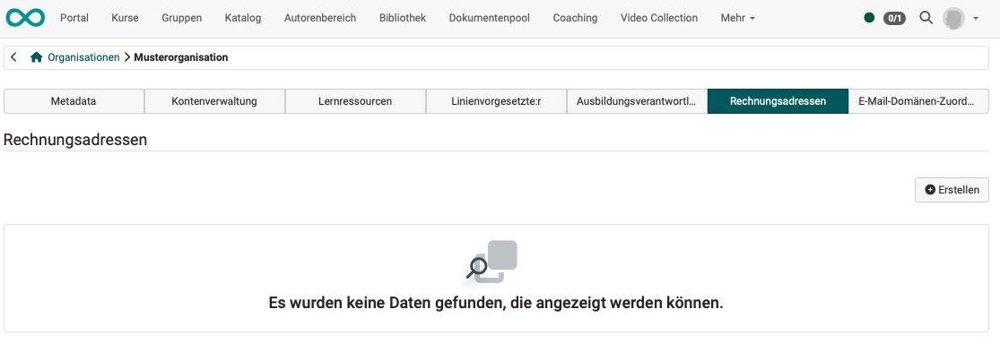{ class="shadow lightbox" }

Für die Kurs- und Seminarverwaltung (ab Release 20 verfügbar) können hier Rechnungsadressen hinterlegt werden.

### E-Mail-Domänen-Zuordnung {: #edit_mail_domain}

(Module > Organisationen > Tab "Organisationsstruktur" > Tab "E-Mail-Domänen-Zuordnung")
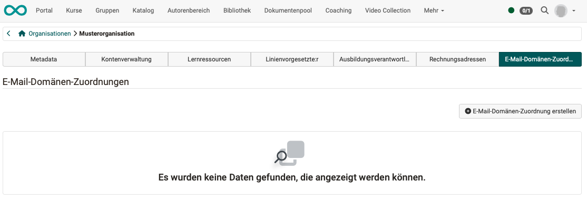{ class="shadow lightbox" }

Zu jedem Organisationselement kann eine E-Mail-Domäne angegeben werden, anhand derer die Zugehörigkeit von Benutzer:innen zu dieser Orgnisationseinheit geprüft werden kann. Die ist dann von Bedeutung, wenn sich Benutzer:innen selbst für Kurse anmelden können, die Kurse jedoch nur für eine bestimmte Organisationseinheit verfügbar sein soll. 

[Zum Seitenanfang ^](#organisations)

---

## Tab Organisationstypen {: #tab_types}

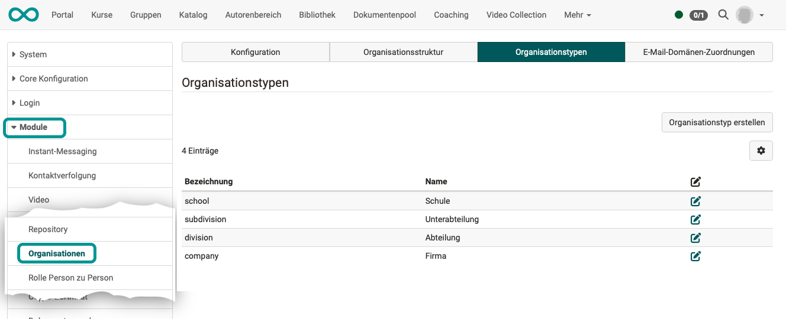{ class="shadow lightbox" }

Die Organisationstypen definieren, welche Elemente eine Organisationsstruktur enthalten kann und geben diesen Elementen eine nähere Bedeutung. Die Typen können dabei auch eine hierarchische Struktur abbilden, dies ist allerdings nicht zwingend. Ein Beispiel für Organisationstypen ist `Firma --> Bereich --> Abteilung`.

Über "Organisationstyp erstellen" können weitere Typen angelegt werden. Neben der Bezeichnung (Kennzeichen) und dem Namen kann eine Beschreibung angegeben werden. Es ist an dieser Stelle möglich, per CSS Klasse ein nur für diesen Organisationstyp geltendes Layout zu hinterlegen. Zudem können dem neuem Organisationstyp bereits bestehende Typen untergeordnet werden.

[Zum Seitenanfang ^](#organisations)

---

## Tab E-Mail-Domänen-Zuordnungen {: #tab_mail_domain_assignment}

!!! info "Verfügbarkeit"

	Die E-Mail-Domänen-Zuordnung ist verfügbar ab Release 20.
	
	Dieser Tab wird ausserdem nur angezeigt, wenn die E-Mail-Domänen-Zuordnung im Tab "Konfiguration" aktiviert wurde.

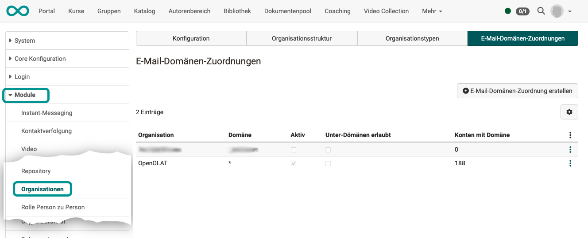{ class="shadow lightbox" }

Existieren Organisationseinheiten, kann die Selbstregistration auf bestimmte E-Mail-Domänen eingeschränkt werden. Neue Benutzer werden dann basierend auf ihrer E-Mail-Domäne automatisch einer Organisationseinheit zugeordnet und nur für Inhalte/Kurse dieser Organisationseinheit zur Selbstregistration zugelassen.

[Zum Seitenanfang ^](#organisations)