# Modul Organisationen {: #organisations}

Das Modul "Organisationen" ist optional in OpenOlat verfügbar. Es wird in der System-Administration unter `Administration > Module > Organisationen` aktiviert.

!!! tip "Aktivierung"

    Kunden von frentix kontaktieren für die Aktivierung bitte: [contact@frentix.com](mailto:contact@frentix.com). Nach der Aktivierung können diverse zusätzliche Einstellungen für die systemweite Konfiguration vorgenommen werden. Bei Systemen mit dem fx-Release werden diese Anpassung durch frentix vorgenommen.

    **Nicht Hosting-Kunde von frentix?** Fragen Sie Ihren Systembetreiber!

## Tab Konfiguration {: #tab_configuration}

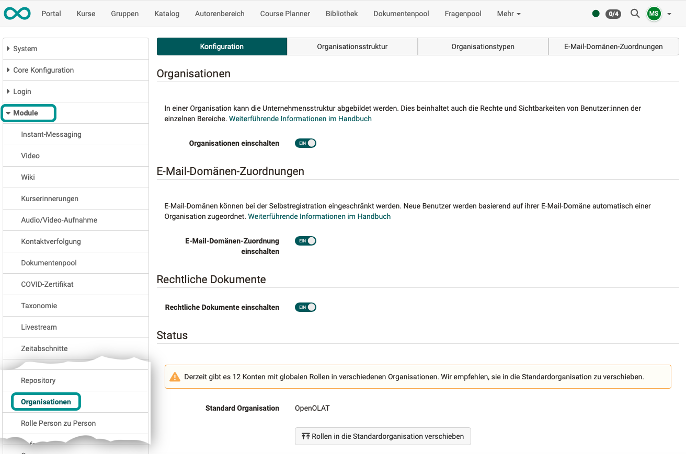{ class="shadow lightbox" title="Tab Konfiguration im Modul Organisationen" }

Im Tab Konfiguration erfolgt

* die Aktivierung des Moduls Organisationsstrukturen
* die Aktivierung der E-Mail-Domänen-Zuordnung (nur aktivierbar bei aktiviertem Modul Organisationen)
* die Aktivierung des Ordners für rechtliche Dokumente
* den Abschnitt "Status", in dem Informationen für Administrator:innen angezeigt werden

Im Modul "Organisationen" kann die Unternehmensstruktur abgebildet werden. Anschliessend können Rollen, Rechte und Sichtbarkeit von Kursen und Inhalten von der Zugehörigkeit zu einer bestimmten Organisationseinheit abhängig gemacht werden.

Auch die Möglichkeit zur Selbstregistration von Kursteilnehmer:innen kann von der Zugehörigkeit zu einer bestimmten Organisationseinheit abhängig gemacht werden. Diese Einschränkung wird vorgenommen, indem die Mail-Adresse neuer Benutzer:innen mit den hinterlegten E-Mail-Domänen abgeglichen und automatisch einer bestimmten Organisationseinheit zugeordnet wird.

[Zum Seitenanfang ^](#organisations)

---

## Tab Organisationsstruktur {: #tab_structure}

Im Tab "Organisationsstruktur" finden sich die bereits erstellten Organisationen mit ihren Unterorganisationen als Baumstruktur dargestellt.

### Neue Organisationen erstellen und bearbeiten {: #create_and_edit}

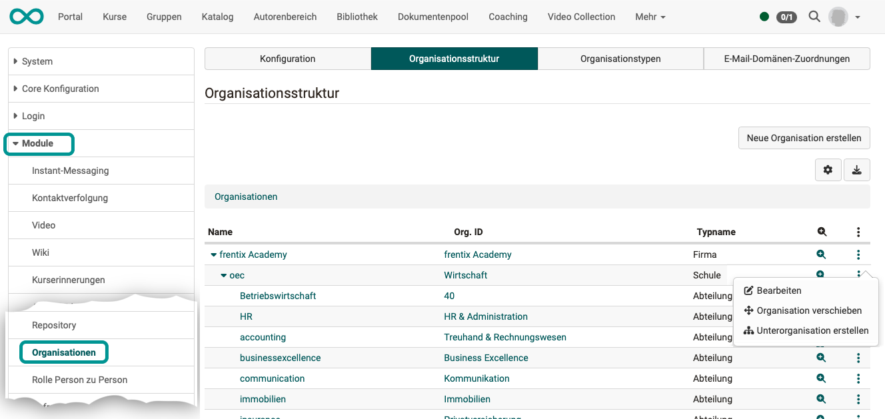{ class="shadow lightbox" title="Tab Organisationsstruktur im Modul Organisationen" }

Neue Organisationen können über den Button "Neue Organisation erstellen" rechts oben oder bei bestehenden Organisationen durch Klick auf die 3 Punkte und "Unterorganisation erstellen" hinzugefügt werden.

Eine bestehende Organisation verschieben Sie mit Klick auf die 3 Punkte und "Organisation verschieben". Im Fenster wählen Sie die Organisation, unter der sie künftig liegen soll, und bestätigen mit "Organisation verschieben". Ihre Unterorganisationen ziehen mit. Fehlt "Organisation verschieben" unter den 3 Punkten, ist das Verschieben gesperrt: bei der [Standardorganisation](#edit_metadata) immer, bei anderen Organisationen durch ein externes System, das die Organisation verwaltet. Das Fenster bietet nur Organisationen an, unter denen der [Organisationstyp](#tab_types) der verschobenen Organisation erlaubt ist. Rollen, die die Organisation von ihrer bisherigen übergeordneten Organisation geerbt hat, entfallen; die vererbten Rollen der neuen übergeordneten Organisation kommen hinzu. Die Rechte, die Sie in der verschobenen Organisation für [Linienvorgesetzte](#edit_linemanager) und [Ausbildungsverantwortliche](#edit_education_manager) gesetzt haben, setzt OpenOlat beim Verschieben zurück. Notieren Sie sie vorher und setzen Sie sie nach dem Verschieben neu.

!!! info "Nach oben verschieben Sie in zwei Schritten"

    Eine Organisation lässt sich nicht direkt in eine Organisation verschieben, die in der Baumstruktur über ihr liegt. OpenOlat meldet dann "Eine Organisation kann nicht in eine ihr über- oder untergeordnete Organisation verschoben werden." Verschieben Sie die Organisation zuerst in eine Organisation, die weder über ihr noch unter der Zielorganisation liegt, und von dort in die Zielorganisation. frentix-Kund:innen können diesen Zwischenschritt nicht selbst ausführen und wenden sich an den frentix Support: [support@frentix.com](mailto:support@frentix.com)

Wird in der Baumstruktur eine Organisation ausgewählt, können ihre Metadaten und weitere Zuordnungen angepasst oder ergänzt werden.

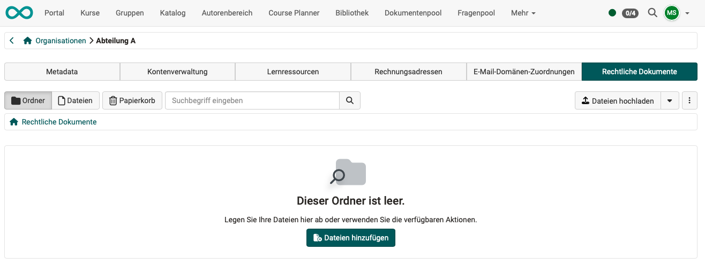{ class="shadow lightbox" title="Tab Rechtliche Dokumente einer Organisation" }

`Administration > Module > Organisationen > Tab "Organisationsstruktur" > "Name der Organisation" > Tab "Rechtliche Dokumente"` 
Ist der Ordner unter `Administration > Module > Organisationen > Tab "Konfiguration"` aktiviert worden, wird dieses Tab für Administrator:innen und andere administrative Rollen angezeigt. Administrator:innen können darin Dokumente zu organisationsspezifischen Belangen ablegen. Andere administrative Rollen haben nur Lesezugriff. [:octicons-tag-16:{ title="ab Release 20.0 (OO-8233)" }](https://track.frentix.com/issue/OO-8233){:target="_blank"}

### Metadaten {: #edit_metadata}

`Administration > Module > Organisationen > Tab "Organisationsstruktur" > "Name der Organisation" > Tab "Metadaten"`
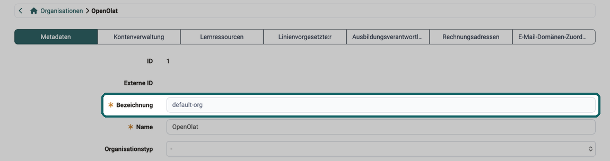{ class="shadow lightbox" title="Tab Metadaten der Standardorganisation · 2026.10.02" }

Im Tab "Metadaten" pflegen Sie die Angaben, an denen eine Organisation in OpenOlat erkannt wird. Neben der Bezeichnung und dem Namen können ein Standort und eine Beschreibung eingetragen werden. Die ID und die Externe ID zeigt OpenOlat nur an, sie lassen sich hier nicht ändern. Ausserdem erfolgt hier die Zuordnung des Organisationstyps (wie im Tab "Organisationstypen" definiert). Wird bei der Erstellung jede Organisation mit einem entsprechenden Organisationstyp verknüpft, kann so eine hierarchische Struktur aufgebaut werden. Eine Organisation, die gleichzeitig mehreren übergeordneten Organisationen angehört, lässt sich nicht abbilden.

Bei Organisationen, die Administrator:innen selbst erstellt haben, lassen sich Bezeichnung und Name jederzeit ändern. Gesperrt sind die beiden Felder nur, wenn ein externes System die Organisation verwaltet.

Anders bei der Standardorganisation, die das Bild zeigt: Ihre Bezeichnung ist immer gesperrt, ihr Name nicht. OpenOlat legt die Standardorganisation beim ersten Start mit dem Namen "OpenOLAT" und der Bezeichnung "default-org" an und sperrt dabei das Feld "Bezeichnung". OpenOlat erkennt die Standardorganisation an dieser Bezeichnung, deshalb bleibt das Feld auch später gesperrt. Den Namen können Administrator:innen jederzeit im Tab "Metadaten" ändern, etwa in den Namen der eigenen Organisation. Im Bild trägt sie den geänderten Namen "OpenOlat". Kurse, Lernressourcen und Rollen bleiben beim Umbenennen unverändert zugeordnet. Verschieben oder löschen lässt sich die Standardorganisation nicht.

!!! note "Hinweis"

    Gleicht Ihr OpenOlat die Organisationen mit LDAP-Gruppen ab, ordnet es jeder LDAP-Gruppe die Organisation zu, deren Bezeichnung, Name oder Externe ID dem Namen der Gruppe entspricht. Gross- und Kleinschreibung spielen dabei keine Rolle. Wählen Sie für die Standardorganisation deshalb keinen Namen, den auch eine LDAP-Gruppe trägt. Sonst verwaltet LDAP die Mitglieder der Standardorganisation.

### Kontenverwaltung {: #edit_account_managment}

`Administration > Module > Organisationen > Tab "Organisationsstruktur" > "Name der Organisation" > Tab "Kontenverwaltung"`
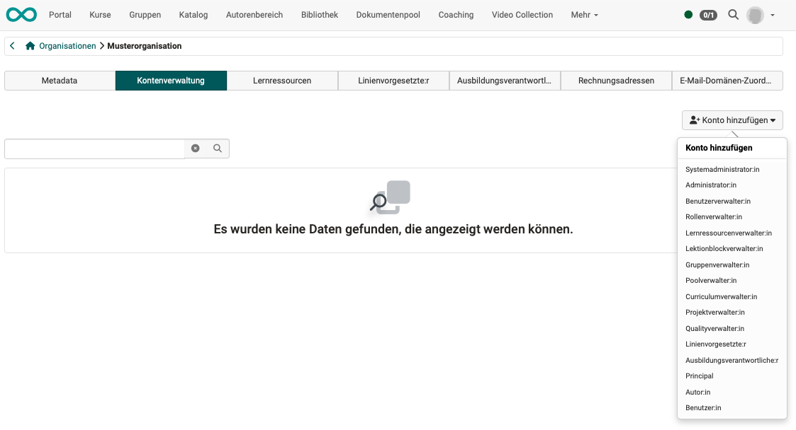{ class="shadow lightbox" title="Tab Kontenverwaltung einer Organisation" }

Im Tab "Kontenverwaltung" erhält man eine Liste mit den aktuell dieser Organisationseinheit zugeordneten Benutzer:innen. Ebenso können bestehende Benutzer:innen wieder entfernt werden.

Mit dem Button "Konto hinzufügen" können weitere Benutzer:innen einer bestimmten Rolle hinzugefügt werden. Hierfür wird aus den aufgelisteten Rollen die gewünschte ausgewählt. Im anschliessenden Dialog kann nach Benutzer:innen gesucht werden.  Entsprechend der Auswahl können sie hinzugefügt werden. Auch das Hinzufügen von mehreren Benutzer:innen ist möglich.

Jeder Stufe der Organisation können Mitglieder verschiedenster Rollen zugeordnet werden. 

Die **Rollen-Zuordnung** ist möglich

  * auf einer spezifischen Organisation
  * auf einer spezifischen Organisation und allen dieser Organisation untergeordneten Organisationsstrukturen

### Lernressourcen {: #edit_learning_resources}

`Administration > Module > Organisationen > Tab "Organisationsstruktur" > "Name der Organisation" > Tab "Lernressourcen"`
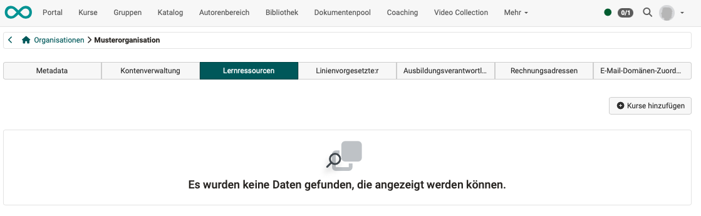{ class="shadow lightbox" title="Tab Lernressourcen einer Organisation" }

Im Tab "Lernressourcen" sehen Sie, welche Kurse der Organisation direkt zugeordnet sind, und passen diese Zuordnung an. Über "Kurse hinzufügen" kann in einem Dialog nach weiteren eigenen und verfügbaren Kursen gesucht werden, um diese der Organisation zuzuordnen. Um Kurse wieder zu entfernen, markieren Sie die Zeilen in der Liste und klicken auf "Entfernen". OpenOlat fragt im Dialog "Lernressourcen entfernen" nach, bevor es die Zuordnung aufhebt.

"Kurse hinzufügen" findet nur Kurse. Tests, Videos und andere Lernressourcen ordnen Sie einer Organisation in der Administrativen Freigabe der Lernressource zu, beschrieben unter [Kurseinstellungen - Tab Freigabe](../../manual_user/learningresources/Course_Settings_Share.de.md#section_share). Für mehrere Lernressourcen gleichzeitig gibt es die [Sammelaktion im Autorenbereich](../../manual_user/area_modules/Authoring_BulkActions.de.md#bulk_administrative_access).

!!! warning "Achtung"

    OpenOlat prüft beim Entfernen nicht, ob der Kurs danach noch einer anderen Organisation zugeordnet ist. Wollen Sie einen Kurs in eine andere Organisation verschieben, klicken Sie deshalb zuerst in der neuen Organisation auf "Kurse hinzufügen". Erst danach entfernen Sie den Kurs in der bisherigen Organisation mit "Entfernen".

Die **Zuordnung von Bildungsprodukten** erfolgt im Course Planner in der jeweiligen Durchführung.

### Linienvorgesetzte [:octicons-tag-16:{ title="ab Release 15.3 (OO-4915)" }](https://track.frentix.com/issue/OO-4915){:target="_blank"} {: #edit_linemanager}

`Administration > Module > Organisationen > Tab "Organisationsstruktur" > "Name der Organisation" > Tab "Linienvorgesetzte"`
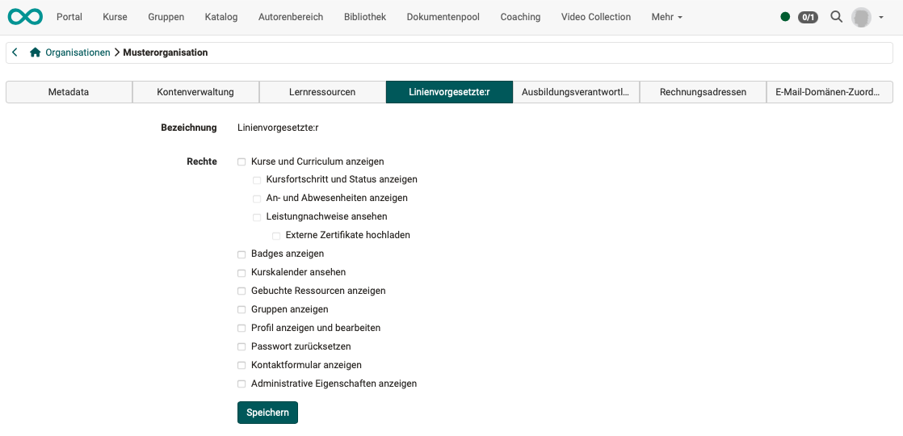{ class="shadow lightbox" title="Tab Linienvorgesetzte:r einer Organisation" }

Die Rechte, die Linienvorgesetzten zugeteilt werden, können für jede Organisationseinheit separat definiert werden. 

### Ausbildungsverantwortliche [:octicons-tag-16:{ title="ab Release 20.0 (OO-7839)" }](https://track.frentix.com/issue/OO-7839){:target="_blank"} {: #edit_education_manager}

`Administration > Module > Organisationen > Tab "Organisationsstruktur" > "Name der Organisation" > Tab "Ausbildungsverantwortliche"`
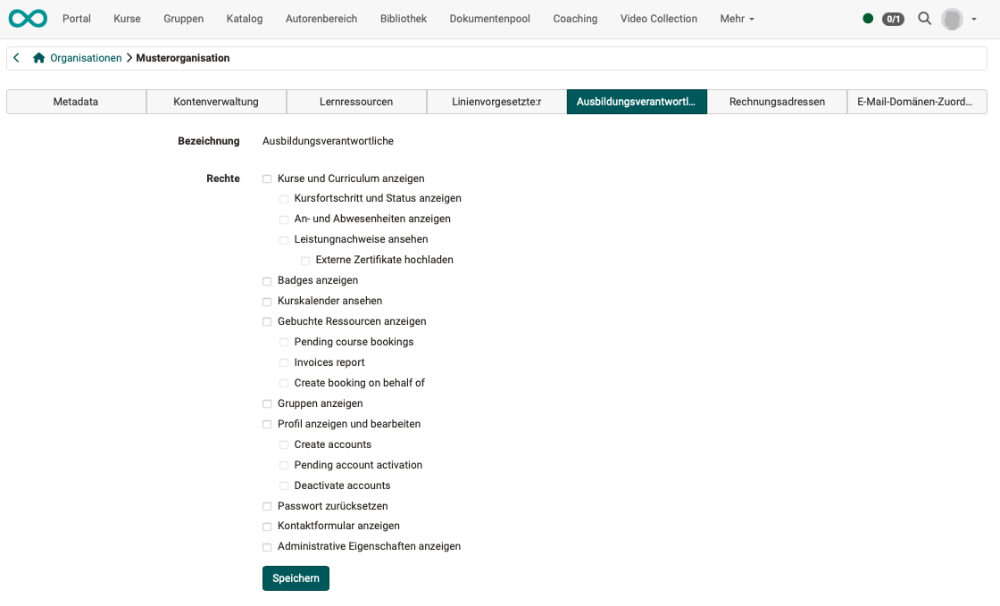{ class="shadow lightbox" title="Tab Ausbildungsverantwortliche einer Organisation" }

Die Rechte, die Ausbildungsverantwortlichen zugeteilt werden, können für jede Organisationseinheit separat definiert werden. 

### Rechnungsadressen [:octicons-tag-16:{ title="ab Release 20.0 (OO-8212)" }](https://track.frentix.com/issue/OO-8212){:target="_blank"} {: #edit_billing_adresses}

`Administration > Module > Organisationen > Tab "Organisationsstruktur" > "Name der Organisation" > Tab "Rechnungsadressen"`
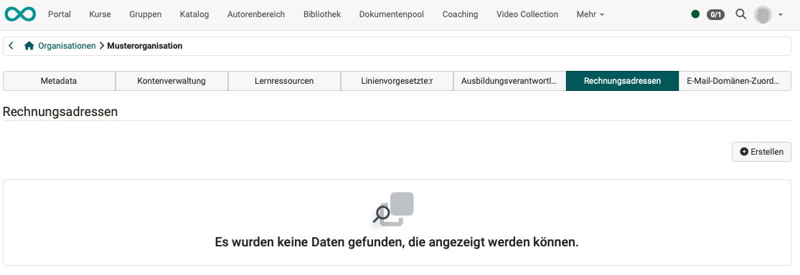{ class="shadow lightbox" title="Tab Rechnungsadressen einer Organisation" }

Für die Kurs- und Seminarverwaltung können hier Rechnungsadressen hinterlegt werden.

### E-Mail-Domänen-Zuordnung {: #edit_mail_domain}

`Administration > Module > Organisationen > Tab "Organisationsstruktur" > "Name der Organisation" > Tab "E-Mail-Domänen-Zuordnung"`
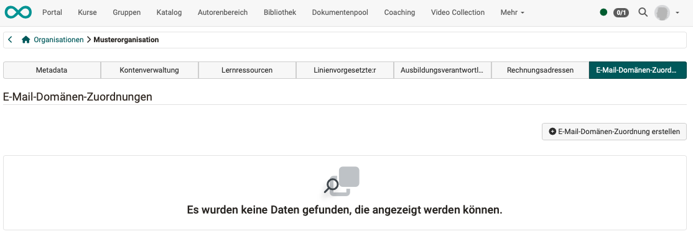{ class="shadow lightbox" title="Tab E-Mail-Domänen-Zuordnung einer Organisation" }

Zu jeder Organisation kann eine E-Mail-Domäne angegeben werden, anhand derer die Zugehörigkeit von Benutzer:innen zu dieser Orgnisationseinheit geprüft werden kann. Die ist dann von Bedeutung, wenn sich Benutzer:innen selbst für Kurse anmelden können, die Kurse jedoch nur für eine bestimmte Organisationseinheit verfügbar sein soll. 

[Zum Seitenanfang ^](#organisations)

---

## Tab Organisationstypen {: #tab_types}

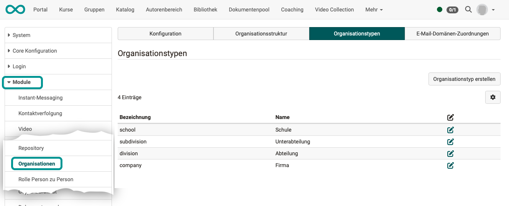{ class="shadow lightbox" title="Tab Organisationstypen im Modul Organisationen" }

Die Organisationstypen definieren, welche Elemente eine Organisationsstruktur enthalten kann und geben diesen Elementen eine nähere Bedeutung. Die Typen können dabei auch eine hierarchische Struktur abbilden, dies ist allerdings nicht zwingend. Ein Beispiel für Organisationstypen ist `Firma --> Bereich --> Abteilung`.

Über "Organisationstyp erstellen" können weitere Typen angelegt werden. Neben der Bezeichnung (Kennzeichen) und dem Namen kann eine Beschreibung angegeben werden. Es ist an dieser Stelle möglich, per CSS Klasse ein nur für diesen Organisationstyp geltendes Layout zu hinterlegen. Zudem können dem neuem Organisationstyp bereits bestehende Typen untergeordnet werden.

[Zum Seitenanfang ^](#organisations)

---

## Tab E-Mail-Domänen-Zuordnungen [:octicons-tag-16:{ title="ab Release 20.0 (OO-8178)" }](https://track.frentix.com/issue/OO-8178){:target="_blank"} {: #tab_mail_domain_assignment}

!!! info "Sichtbarkeit"

    Dieser Tab wird nur angezeigt, wenn die E-Mail-Domänen-Zuordnung im Tab "Konfiguration" aktiviert wurde.

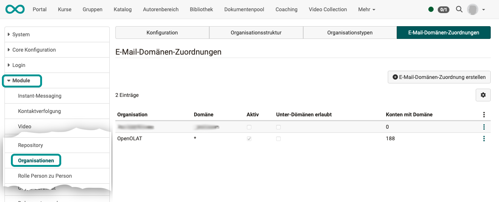{ class="shadow lightbox" title="Tab E-Mail-Domänen-Zuordnungen im Modul Organisationen" }

Existieren Organisationseinheiten, kann die Selbstregistration auf bestimmte E-Mail-Domänen eingeschränkt werden. Neue Benutzer:innen werden dann basierend auf ihrer E-Mail-Domäne automatisch einer Organisationseinheit zugeordnet und nur für Inhalte/Kurse dieser Organisationseinheit zur Selbstregistration zugelassen.

[Zum Seitenanfang ^](#organisations)

---

## Weiterführende Informationen {: #further_information}

**Auf dieser Seite erwähnt** 
[Kurseinstellungen - Tab Freigabe >](../../manual_user/learningresources/Course_Settings_Share.de.md) 
[Autorenbereich - Sammelaktionen >](../../manual_user/area_modules/Authoring_BulkActions.de.md)

**Weiterführend** 
[Rollen zuweisen >](../usermanagement/Assign_roles.de.md) 
[Rollen und Rechte: Welche Rollen gibt es? >](../../manual_user/basic_concepts/Roles.de.md) 
[Selbstregistration >](Login_Self-Registration.de.md)

[Zum Seitenanfang ^](#organisations)