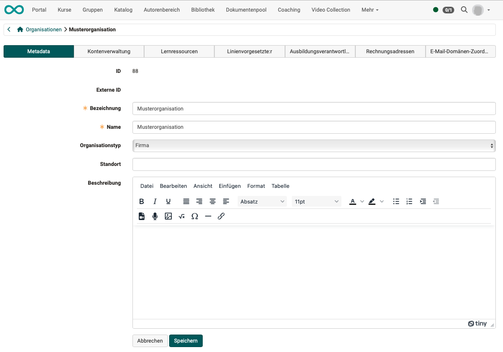

# Module Organisations {: #organisations}

The "Organizations" module is optionally available in OpenOlat. It is activated in the system administration under `Administration > Modules > Organizations`.

!!! tip "Activation"

    Customers of frentix please contact [contact@frentix.com](mailto:contact@frentix.com) for the activation. After activation, various additional settings can be made for the system-wide configuration. For systems with the fx-Release, these adjustments are made by frentix.

    **Not a frentix hosting customer?** Please ask your system operator!

## Tab Configuration {: #tab_configuration}

{ class="shadow lightbox" }

In the Configuration tab

* the Organization structures module is activated
* the e-mail domain mapping is activated (can only be activated if the Organizations module is activated)
* the folder for legal documents is activated
* the "Status" section, which shows information for administrators

The company structure can be mapped in the "Organizations" module. Roles, rights and the visibility of courses and content can then be made dependent on membership of a specific organizational unit.

The ability of course participants to self-register can also be made dependent on membership of a specific organizational unit. This restriction is set up by comparing the e-mail address of new users against the stored e-mail domains and automatically assigning them to a specific organizational unit.

[To the top of the page ^](#organisations)

---

## Tab Organization structure {: #tab_structure}

The "Organization structure" tab shows the organizations already created, together with their sub-organizations, as a tree structure.

### Creating and editing organizations {: #create_and_edit}

{ class="shadow lightbox" }

New organizations can be added using the "Create new organization" button at the top right, or for existing organizations by clicking the three dots and "Create sub-organization". It is also possible to move the organization within the tree structure or to create a new sub-organization directly.

If an organization is selected in the tree structure, its metadata and other assignments can be adjusted or supplemented.

{ class="shadow lightbox" }

`Administration > Modules > Organizations > Tab "Organization structure" > Tab "Legal documents"` 
If the folder has been activated under `Administration > Modules > Organizations > Tab "Configuration"`, this tab is displayed for administrators and other administrative roles. Administrators can store documents on organization-specific matters in it. Other administrative roles only have read access. [:octicons-tag-16:{ title="from Release 20.0 (OO-8233)" }](https://track.frentix.com/issue/OO-8233){:target="_blank"}

### Metadata {: #edit_metadata}

`Administration > Modules > Organizations > Tab "Organization structure" > Tab "Metadata"`
{ class="shadow lightbox" }

In the "Metadata" tab, you maintain the details by which an organization is recognized in OpenOlat. In addition to the identifier and the name, a location and a description can be entered. OpenOlat only displays the ID and the External ID; they cannot be changed here.
The organization type (as defined in the "Organization types" tab) is also assigned here.
If every organization is linked to a corresponding organization type on creation, a hierarchical structure can be built. An organization that belongs to several higher-level organizations at the same time cannot be represented.

On its first start, OpenOlat creates the default organization. It has the name "OpenOLAT" and the identifier "default-org". Administrators can freely change the name in the "Metadata" tab, for example to the name of their own organization. The identifier is locked because OpenOlat recognizes the default organization by it. Courses, learning resources and roles remain assigned unchanged when you rename it. The default organization cannot be deleted or moved.

!!! note "Note"

    If your OpenOlat synchronizes the organizations with LDAP groups, it assigns each LDAP group the organization whose identifier, name or External ID matches the name of the group. Upper and lower case do not matter. For this reason, do not choose a name for the default organization that an LDAP group also has. Otherwise LDAP manages the members of the default organization.

### Account management {: #edit_account_managment}

`Administration > Modules > Organizations > Tab "Organization structure" > Tab "Account management"`
{ class="shadow lightbox" }

The "Account management" tab shows a list of the users currently assigned to this organizational unit. Existing users can also be removed again.

The "Add account" button can be used to add further users with a specific role. Select the desired role from the listed roles. In the following dialog, you can search for users. They can be added according to the selection. It is also possible to add several users at once.

Members of various roles can be assigned to each level of the organization.

The **role assignment** is possible

  * on a specific organization
  * on a specific organization and all organization structures subordinate to this organization

### Learning resources {: #edit_learning_resources}

`Administration > Modules > Organizations > Tab "Organization structure" > Tab "Learning resources"`
{ class="shadow lightbox" }

In the "Learning resources" tab, you see which courses are directly assigned to the organization, and you adjust this assignment. Via "Add courses", a dialog lets you search for further own and available courses to assign to the organization. To remove courses again, select the rows in the list and click "Remove". OpenOlat asks for confirmation in the dialog "Remove learning resources" before it removes the assignment.

"Add courses" only finds courses. You assign tests, videos and other learning resources to an organization in the Administrative access of the learning resource, described under [Course settings - Tab Share](../../manual_user/learningresources/Course_Settings_Share.md#section_share). For several learning resources at once, use the [bulk action in Authoring](../../manual_user/area_modules/Authoring_BulkActions.md#bulk_administrative_access).

!!! warning "Warning"

    When you remove a course, OpenOlat does not check whether the course is still assigned to another organization afterwards. If you want to move a course to another organization, first click "Add courses" in the new organization. Only then remove the course from the previous organization with "Remove".

The **assignment of educational products** is done in the Course Planner, at the respective implementation.

### Line manager [:octicons-tag-16:{ title="from Release 15.3 (OO-4915)" }](https://track.frentix.com/issue/OO-4915){:target="_blank"} {: #edit_linemanager}

`Administration > Modules > Organizations > Tab "Organization structure" > Tab "Line manager"`
{ class="shadow lightbox" }

The rights assigned to line managers can be defined separately for each organizational unit.

### Education manager [:octicons-tag-16:{ title="from Release 20.0 (OO-7839)" }](https://track.frentix.com/issue/OO-7839){:target="_blank"} {: #edit_education_manager}

`Administration > Modules > Organizations > Tab "Organization structure" > Tab "Education manager"`
{ class="shadow lightbox" }

The rights assigned to education managers can be defined separately for each organizational unit.

### Billing addresses [:octicons-tag-16:{ title="from Release 20.0 (OO-8212)" }](https://track.frentix.com/issue/OO-8212){:target="_blank"} {: #edit_billing_adresses}

`Administration > Modules > Organizations > Tab "Organization structure" > Tab "Billing addresses"`
{ class="shadow lightbox" }

Billing addresses for course and seminar management can be stored here.

### E-mail domain mapping {: #edit_mail_domain}

`Administration > Modules > Organizations > Tab "Organization structure" > Tab "E-mail domain mapping"`
{ class="shadow lightbox" }

An e-mail domain can be specified for each organization, which is used to check whether users belong to this organizational unit. This matters when users can self-register for courses, but the courses should only be available for a specific organizational unit.

[To the top of the page ^](#organisations)

---

## Tab Organization types {: #tab_types}

{ class="shadow lightbox" }

The organization types define which elements an organization structure can contain and give these elements a more specific meaning. The types can also map a hierarchical structure, but this is not mandatory. An example of organization types is `Company --> Division --> Department`.

Further types can be created via "Create organization type". In addition to the designation (identifier) and the name, a description can be entered. At this point, a CSS class can be used to define a layout that only applies to this organization type. In addition, existing types can be subordinated to the new organization type.

[To the top of the page ^](#organisations)

---

## Tab E-mail domain mappings [:octicons-tag-16:{ title="from Release 20.0 (OO-8178)" }](https://track.frentix.com/issue/OO-8178){:target="_blank"} {: #tab_mail_domain_assignment}

!!! info "Visibility"

    This tab is only displayed if the e-mail domain mapping has been activated in the "Configuration" tab.

{ class="shadow lightbox" }

If organizational units exist, self-registration can be restricted to specific e-mail domains. New users are then automatically assigned to an organizational unit based on their e-mail domain and are only allowed to self-register for content/courses of this organizational unit.

[To the top of the page ^](#organisations)

---

## Further information {: #further_information}

**Mentioned on this page** 
[Course settings - Tab Share >](../../manual_user/learningresources/Course_Settings_Share.md) 
[Authoring - Bulk Actions >](../../manual_user/area_modules/Authoring_BulkActions.md)

**Further reading** 
[Assign roles >](../usermanagement/Assign_roles.md) 
[Roles and Rights: Which roles are available? >](../../manual_user/basic_concepts/Roles.md) 
[Self-registration >](Login_Self-Registration.md)

[To the top of the page ^](#organisations)
