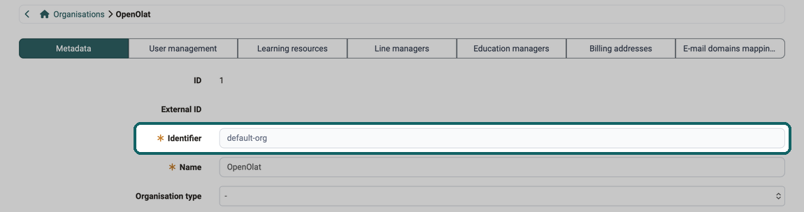

# Module Organisations {: #organisations}

The "Organisations" module is optionally available in OpenOlat. It is activated in the system administration under `Administration > Modules > Organisations`.

!!! tip "Activation"

    Customers of frentix please contact [contact@frentix.com](mailto:contact@frentix.com) for the activation. After activation, various additional settings can be made for the system-wide configuration. For systems with the fx-Release, these adjustments are made by frentix.

    **Not a frentix hosting customer?** Please ask your system operator!

## Tab Configuration {: #tab_configuration}

{ class="shadow lightbox" title="Configuration tab of the Organisations module" }

In the "Configuration" tab, you switch on the module and the additional functions your organisation needs. The tab contains

* the activation of the Organisations module
* the activation of the e-mail domain mapping (can only be activated if the Organisations module is activated)
* the activation of the folder for legal documents
* the activation of the [customer number](#customer_number) (only visible if the Organisations module is activated)
* the "Status" section, which shows information for administrators

The company structure can be mapped in the "Organisations" module. Roles, rights and the visibility of courses and content can then be made dependent on membership of a specific organisation.

The ability of course participants to self-register can also be made dependent on membership of a specific organisation. This restriction is set up by comparing the e-mail address of new users against the stored e-mail domains and automatically assigning them to a specific organisation.

### Customer number [:octicons-tag-16:{ title="from Release 21.1 (OO-9736)" }](https://track.frentix.com/issue/OO-9736){:target="_blank"} {: #customer_number}

If your organisation invoices courses, the customer number links each booking to the person or organisation that your accounting keeps for it. The customer number is the number under which the accounting keeps a person or an organisation. If it is included in the export of the booking orders, the accounting assigns each booking to the right account without looking it up.

You switch on the customer number in the "Configuration" tab, in the "Customer number" section, with the "Enable customer number" toggle. The section only appears once the Organisations module is switched on. By default, the toggle is off.

If the toggle is on, the "Customer number" field is available in three places:

* in the "User profile" tab of an account in User management, see [Manage user settings](../usermanagement/Configure_User.md#profile)
* in the [Metadata](#edit_metadata) tab of an organisation
* in a [billing address](#edit_billing_adresses) of an organisation

The field is never mandatory and accepts any text. OpenOlat shows recorded numbers in the Course Planner in the [member list of an implementation](../../manual_user/area_modules/Course_Planner_Implementations.md#tab_members) and in the billing address of a booking order. The [Booking orders report](../../manual_user/area_modules/Reports_BookingOrders.md) contains three additional columns: the customer number of the person, that of the billing address and that of the organisation to which the billing address belongs.

If you switch the customer number off again, the field disappears from all forms. The recorded numbers remain stored, but OpenOlat no longer displays or exports them.

[To the top of the page ^](#organisations)

---

## Tab Organisations structures {: #tab_structure}

The "Organisations structures" tab shows the organisations already created, together with their sub-organisations, as a tree structure.

### Creating and editing organisations {: #create_and_edit}

{ class="shadow lightbox" title="Organisations structures tab of the Organisations module" }

New organisations can be added using the "Create new organisation" button at the top right, or for existing organisations by clicking the three dots and "Add new organisation under this one". Both dialogs contain the same fields as the [Metadata](#edit_metadata) tab.

If the [customer number](#customer_number) is switched on, you show the "Customer number" column in the list of organisations via "Displayed columns". It is hidden by default.

To move an existing organisation, click the three dots and "Move organisation". In the window, select the organisation under which it is to be placed in future and confirm with "Move organisation". Its sub-organisations move along. If "Move organisation" is missing under the three dots, moving is locked: always for the [default organisation](#edit_metadata), and for other organisations by an external system that manages the organisation. The window only offers organisations under which the [organisation type](#tab_types) of the moved organisation is allowed. Roles that the organisation inherited from its previous parent organisation are dropped; the inherited roles of the new parent organisation are added. When you move an organisation, OpenOlat resets the rights that you have set in it for [line managers](#edit_linemanager) and [education managers](#edit_education_manager). Note them down beforehand and set them again after the move.

!!! info "Moving upwards takes two steps"

    An organisation cannot be moved directly into an organisation that is above it in the tree structure. OpenOlat then reports "An organisation cannot be moved into a parent or sub-organisation of itself." First move the organisation into an organisation that is neither above it nor below the target organisation, and from there into the target organisation. frentix customers cannot carry out this intermediate step themselves and contact frentix support: [support@frentix.com](mailto:support@frentix.com)

If an organisation is selected in the tree structure, its metadata and other assignments can be adjusted or supplemented.

{ class="shadow lightbox" title="Legal documents tab of an organisation" }

`Administration > Modules > Organisations > Tab "Organisations structures" > "Organisation name" > Tab "Legal documents"` 
If the folder has been activated under `Administration > Modules > Organisations > Tab "Configuration"`, this tab is displayed for administrators and other administrative roles. Administrators can store documents on organisation-specific matters in it. Other administrative roles only have read access. [:octicons-tag-16:{ title="from Release 20.0 (OO-8233)" }](https://track.frentix.com/issue/OO-8233){:target="_blank"}

### Metadata {: #edit_metadata}

`Administration > Modules > Organisations > Tab "Organisations structures" > "Organisation name" > Tab "Metadata"`
{ class="shadow lightbox" title="Metadata tab of the default organisation · 2026.10.02" }

In the "Metadata" tab, you maintain the details by which an organisation is recognized in OpenOlat. In addition to the identifier and the name, a location and a description can be entered. If the [customer number](#customer_number) is switched on, the additional field "Customer number" appears between location and description. OpenOlat only displays the ID and the External ID; they cannot be changed here. The organisation type (as defined in the "Organisations types" tab) is also assigned here. If every organisation is linked to a corresponding organisation type on creation, a hierarchical structure can be built. An organisation that belongs to several higher-level organisations at the same time cannot be represented.

For organisations that administrators created themselves, the identifier and name can be changed at any time. The two fields are only locked if an external system manages the organisation. Via the [REST API](REST_API.md), such a system can also set the customer number of an organisation and lock the field in doing so.

The default organisation, shown in the image, is different: its identifier is always locked, its name is not. On its first start, OpenOlat creates the default organisation with the name "OpenOLAT" and the identifier "default-org" and locks the "Identifier" field. OpenOlat recognizes the default organisation by this identifier, so the field remains locked later on as well. Administrators can change the name in the "Metadata" tab at any time, for example to the name of their own organisation. In the image, it bears the changed name "OpenOlat". Courses, learning resources and roles remain assigned unchanged when you rename it. The default organisation cannot be moved or deleted.

!!! note "Note"

    If your OpenOlat synchronizes the organisations with LDAP groups, it assigns each LDAP group the organisation whose identifier, name or External ID matches the name of the group. Upper and lower case do not matter. For this reason, do not choose a name for the default organisation that an LDAP group also has. Otherwise LDAP manages the members of the default organisation.

### User management {: #edit_account_managment}

`Administration > Modules > Organisations > Tab "Organisations structures" > "Organisation name" > Tab "User management"`
{ class="shadow lightbox" title="User management tab of an organisation" }

The "User management" tab shows a list of the users currently assigned to this organisation. Existing users can also be removed again.

The "Add user" button can be used to add further users with a specific role. Select the desired role from the listed roles. In the following dialog, you can search for users. They can be added according to the selection. It is also possible to add several users at once.

Members of various roles can be assigned to each level of the organisation.

The **role assignment** is possible

  * on a specific organisation
  * on a specific organisation and all sub-organisations below this organisation

### Learning resources {: #edit_learning_resources}

`Administration > Modules > Organisations > Tab "Organisations structures" > "Organisation name" > Tab "Learning resources"`
{ class="shadow lightbox" title="Learning resources tab of an organisation" }

In the "Learning resources" tab, you see which courses are directly assigned to the organisation, and you adjust this assignment. Via "Add courses", a dialog lets you search for further own and available courses to assign to the organisation. To remove courses again, select the rows in the list and click "Remove". OpenOlat asks for confirmation in the dialog "Remove learning resources" before it removes the assignment.

"Add courses" only finds courses. You assign tests, videos and other learning resources to an organisation in the Administrative access of the learning resource, described under [Course settings - Tab Share](../../manual_user/learningresources/Course_Settings_Share.md#section_share). For several learning resources at once, use the [bulk action in Authoring](../../manual_user/area_modules/Authoring_BulkActions.md#bulk_administrative_access).

!!! warning "Warning"

    When you remove a course, OpenOlat does not check whether the course is still assigned to another organisation afterwards. If you want to move a course to another organisation, first click "Add courses" in the new organisation. Only then remove the course from the previous organisation with "Remove".

The **assignment of educational products** is done in the Course Planner, at the respective implementation.

### Line managers [:octicons-tag-16:{ title="from Release 15.3 (OO-4915)" }](https://track.frentix.com/issue/OO-4915){:target="_blank"} {: #edit_linemanager}

`Administration > Modules > Organisations > Tab "Organisations structures" > "Organisation name" > Tab "Line managers"`
{ class="shadow lightbox" title="Line managers tab of an organisation" }

The rights assigned to line managers can be defined separately for each organisation.

### Education managers [:octicons-tag-16:{ title="from Release 20.0 (OO-7839)" }](https://track.frentix.com/issue/OO-7839){:target="_blank"} {: #edit_education_manager}

`Administration > Modules > Organisations > Tab "Organisations structures" > "Organisation name" > Tab "Education managers"`
{ class="shadow lightbox" title="Education managers tab of an organisation" }

The rights assigned to education managers can be defined separately for each organisation.

### Billing addresses [:octicons-tag-16:{ title="from Release 20.0 (OO-8212)" }](https://track.frentix.com/issue/OO-8212){:target="_blank"} {: #edit_billing_adresses}

`Administration > Modules > Organisations > Tab "Organisations structures" > "Organisation name" > Tab "Billing addresses"`
{ class="shadow lightbox" title="Billing addresses tab of an organisation" }

When a person books an offer with invoice, they select a billing address of their organisation instead of entering the address themselves. You store these billing addresses here for each organisation with "Create". The person can choose from the active billing addresses of the organisations in which they are a user.

The tab only appears if the offer type "Invoice" is enabled. You select it in the system administration under "Available offer types": 
`Administration > Core functions > Access control`, see [Core functions](Core_functions.md).

A billing address consists of the fields "Identifier", "Name / Company", "Addition / Department", "Address line 1" to "Address line 4", "P.O. box", "Region", "ZIP", "City" and "Country". Mandatory fields are "Identifier", "Name / Company", "Address line 1", "City" and "Country".

If the [customer number](#customer_number) is switched on, a billing address of an organisation has the additional field "Customer number". Personal billing addresses do not have this field, nor does an address that is only entered during booking via "Other organisation address". If a number is recorded, it appears as the first line of the billing address wherever OpenOlat displays the address: in the detail view of a booking order in the Course Planner, when selecting the billing address during a booking with invoice, and in the participants' [own booking orders](../../manual_user/personal_menu/Bookings.md).

### E-mail domains mappings {: #edit_mail_domain}

`Administration > Modules > Organisations > Tab "Organisations structures" > "Organisation name" > Tab "E-mail domains mappings"`
{ class="shadow lightbox" title="E-mail domains mappings tab of an organisation" }

An e-mail domain can be specified for each organisation, which is used to check whether users belong to this organisation. This matters when users can self-register for courses, but the courses should only be available for a specific organisation.

[To the top of the page ^](#organisations)

---

## Tab Organisations types {: #tab_types}

{ class="shadow lightbox" title="Organisations types tab of the Organisations module" }

The organisation types define which elements an organisation structure can contain and give these elements a more specific meaning. The types can also map a hierarchical structure, but this is not mandatory. An example of organisation types is `Company --> Division --> Department`.

Further types can be created via "Create organisation type". In addition to the reference and the name, a description can be entered. At this point, a CSS class can be used to define a layout that only applies to this organisation type. In addition, existing types can be subordinated to the new organisation type.

[To the top of the page ^](#organisations)

---

## Tab E-mail domains mappings [:octicons-tag-16:{ title="from Release 20.0 (OO-8178)" }](https://track.frentix.com/issue/OO-8178){:target="_blank"} {: #tab_mail_domain_assignment}

!!! info "Visibility"

    This tab is only displayed if the e-mail domain mapping has been activated in the "Configuration" tab.

{ class="shadow lightbox" title="E-mail domains mappings tab of the Organisations module" }

If organisations exist, self-registration can be restricted to specific e-mail domains. New users are then automatically assigned to an organisation based on their e-mail domain and are only allowed to self-register for content/courses of this organisation.

[To the top of the page ^](#organisations)

---

## Further information {: #further_information}

**Mentioned on this page** 
[Manage user settings >](../usermanagement/Configure_User.md) 
[Course Planner: Implementations >](../../manual_user/area_modules/Course_Planner_Implementations.md) 
[Reports: Booking orders >](../../manual_user/area_modules/Reports_BookingOrders.md) 
[REST API >](REST_API.md) 
[Course settings - Tab Share >](../../manual_user/learningresources/Course_Settings_Share.md) 
[Authoring - Bulk Actions >](../../manual_user/area_modules/Authoring_BulkActions.md) 
[Core functions: Overview >](Core_functions.md) 
[Personal tools: Booking orders >](../../manual_user/personal_menu/Bookings.md)

**Further reading** 
[Assign roles >](../usermanagement/Assign_roles.md) 
[Roles and Rights: Which roles are available? >](../../manual_user/basic_concepts/Roles.md) 
[Self-registration >](Login_Self-Registration.md)

[To the top of the page ^](#organisations)
