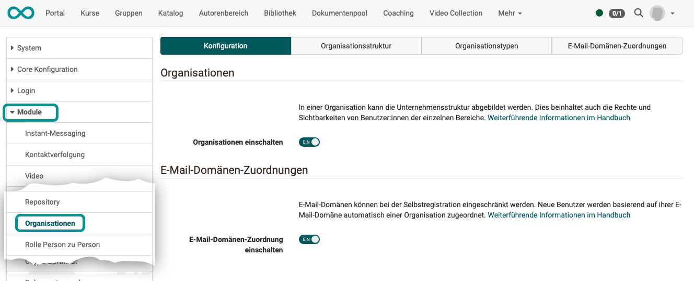
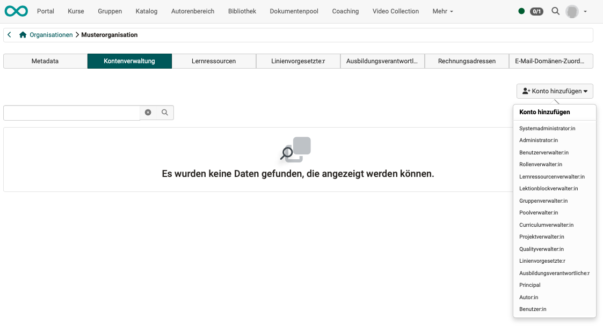
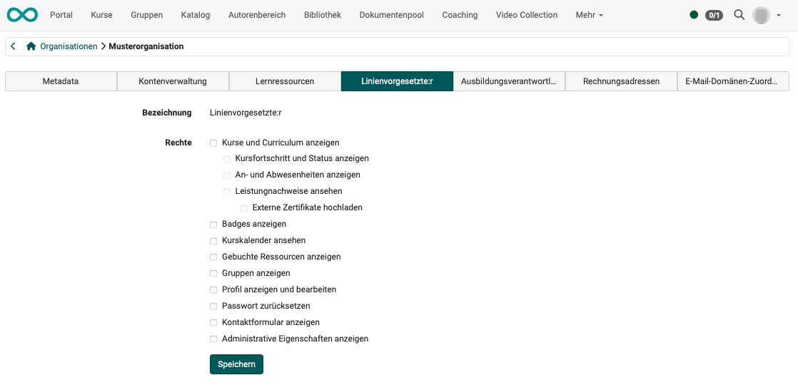
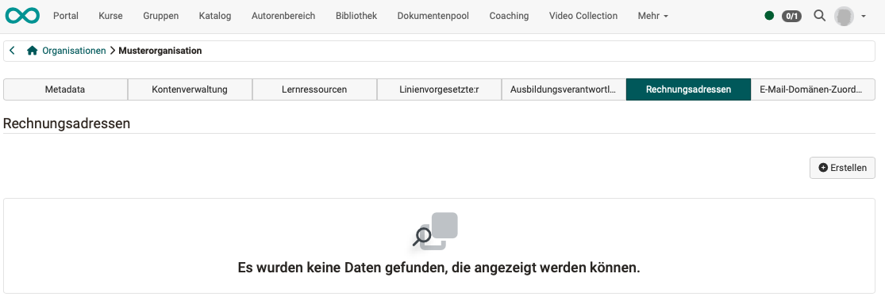
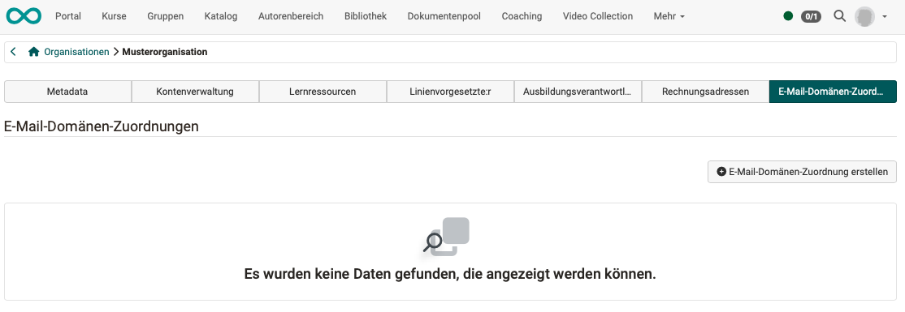
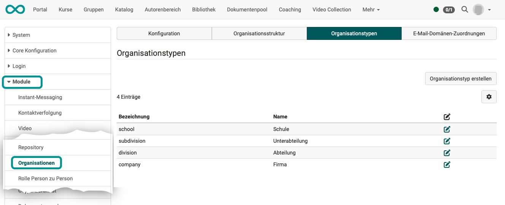

# Module Organisations {: #organisations}

##  Activation of the organizational structures

The Organizations module is optionally available in OpenOlat and must be activated in the administration. 

!!! hint "Activation"
	
	Customers of frentix please contact
	[contact@frentix.com](mailto:contact@frentix.com) for this. After activation, various additional settings can be made for the system-wide configuration. For systems with the fx-Release, these adjustments are made by frentix.

	:material-alert: **Not a frentix hosting-client?** Please ask your local system operator!

## Tab Configuration {: #tab_configuration}

{ class="shadow lightbox" }

In the Configuration tab

* the organizational structures module is activated
* e-mail domain mapping is activated (available from Release 20, can only be activated if the Organizations module is activated)

The company structure can be mapped in the "Organizations" module. Roles, rights and visibility of courses and content can then be made dependent on membership of a specific organizational unit.

The ability of course participants to register themselves can also be made dependent on membership of a specific organizational unit. This restriction is made by comparing the e-mail address of new users with the stored e-mail domains and automatically assigning them to a specific organizational unit.

[To the top of the page ^](#organisations)

---

## Tab Organization structure {: #tab_structure}

The "Organizational structure" tab shows the organizations that have already been created with their sub-organizations as a tree structure.

### Creating and editing organizational structures {: #create_and_edit}

{ class="shadow lightbox" }

New organizations can be created using the "Create new organization" button, or for existing organizations using the cogwheel and "Create sub-organization". In addition to the designation and the name, a description for the element can be entered. Furthermore, the assignment of the organization type is done here.

If an organizational element is selected in the tree structure, the metadata of the organizational element and other assignments can be adjusted or supplemented. 

### Metadaten {: #edit_metadata}

(Modules > Organizations > Tab "Organization structure" > Tab "Metadata")
{ class="shadow lightbox" }

A description for the element can be entered in addition to the designation and name.
The organization type is also assigned here (as defined in the "Organization types" tab).
If each organizational element is linked to a corresponding organizational type during creation, a hierarchical structure can be created. This makes it possible to map process and organizational structures, but a matrix organization cannot be represented.

### Account management  {: #edit_account_managment}

(Modules > Organizations > Tab "Organization structure" > Tab "Metadata")
{ class="shadow lightbox" }

The "Account management" tab displays a list of the users currently assigned to this organizational unit. Existing users can also be removed again.

The "Add account" button can be used to add additional users to a specific role. To do this, select the desired role from those listed. You can search for users in the subsequent dialog. They can be added according to the selection. It is also possible to add multiple users.

Members of different roles can be assigned to each level of the organization. 

 **Role assignment** is possible

  * on a specific organization
  * on a specific organization and all organizational structures subordinated to this organization

### Learning resources {: #edit_learning_resources}

(Modules > Organizations > Tab "Organization structure" > Tab "Learning resources")
{ class="shadow lightbox" }

Courses directly assigned to the organizational element are displayed in the "Learning resources" tab. These can also be removed here. Via "Add courses", you can search for additional own and available courses in a dialog in order to assign them to the organizational element.

The **assignment of curricula** is done in the Course Planner at the respective implementation.

### Line manager  {: #edit_linemanager}

(Modules > Organizations > Tab "Organization structure" > Tab "Line management")
{ class="shadow lightbox" }

The rights assigned to line managers can be defined separately for each organizational unit. 

### Education manager {: #edit_education_manager}

(Modules > Organizations > Tab "Organization structure" > Tab "Education manager")
{ class="shadow lightbox" }

The rights assigned to those responsible for training can be defined separately for each organizational unit. 

### Billing adresses {: #edit_billing_adresses}

(Modules > Organizations > Tab "Organization structure" > Tab "Billing adresses")
{ class="shadow lightbox" }

Invoice addresses can be stored here for course and seminar management (available from Release 20).

### Mail domain assignment {: #edit_mail_domain}

(Modules > Organizations > Tab "Organization structure" > Tab "E-mail domain assignment")
{ class="shadow lightbox" }

An e-mail domain can be specified for each organizational element, which can be used to check the affiliation of users to this organizational unit. This is important if users can register for courses themselves, but the courses should only be available for a specific organizational unit. 

[To the top of the page ^](#organisations)

---

  
## Tab organization types {: #tab_types}

{ class="shadow lightbox" }

The organization types define which elements an organizational structure can contain and give a closer meaning to these elements. The types can also represent a hierarchical structure, but this is not mandatory. An example for organization types is `Company --> Division --> Department`.

Further types can be created via "Create organization type". In addition to the designation (indicator) and the name, a description can be entered. At this point, it is possible to define a layout that is only valid for this organization type via CSS class. In addition, already existing types can be subordinated to the new organization type.

[To the top of the page ^](#organisations)

---

## Tab E-Mail domain assignment {: #tab_mail_domain_assignment}

!!! info "Availability"

	The e-mail domain mapping is available from Release 20.

	This tab is also only displayed if the e-mail domain assignment has been activated in the “Configuration” tab.

{ class="shadow lightbox" }

If organizational units exist, self-registration can be restricted to certain e-mail domains. New users are then automatically assigned to an organizational unit based on their e-mail domain and are only permitted to self-register for content/courses in this organizational unit.

[To the top of the page ^](#organisations)
