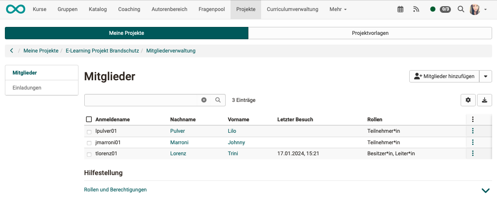

# Modul Projekte

:octicons-tag-24: Release 18.0

Administratori:innen können

* das Modul "Projekt" **aktivieren**
* **Berechtigungen** für die projektübergreifenden Rollen vergeben (Organisationsrollen)

{ class="shadow lightbox" }

## Einstellungen (Aktivierung des Moduls)

Projekte können erst erstellt werden, wenn das Modul "Projekte" durch einen/eine Administrator:in eingeschaltet wurde.

## Berechtigungen

Als Administrator:in bestimmen Sie, ob **alle registrierten OpenOlat-Benutzer:innen** oder nur **bestimmte Rollen** neue Projekte und Projektvorlagen erstellen dürfen. 

Sollen nur bestimmte Rollen dieses Recht erhalten, können diese genauer spezifiziert werden.

## Rollen

Als Administrator:in sehen Sie hier neben den **Autor:innen** nur die beiden Systemrollen **Projektverwalter:in** und **Administrator:in**, weil es Rollen sind, die über mehrere Projekte hinweg agieren können (Organisationsrollen).

Die übrigen Rollen und ihre Rechte werden im jeweiligen Projekt bestimmt.

## Rollen, projektübergreifend

**Projektverwalter:in**

* Projektverwalter:innen können alle Projekte sehen, aktualisieren und verwalten, inklusive deren Mitglieder. 
* Sie sehen aber nicht den "Inhalt" der Projekte (Termine, Dateien, To-dos, usw.). 
* Sie sind neben den Besitzer:innen und den Administrator:innnen diejenigen Personen, die die Leitungsrolle an andere vergeben können. 
* Sie haben Zugriff auf den Tab "Administration" im Bereich Projekte.

**Administrator:in**

* Die systemweit gültige Rolle der Administratorin / des Administrators hat auf Projekte nur einen eingeschränkten Zugriff. Administrator:innen haben nur Einblick in ein Projekt, wenn sie auch Mitglied im Projekt sind. 
* Administrator:innen können sich zwar selbst zum Mitglied machen, aber das ist dann protokolliert. Auf diese Art soll missbräuchlicher Zugriff eingedämmt werden.

## Rollen, projektspezifisch

Innerhalb eines Projektes können verschiedene Rollen vergeben werden, die nur für das jeweilige Projekt gelten.

{ class="shadow lightbox" }

**Besitzer:in (Projektbesitzer:in)**

* Projektbesitzer:in ist die Person, die ein neues Projekt anlegt.
* Sie hat alle Schreib- und Leserechte im Projekt, inkl. dem Recht zur Löschung.

**Leiter:in (Projektleiter:in)**

* Projektleiter:innen haben wie die Projektbesitzer:innen alle Schreib- und Leserechte in ihrem Projekt.

**Projektbüro**

* Mitglieder des Projektbüros sind mit organisatorischen Aufgaben betraut und haben deshalb weitgehende Schreib- und Löschrechte, ausser beim Projekt selbst.
* Es handelt sich um eine Aufgabe/Rolle im Projektmanagement, keine OpenOlat-Rolle mit bestimmten Rechten.

**Teilnehmer:in (Projektmitarbeiter:in)**

* Der Begriff **Teilnehmer:in** zeigt die Analogie zu Kursteilnehmer:innen.
* Projektmitarbeiter:innen können Termine, To-dos, Dateien usw. erstellen (alle Objekttypen in einem Projekt).
* Sie haben jedoch nur Leserecht was die Projektmitarbeiter und das Gesamtprojekt angeht.

**Business-Analyst:in/Lieferant:in**

* Business-Analyst:in/Lieferant:in ist eine Rolle im Projektmanagement, keine OpenOlat-Rolle mit bestimmten Rechten.

**Sponsor/Auftraggeber**

* Sponsor ist eine Rolle im Projektmanagement, keine OpenOlat-Rolle mit bestimmten Rechten.
* Sponsoren sind nicht operativ tätig und haben deshalb in OpenOlat nur Leserecht.

**Lenkungsausschuss**

* Der Lenkungsausschuss wird auch bezeichnet als Steering Committee, Steering Board, Steuerungsausschuss, Lenkungskreis, Steuerungskreis, Controlboard oder Entscheidungsgremium.
* Es ist eine Rolle im Projektmanagement, keine OpenOlat-Rolle mit bestimmten Rechten.
* Mitglieder des Lenkungsausschusses sind nicht operativ tätig und haben deshalb in OpenOlat nur Leserecht.

## Projektmitglieder

Die Projektmitglieder werden in der Regel durch die Projektleiter:innen zu Projektmitgliedern gemacht. (In der Regel liegt die Projektleitung bei der Person, die das neue Projekt anlegt.) Dabei wird auch die Rolle im Projekt zugewiesen.

Sobald ein Projektmitglied erfasst ist, erhält es einen Link. Nach Aufruf des Links führt ein Wizard das neue Projektmitglied durch Anmeldung und Registration.

{ class="shadow lightbox" }

{ class="shadow lightbox" }

## Externe Mitglieder

Sollen auch Personen im Projekt mitarbeiten, die nicht in OpenOlat als Benutzer registriert sind, können sie als externe Mitglieder eingeladen werden.

{ class="shadow lightbox" }

!!! info "Hinweis"

    "Externes Mitglied" ist keine Rolle. Ein externes Mitglied kann alle Rollen erhalten, ausser Besitzer und Kursbesitzer (Rollen, mit denen das ganze Projekt gelöscht werden kann). 
