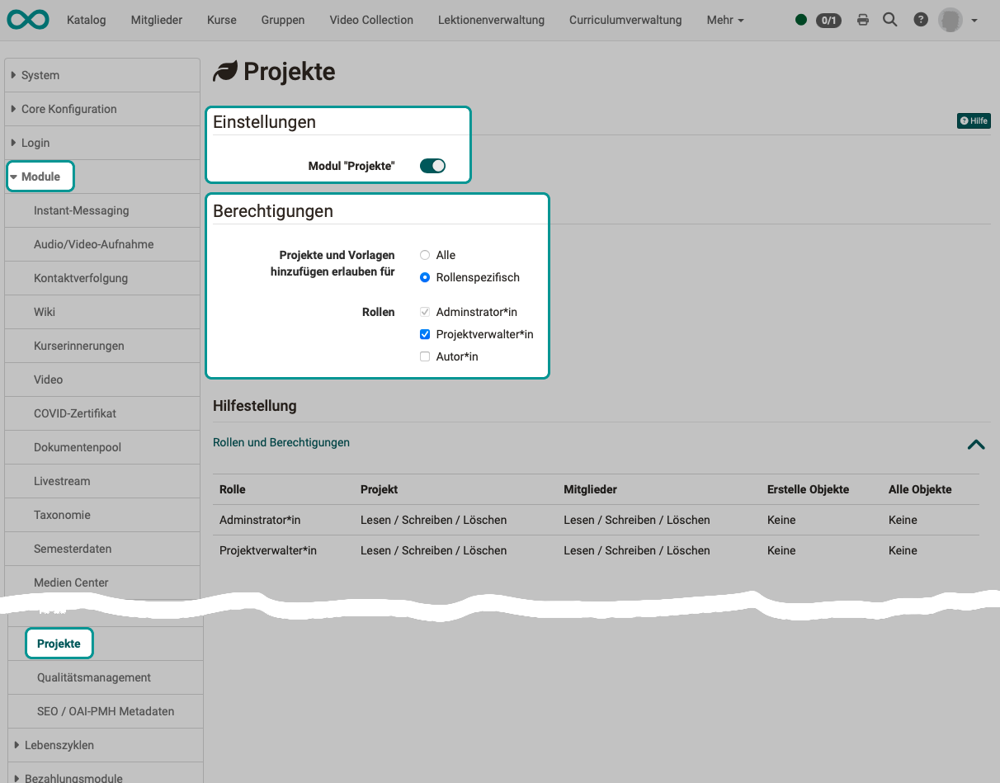
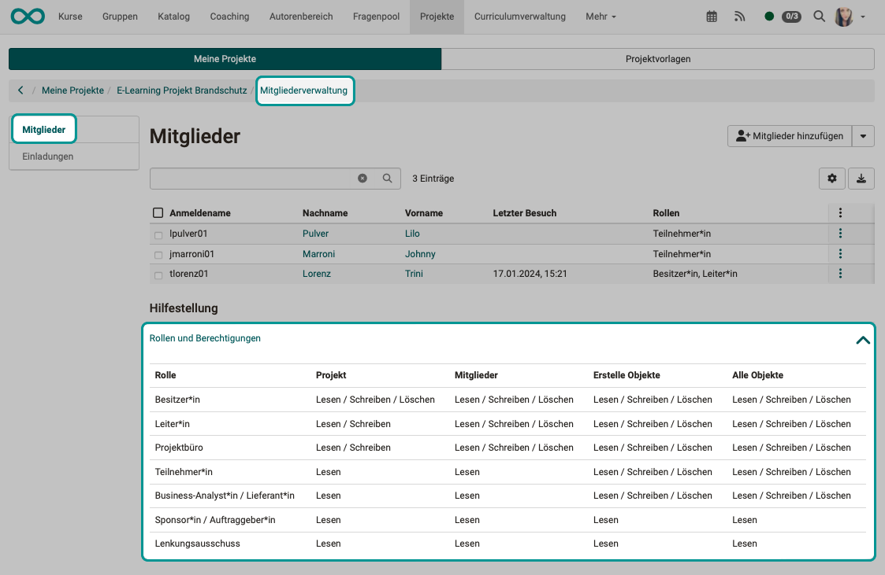
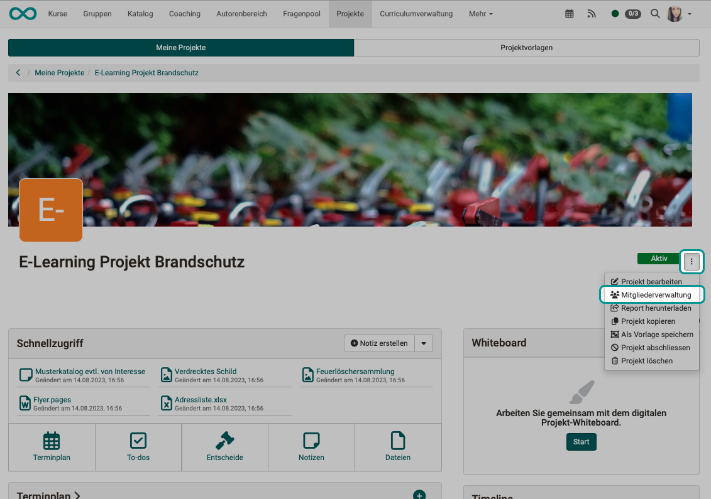
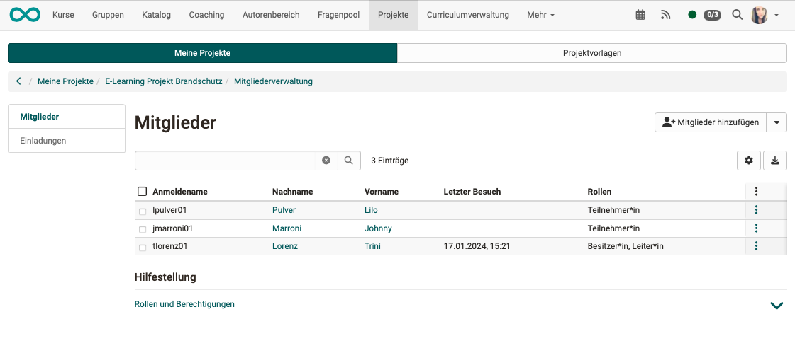
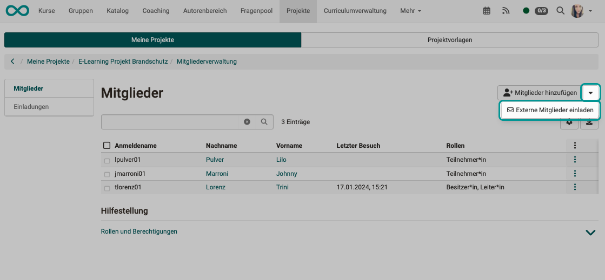

# Module Projects

:octicons-tag-24: Release 18.0

Administrators can

* **activate** the module "Projects"
* Assign **authorizations** for the cross-project roles (Organizational roles)

{ class="shadow lightbox" }

## Settings (activation of the module)

Projects can only be created once the "Projects" module has been activated by an administrator.

## Authorizations

As an administrator, you determine whether **all registered OpenOlat users** or only **specific roles** are allowed to create new projects and project templates.

If only certain roles are to receive this right, these can be specified in more detail.

## Roles

As an administrator, you will only see the two system roles **Project administrator** and **Administrator** in addition to the **Authors**, because these are roles that can act across several projects (organizational roles).

The other roles and their rights are determined in the respective project.

## Roles, cross-project

**Project manager**

* Project administrators can view, update and manage all projects, including their members.
* However, you do not see the "content" of the projects (appointments, files, to-dos, etc.).
* In addition to the owners and administrators, they are the people who can assign the management role to others.
* You have access to the "Administration" tab in the Projects area.

**Administrator**

* The system-wide administrator role only has limited access to projects. Administrators only have access to a project if they are also a member of the project.
* Administrators can make themselves a member, but this is then logged. This is intended to curb abusive access.

## Roles, project-specific

Within a project, various roles can be assigned that only apply to the respective project.

{ class="shadow lightbox" }

**Owner (Project owner)**

* Project owner is the person who creates a new project.
* They have all write and read rights in the project, including the right to delete.

**Manager (project manager)**

* Project managers, like project owners, have all write and read rights in their project.

**Project office**

* Members of the project office are entrusted with organizational tasks and therefore have extensive writing and deletion rights, except for the project itself.
* This is a task/role in project management, not an OpenOlat role with specific rights.

**Participant (project member)**

* The term **participant** shows the analogy to course participants.
* Project team members can create appointments, to-dos, files, etc. (all object types in a project).
* However, they only have read-only rights for the project team members and the overall project.

**Business analyst/Supplier**

* Business analyst/supplier is a role in project management, not an OpenOlat role with specific rights.

**Sponsor/Client**

* Sponsor is a role in project management, not an OpenOlat role with specific rights.
* Sponsors are not operationally active and therefore only have read-only rights in OpenOlat.

**Steering Committee**

* The steering committee is also known as the steering committee, steering board, steering committee, steering group, control board or decision-making body.
* It is a role in project management, not an OpenOlat role with specific rights.
* Members of the Steering Committee are not operationally active and therefore only have read-only rights in OpenOlat.

## Project members

The project members are usually made project members by the project manager. (As a rule, the project manager is the person who creates the new project). The role in the project is also assigned.

As soon as a project member is registered, they receive a link. After clicking on the link, a wizard guides the new project member through the login and registration process.

{ class="shadow lightbox" }

{ class="shadow lightbox" }

## External members

If people who are not registered as users in OpenOlat are also to work on the project, they can be invited as external members. The usage period is for them limited to 180 days.

{ class="shadow lightbox" }

!!! info "Note"

    "External member" is not a role. An external member can have all roles except owner and course owner (roles that can be used to delete the entire project).

