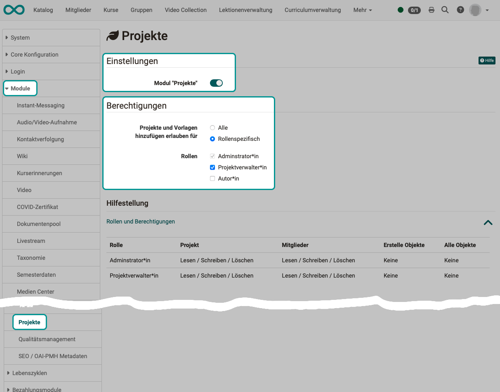
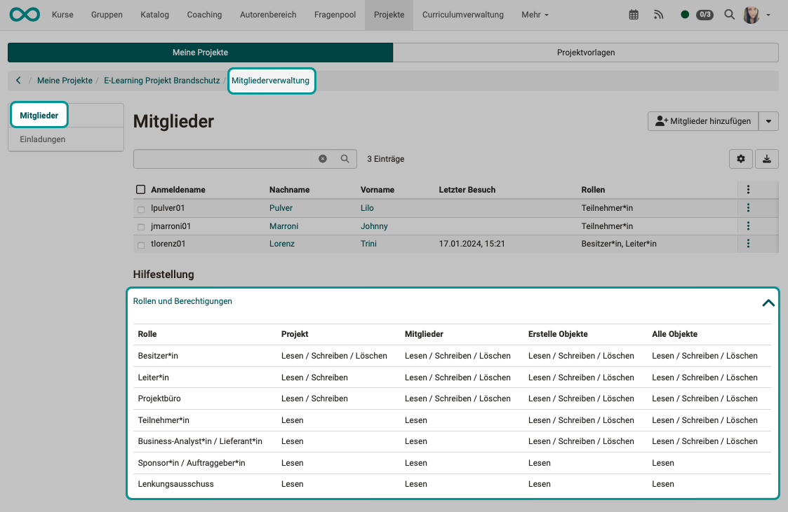
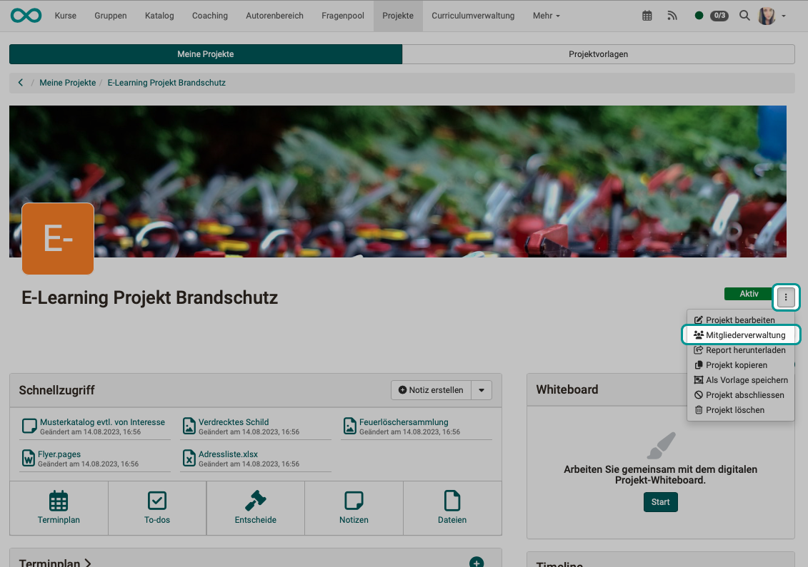
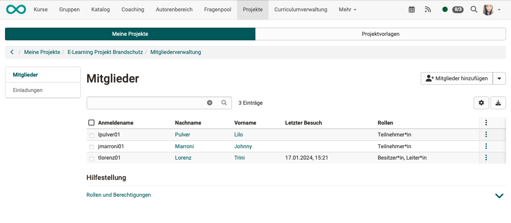
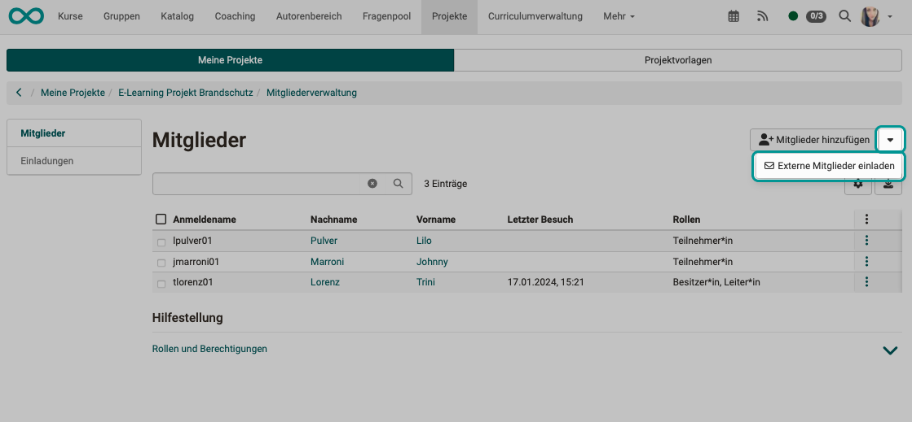

# Module Projects {: #module_projects}

[:octicons-tag-16:{ title="from Release 18.0 (OO-6845)" }](https://track.frentix.com/issue/OO-6845)

Administrators can

* **activate** the "Projects" module
* assign **authorizations** for the cross-project roles (organizational roles)

{ class="shadow lightbox" }

## Settings (activation of the module) {: #settings}

Projects can only be created once the "Projects" module has been switched on by an administrator.

## Authorizations {: #authorization}

As an administrator, you determine whether **all registered OpenOlat users** or only **specific roles** are allowed to create new projects and project templates.

If only specific roles are to receive this right, they can be specified in more detail.

## Roles {: #roles}

As an administrator, you see here, besides the **authors**, only the two system roles **Project manager** and **Administrator**, because these are roles that can act across several projects (organizational roles).

The other roles and their rights are determined in the respective project.

## Roles, cross-project {: #roles_cross_project}

**Project manager**

* Project managers can see, update and manage all projects, including their members.
* However, they do not see the "content" of the projects (appointments, files, to-dos, etc.).
* Besides the owners and the administrators, they are the people who can assign the leader role to others.
* They have access to the "Administration" tab in the projects area.

**Administrator**

* The system-wide administrator role has only limited access to projects. Administrators only have insight into a project if they are also a member of the project.
* Administrators can make themselves a member, but this is then logged. This is intended to curb abusive access.

## Roles, project-specific {: #roles_specific}

Within a project, various roles can be assigned that only apply to the respective project.

{ class="shadow lightbox" }

**Owner (Project owner)**

* The owner is the person who creates a new project.
* They have all write and read rights in the project, including the right to delete it.

**Leader (Project leader)**

* Like the owners, leaders have full write, read and delete rights within the project. Unlike the owners, however, they may not delete the entire project.

**Project office**

* Members of the project office are entrusted with organizational tasks and therefore have extensive write and delete rights, except for the project itself.
* This is a task/role in project management, however, the right to delete the entire project does not exist.

**Participant (Project team member)**

* The term **participant** shows the analogy to course participants.
* Participants can create appointments, to-dos, files, etc. (all object types in a project).
* For the members and for the entire project, however, they only have read rights.

**Business analyst / Supplier**

* Business analyst / Supplier is a role in project management that has permission to read, write, and delete objects. For the project itself and its members, only read access is granted.

**Sponsor / Client**

* Sponsor / Client is a role in project management.
* Sponsors are not operationally active and therefore only have read rights in OpenOlat.

**Steering committee**

* The steering committee is also known as Steering Committee, Steering Board, Steuerungsausschuss, Lenkungskreis, Steuerungskreis, Control Board or decision-making body.
* It is a role in project management.
* Members of the steering committee are not operationally active and therefore only have read rights in OpenOlat.

## Project members {: #project_members}

Project members are usually made project members by the leaders. (As a rule, the project leadership lies with the person who creates the new project.) The role in the project is assigned at the same time.

As soon as a project member is registered, they receive a link. After opening the link, a wizard guides the new project member through login and registration.

{ class="shadow lightbox" }

{ class="shadow lightbox" }

## External members {: #external_members}

If people who are not registered as users in OpenOlat are also to work on the project, they can be invited as external members. Their usage period is limited to 180 days.

{ class="shadow lightbox" }

!!! info "Note"

    "External member" is not a role. An external member can have every role in the project except owner. Only owners may delete the entire project, and this right stays reserved for registered OpenOlat users.
