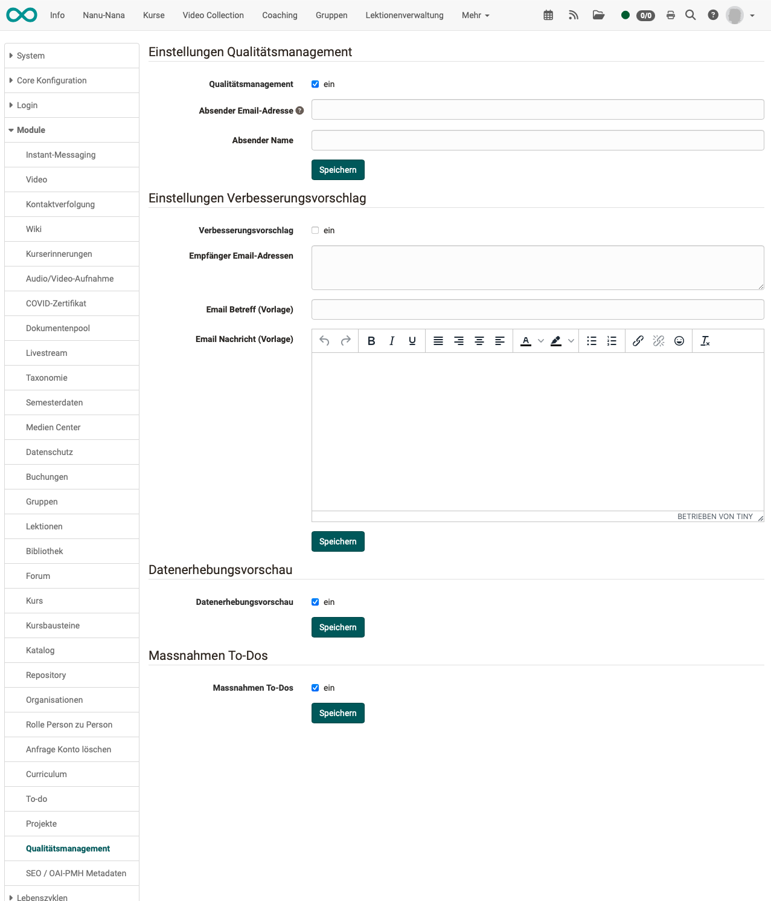

# Modul Qualitätsmanagement {: #Modules_Quality_Management}

Das Modul "Qualitätsmanagement" ist ein Zusatzmodul. 
Es muss zunächst von einem/einer Administrator:in aktiviert werden.

Die Konfiguration des Moduls kann von Administrator:innen vorgenommen werden unter 
**Administration > Module > Qualitätsmanagement**.

{ class="shadow lightbox" }

## Einstellungen Qualitätsmanagement

Mit der ersten Checkbox wird das gesamte Modul aktiviert.

Die optionale Mailadresse kann für eine individuelle Anpassung verwendet werden: 
Bei jeder Datenerhebung wird definiert, an wen Mails automatisch verschickt werden.
Die Mails werden grundsätzlich von OpenOlat mit der Standardadresse (no-reply) verschickt.
Durch Angabe einer anderen E-Mail in diesem Abschnitt, kann diese Adresse übersteuert werden.

## Einstellungen Verbesserungsvorschlag

Wird die Option aktiviert, wird unter dem Menüpunkt Qualitätsmanagment die Option zur Erstellung von Verbesserungsvorschlägen angzeigt. Die dort erstellten Mails werden an die hier angegebene Mailadresse geschickt.

## Datenerhebungsvorschau

Diese Vorschau wird nach der Aktivierung angezeigt

* in Kursen
* in Curricula
* im Modul "Qualitätsmanagement"

Wird die Option aktiviert, ist für Kursbesitzer:innen im Menü der Kursadministration die Option "Datenerhebungsvorschau" angezeigt. Dort können die geplanten Erhebungen eingesehen werden, die diesen Kurs betreffen. Für Kursbesitzer:innen ist diese Vorschau rein informativ. Eine Bearbeitung ist lediglich für Qualitätsmanager:innen möglich.

Siehe [Benutzerhandbuch](../../manual_user/learningresources/Data_Collection_Previews.de.md)

Ausserdem kann die Datenerhebungsvorschau in Curriculua aufgerufen werden und zeigt dort alle Erhebungen, die eines der Curriculumelemente betreffen.

Die Datenerhebungsvorschau im Modul "Qualitätsmanagement" bezieht sich auf alle geplanten Erhebungen (nicht nur auf einzelne Kurse). 

## Massnahmen To-dos

In OpenOlat können an verschiedenen Stellen To-dos erstellt werden (Projekte, Aufgaben, usw.). Im Qualitätsmanagement redet man in der Regel eher von "Massnahmen" als Reaktion auf Erkenntnisse aus einer oder mehreren Erhebungen. Technisch gesehen, handelt es sich bei "Massnahmen" aus dem QM um To-do-Objekte. 

Wird diese Option aktiviert, können Qualitätsmanager:innen To-dos (Massnahmen) erstellen.

## Aktivierung der Site

Nachdem das Modul aktiviert worden ist, muss noch unter 
**Administration > Customizing > Sites** 
die Checkbox gesetzt und die Benutzergruppe definiert werden, die die Option "Qualitätsmanagement" in der Hauptnavigation angezeigt bekommt. 