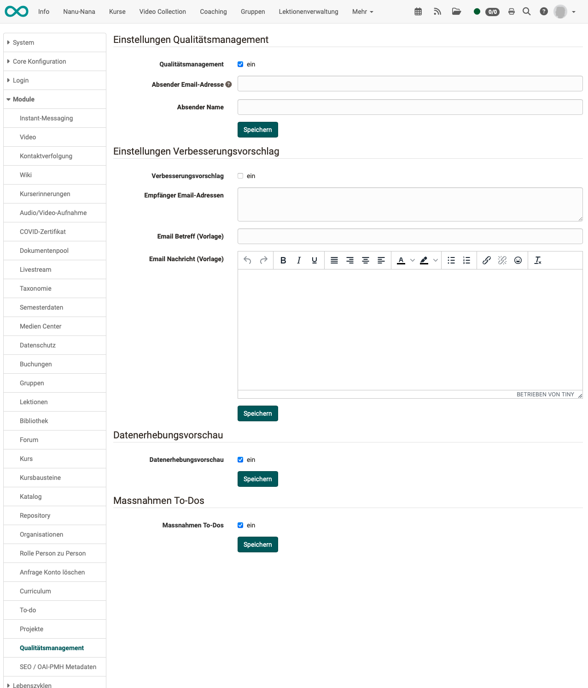

# Module Quality Management {: #Modules_Quality_Management}

The "Quality management" module is an additional module.
It must first be activated by an administrator.

The configuration of the module is carried out by administrators in the system administration under 
`Administration > Module > Quality Management`.

{ class="shadow lightbox" }

## Configuration quality management {: #settings_qm}

The entire module is activated with the first checkbox.

The optional email address can be used for individual customization: 
Each time data is collected, it is defined to whom emails are automatically sent.
The mails are always sent by OpenOlat with the standard address (no-reply).
This address can be overridden by entering a different email in this section.
The field "Sender email name" sets the name displayed for the sender.

## Configuration suggestion for improvement {: #settings_improvement}

If the option is activated, the option to create suggestions for improvement is displayed under the Quality management menu item. The emails created there are sent to the email address specified here.

## Data collection preview {: #data_collection_preview}

This preview is displayed after activation

* in courses
* in products
* in the "Quality management" module

If this option is activated, the "Data collection preview" option is displayed for course owners in the course administration menu. The planned surveys relating to this course can be viewed there. This preview is purely informative for course owners. Editing is only possible for quality managers.

See [User manual](../../manual_user/learningresources/Data_Collection_Previews.md)

In addition, the data collection preview can be called up in products and shows all surveys that relate to one of the elements.

The data collection preview in the "Quality management" module refers to all planned surveys (not just individual courses).

## Action to-dos {: #to_do}

To-dos can be created in various places in OpenOlat (projects, tasks, etc.). In quality management, we tend to talk about "measures" as a reaction to findings from a survey. Technically speaking, "measures" from QM are to-do objects.

If this option is activated, quality managers can create to-dos (measures).

## Activation of Site {: #site_activation}

After the module has been activated, the checkbox must additionally be marked in the system administration under 
`Administration > Customizing > Sites` 
and the user group must be defined for which the "Quality management" option is displayed in the main navigation.

---

## Further information {: #further_information}

**Mentioned on this page** 
[Data collection preview >](../../manual_user/learningresources/Data_Collection_Previews.md)

[To the top of the page ^](#Modules_Quality_Management)