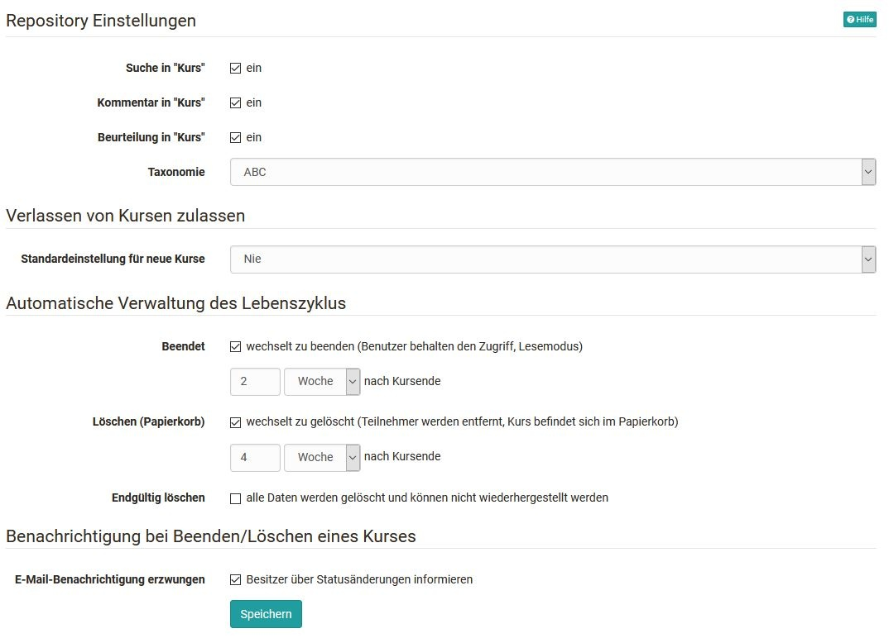
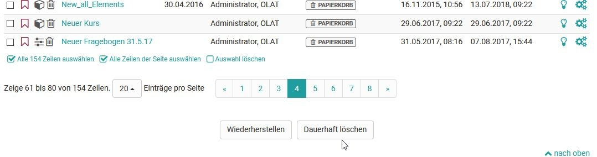

# Modul: Repository

Im Tab `Administration → Modules → Repository` können diverse Einstellungen vorgenommen werden.
Nebst allgemeinen Einstellungen zum Kurs kann hier der Lebenszyklus automatisch verwaltet werden. 

{ class="shadow lightbox" }

Wählen Sie aus, welcher Status im Lebenszyklus eines Kurses automatisch verwaltet werden soll. Anschliessend haben Sie die Möglichkeit zu definieren, in welchem Zeitraum der entsprechende Status eintreten soll. Diese Einstellung gilt dann für das gesamte System und kann nicht manuell für einzelne Kurse angepasst werden. Auch die Einstellung, dass Kurse endgültig, ohne die Möglichkeit der Widerherstellung, gelöscht werden, kann hier eingestellt werden.
Es besteht ausserdem die Möglichkeit, bei Beenden oder Löschen einer Lernressource all deren Besitzer per E-Mail darüber zu informieren.

!!! hint "Hinweis"
	Die hier vorgenommen Einstellungen gelten für das gesamte System.
	Als Administrator haben Sie zudem die Möglichkeit, Kurse, die sich im Tab "Gelöscht" befinden, definitiv zu löschen. Die Kurse sind dann nicht wiederherstellbar! 
	Rufen Sie dazu im Autorenbereich den Tab "Gelöscht" auf und wählen Sie den Button "Dauerhaft löschen" .

{ class="shadow lightbox" }
	