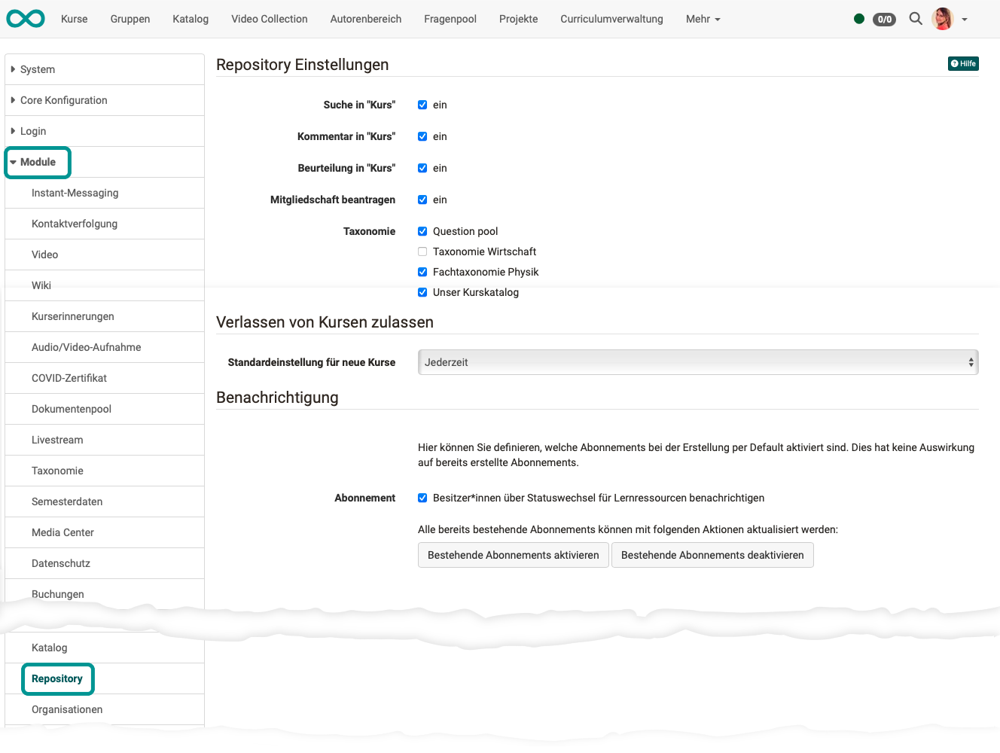
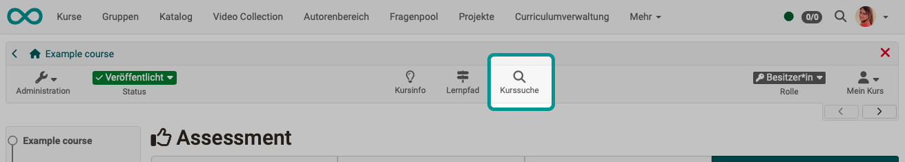
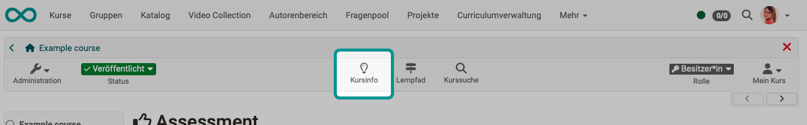
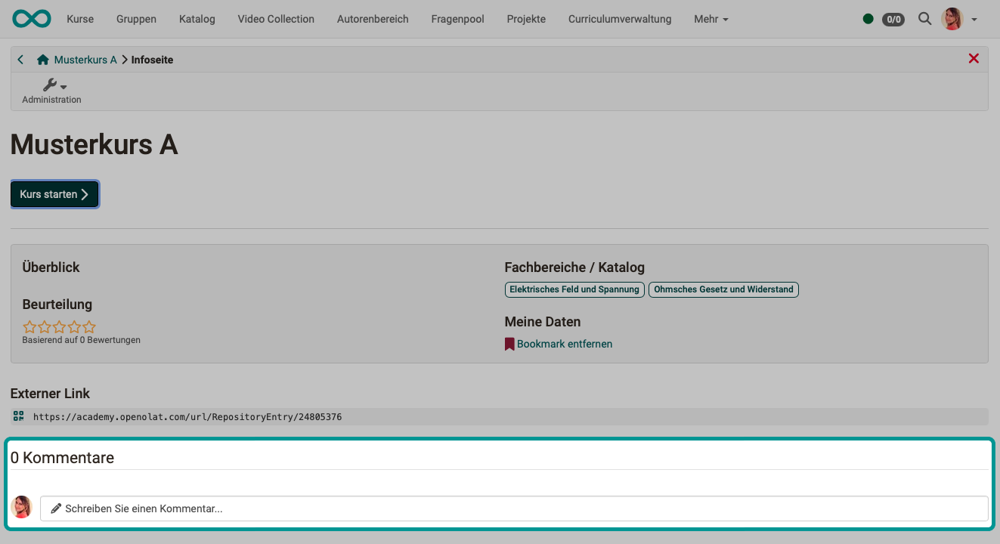
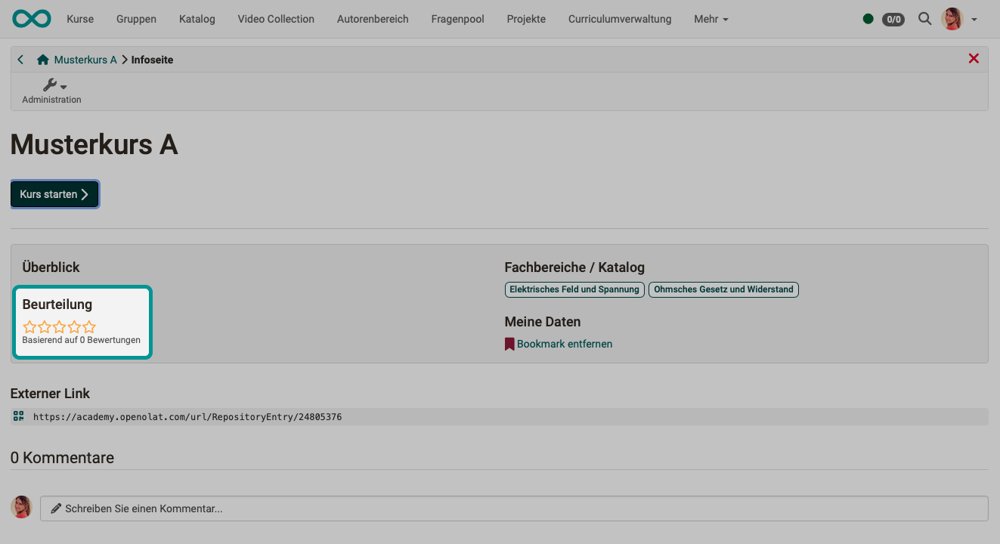
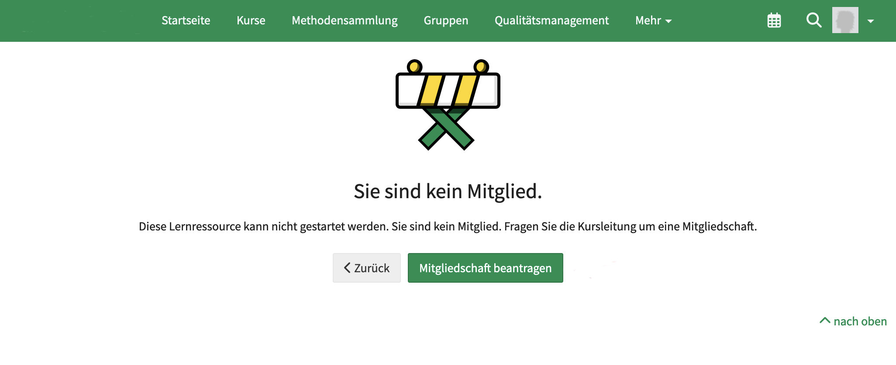

# Modul Repository {: #repository}

Zum Modul Repository gehören Einstellungen, die die Kurse und Lernressourcen betreffen, die im Repository gespeichert sind.

{ class="shadow lightbox" }

## Repository Einstellungen {: #settings}

### Suche in "Kurs"

In der Kopfzeile eines Kurses kann eine Suche im Kurs angezeigt werden.

{ class="shadow lightbox" }

Die Verfügbarkeit dieses Buttons kann von Administrator:innen hier unter **Administration > Module > Repository > Suche in "Kurs"** global ein-/ausgeschaltet werden.

[Zum Seitenanfang ^](#repository)

---

### Kommentar in "Kurs"

In der Kopfzeile eines Kurses kann die Info-Seite zum Kurs aufgerufen werden.

{ class="shadow lightbox" }

Auf der Infoseite kann dann ein Eingabefeld zur Abgabe eines Kommentars angezeigt werden.

{ class="shadow lightbox" }

Die Verfügbarkeit dieses Eingabefeldes kann von Administrator:innen hier unter **Administration > Module > Repository > Kommentar in "Kurs"** global ein-/ausgeschaltet werden.

[Zum Seitenanfang ^](#repository)

---

### Beurteilung in "Kurs"

Auf der Infoseite zu einem Kurs können ebenfalls anklickbare Sterne zur Beurteilung angezeigt werden.

{ class="shadow lightbox" }

Die Verfügbarkeit der Sterne zur Beurteilung kann von Administrator:innen hier unter **Administration > Module > Repository > Beurteilung in "Kurs"** global ein-/ausgeschaltet werden.

[Zum Seitenanfang ^](#repository)

---

### Mitgliedschaft beantragen

Wenn jemand einen Kurs öffnet, auf welchen er keinen Zugriff hat, erscheint ein Screen mit Hinweis. 
Hier gibt es einen Button, mit dem eine Mitgliedschaft beantragt werden kann. Beim Anklicken wird damit eine E-Mail an alle Kursbesitzer:innen verschickt.

{ class="shadow lightbox" }

Diese Funktion kann von Administrator:innen unter **Administration > Module > Repository > Mitgliedschaft beantragen** global ein-/ausgeschaltet werden.

[Zum Seitenanfang ^](#repository)

---

### Taxonomie

Unter **Administration > Module > Taxonomie** können verschiedene Taxonomien erstellt werden.

Die Aktivierung und Verfügbarkeit dieser Taxonomien im Repository kann hier unter **Administration > Module > Repository > Taxonomie** von Administrator:innen vorgenommen werden.

[Zum Modul Taxonomie >](Modules_Taxonomy.de.md) 
[Zum Seitenanfang ^](#repository)

---

## Verlassen von Kursen zulassen {: #allow_leaving_courses}

Mit dieser Option wird eine Standardeinstellung für alle neuen Kurse vorgegeben. (Bereits bestehende Kurse sind davon nicht betroffen.) Kursteilnehmer:innen können ggf. dann selbst entscheiden, ob sie einen Kurs verlassen möchten. D.h., sie können selbst die Mitgliedschaft in einem Kurs beenden und sich als Kursmitglied austragen.

Die Einstellung kann von Kursbesitzer:innen im Kurs unter **(Kurs-)Administration > Einstellungen > Tab Freigabe** kursspezifisch angepasst werden.

[Zum Seitenanfang ^](#repository)

---

## Benachrichtigung {: #notification}

OpenOlat kann an verschiedenen Stellen Benachrichtigungen über Ereignisse versenden. Wenn jemand die Benachrichtigungen erhalten möchte, kann dazu ein Abonnement eingerichtet werden.

Benachrichtigungen über Ereignisse im Repository betreffen aktuell (Release 19) nur das Abonnenment "**Besitzer:innen über Statuswechsel für Lernressourcen benachrichtigen**".

A) Voreinstellung 
Durch Aktivierung/Deaktivierung des Abonnements wird bestimmt, ob bei Erstellung eines neuen Kurses bzw. einer Lernressource im Repository als Default auch ein Abonnement für die beschriebene Zielgruppe eingerichtet wird. 

B) Bereits bestehende Abonnements können aktualisiert werden mit den Buttons 
"Bestehende Abonnements aktivieren" und "Bestehende Abonnements deaktivieren". 

[Zum Seitenanfang ^](#repository)

