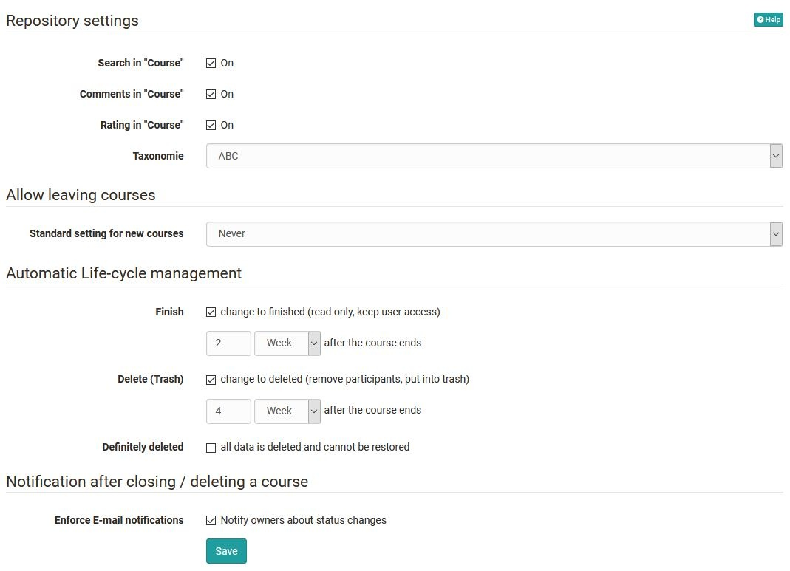
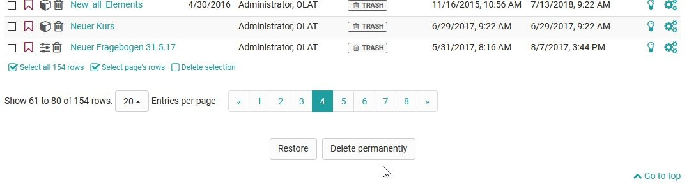

# Module Repository

In the tab `Administration → Modules → Repository` multiple settings can be made. 
Beside general settings about the course, the life cycle can be managed automatically. 

{ class="shadow lightbox" }

Select which status of the life cycle of the course should be managed automatically. Afterward you can define in which time period the corresponding status should appear. This setting is valid for the whole system and cannot be set manually for one course. The setting that courses are deleted permanently, without the possibility of recovery, can also be set here.
It is also possible to inform all owners of a learning resource by e-mail when it is closed or deleted.

!!! Hint
	The settings made here are valid for the whole system.
	Additionally as administrator you have the possibility to delete courses definitely. These courses cannot be restored anymore. 
	Therefore open the tab "Deleted" in theauthoring. Under settings you chose the action "Delete permanently".

{ class="shadow lightbox" }

