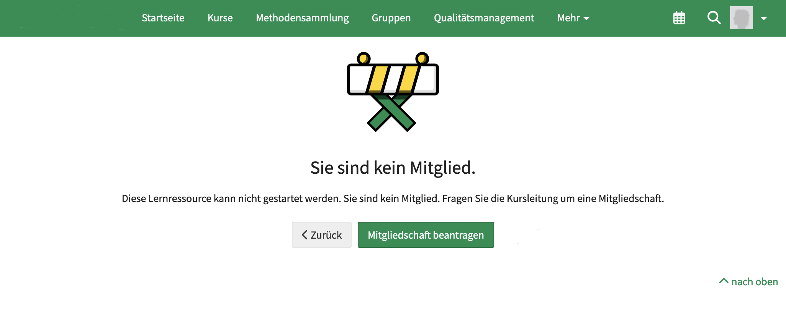

# Module Repository {: #repository}

The Repository module includes settings that affect the courses and learning resources stored in the repository.

{ class="shadow lightbox" }

## Repository Settings {: #settings}

### Search in "course"

In der Kopfzeile eines Kurses kann eine Suche im Kurs angezeigt werden.

{ class="shadow lightbox" }

The availability of this button can be switched on/off globally by administrators here under **Administration > Module > Repository > Search in "course"**.

[To the top of the page ^](#repository)

---

### Comment in "course"

The course info page can be called up in the header of a course.

{ class="shadow lightbox" }

An input field for submitting a comment can then be displayed on the info page.

{ class="shadow lightbox" }

The availability of this input field can be switched on/off globally by administrators here under **Administration > Modules > Repository > Comment in "Course"**.

[To the top of the page ^](#repository)

---

### Assessment in "Course"

Clickable stars can also be displayed on the information page for a course.

{ class="shadow lightbox" }

The availability of stars for assessment can be switched on/off globally by administrators here under **Administration > Modules > Repository > Assessment in "Course"**.

[To the top of the page ^](#repository)

---

### Request membership

If someone opens a course to which they do not have access, a screen with a note appears. 
There is a button here that can be used to apply for membership. When clicked, an e-mail is sent to all course owners.

{ class="shadow lightbox" }

This function can be switched on/off globally by administrators under **Administration > Modules > Repository > Request membership**.

[To the top of the page ^](#repository)

---

### Taxonomy

Various taxonomies can be created under **Administration > Modules > Taxonomy**.

The activation and availability of these taxonomies in the repository can be carried out here under **Administration > Modules > Repository > Taxonomy** by administrators.

[To module Taxonomy >](Modules_Taxonomy.md) 
[To the top of the page ^](#repository)

---

## Allow leaving courses {: #allow_leaving_courses}

This option specifies a default setting for all new courses. (Existing courses are not affected by this.) Course participants can then decide for themselves whether they want to leave a course. This means that they can terminate their membership of a course themselves and unsubscribe as a course member.

The setting can be adjusted by course owners in the course under **(Course) Administration > Settings > Sharing tab** on a course-specific basis.

[To the top of the page ^](#repository)

---

## Notification {: #notification}

OpenOlat can send notifications about events at various points. If someone wants to receive the notifications, a subscription can be set up.

Notifications about events in the repository currently (Release 19) only affect the subscription item "**Notify owners about status changes for learning resources**".

A) Default setting 
Activating/deactivating the subscription determines whether a subscription for the described target group is also set up by default when a new course or learning resource is created in the repository.

B) Existing subscriptions can be updated using the "Activate existing subscriptions" and "Deactivate existing subscriptions" buttons.

[To the top of the page ^](#repository)

