# Modul Taxonomie {: #module_taxonomy}

Sie finden das Modul in der System-Administration unter: 
`Administration > Module > Taxonomie`

!!! note "Was ist eine Taxonomie?"

    Im OpenOlat ist eine Taxonomie eine hierarchische Verschlagwortung,
    oftmals mit einem Kompetenzansatz.

    Taxonomie kann in mehreren OpenOlat Bereichen aktiviert und eingesetzt werden:

    * [Dokumentenpool](Modules_Document_pool.de.md)
    * [Fragenpool](../../manual_user/area_modules/Question_Bank.de.md)
    * [ePortfolio](eAssessment_ePortfolio.de.md)
    * [Katalog](Modules_Catalog_2.0.de.md)

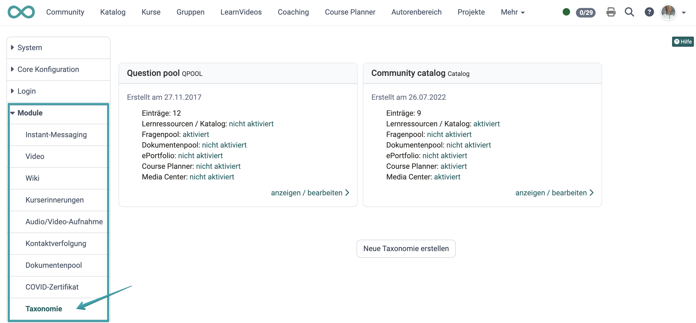{ class="shadow lightbox" }

Direkt auf der Übersichtsseite kann eine neue Taxonomiestruktur erstellt werden.

Es können mehrere Taxonomiestrukturen erstellt und für verschiedene Zwecke aktiviert
werden. Pro Taxonomie zeigt die Übersichtskarte, für welche Bereiche sie aktiviert ist:
Fragenpool, Dokumentenpool, ePortfolio, Lernressourcen / Katalog, Course Planner und
Media Center. [:octicons-tag-16:{ title="ab Release 20.3.0 (OO-9185)" }](https://track.frentix.com/issue/OO-9185){:target="_blank"}

Zum einen können also Taxonomiestrukturen beispielsweise in Form einer
 Fächer-, Handlungsfeld- oder Kompetenzstruktur abgebildet werden. Zum anderen
 können den Benutzern Kompetenzen zugeordnet werden, welche ihnen den Zugriff
 auf die Taxonomie erlauben.

**Beispiel** einer ausgearbeiteten Taxonomiestruktur, nach Fächern für den Dokumentenpool:

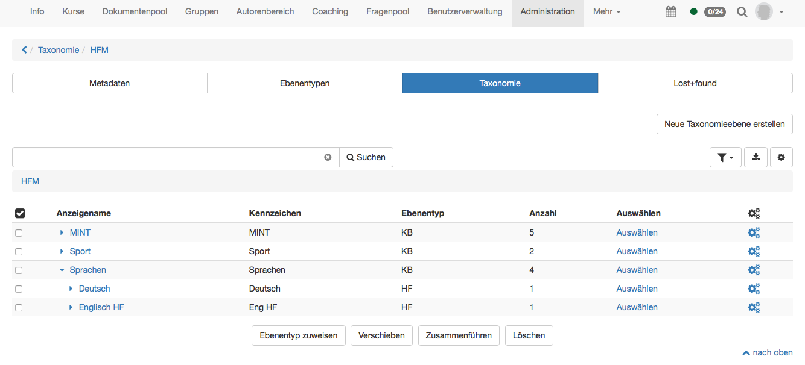{ class="shadow lightbox" }

## Metadaten {: #metadata}

Beim Erstellen werden die Metadaten Bezeichnung und Name, und falls gewünscht
die Beschreibung eingetragen. Diese Daten können anschliessend im Tab
"Metadaten" bearbeitet werden. Hier wird zudem automatisch eine ID erstellt
und sofern ein externes Verwaltungssystem die Ebenen angelegt hat, wird die
Externe ID erstellt.
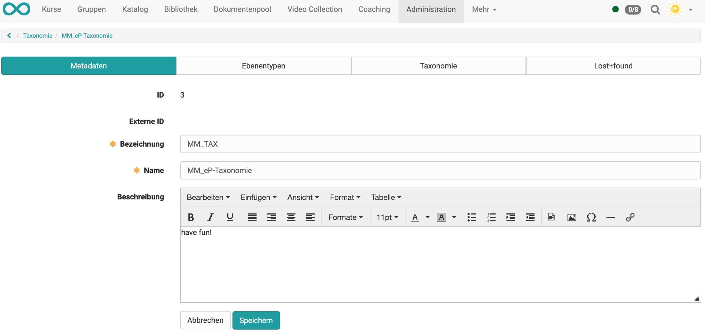{ class="shadow lightbox" }

## Ebenentypen {: #level_types}

Ebenentypen werden gebraucht, um der Taxonomiestruktur eine Bedeutung zu
geben. So können beispielsweise die Ebenentypen Kompetenz → Handlungsfeld →
Fach erstellt und untereinander als Unterkategorien angelegt werden. Es ist
dabei nicht notwendig, dass ein Ebenentyp immer an derselben Stelle oder auf
demselben Level der Taxonomiestruktur vorzufinden ist.

Zu Ebenentypen werden gewisse Konfigurationen hinzugefügt.

Im Tab "Ebenentypen" kann mit "Neuer Ebenentyp erstellen" ein neuer Typ
erstellt werden.

#### Kennzeichen {: #level_type_identifier}

Kennung für die Taxonomieebene. Dieses Kennzeichen wird in der Tabelle im Tab "Taxonomie" in der Spalte "Ebenentyp" angezeigt. Wählen Sie ein eindeutiges und logisches Kennzeichen.

#### Anzeigename {: #level_type_display_name}

Der Anzeigename ist sprachabhängig und wird an unterschiedlichen Stellen verwendet: Katalog 2.0, Dokumentenpool, e-Portfolio.

#### CSS class {: #level_type_css_class}

Sofern eine entsprechende css class im Theme hinterlegt ist, können Sie diese hier auswählen. Es können so nur Icons hinterlegt werden.

#### Sichtbar {: #level_type_visible}

Definiert, ob alle Taxonomieebenen von diesem Typ sichtbar sein sollen.

#### Kompetenzen {: #level_type_competences}

Wenn aktiviert, steht dieser Ebenentyp als Kompetenz zur Verfügung und kann z.B. zur kompetenzbasierten Verschlagwortung in ePortfolio-Einträgen genutzt werden.

#### Leistungsnachweise {: #level_type_achievements}

Hier können Taxonomieebenen mit diesem Leveltyp für die Gruppierung von Leistungsnachweisen freigeschaltet werden.

#### Beschreibung {: #level_type_description}

Eine kurze Beschreibung des Ebenentyps (optional).

#### Sub types {: #level_type_sub_types}

Aus den bereits bestehenden Ebenentypen kann nun ein Untertyp ausgewählt werden. So ist es möglich, eine hierarchische Struktur zu schaffen. Diese wird dann beim Erstellen der Taxonomieebenen sichtbar.

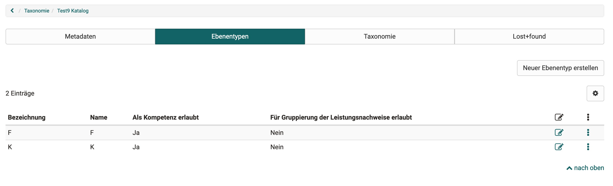{ class="shadow lightbox" }

## Taxonomie erstellen {: #taxonomy}

In diesem Tab werden nun die einzelnen Taxonomieebenen erstellt, importiert, exportiert und angezeigt.

Beim Erstellen werden folgende Angaben benötigt:

#### Pfad {: #level_path}

Mit dem Pfad kann direkt die Position der neuen Taxonomieebene definiert werden.

#### Kennzeichen {: #level_identifier}

Als Kennzeichen kann wiederum ein Kürzel für die Ebene verwendet werden.

#### Typ {: #level_type}

Beim Typ wird nun der zuvor definierte Ebenentyp ausgewählt.

#### Sortierung {: #level_sort_order}

::octicons-tag-24: *aktuell Beta Feature* Hier können Zahlen eingetragen werden, nach dem die Taxonomien sortiert werden. ( z.B. 1, 2, 3, 4, .. / 01, 02,03,04,...)

#### Teaserbild {: #level_teaser_image}

#### Hintergrundbild {: #level_background_image}

#### Anzeigename {: #level_display_name}

Der Anzeigename ist sprachabhängig und wird an unterschiedlichen Stellen verwendet: Katalog 2.0, Dokumentenpool, e-Portfolio.

#### Beschreibung {: #level_description}

Beschreibung der Taxonomieebene. Wird im Katalog unter der Ebene angezeigt.

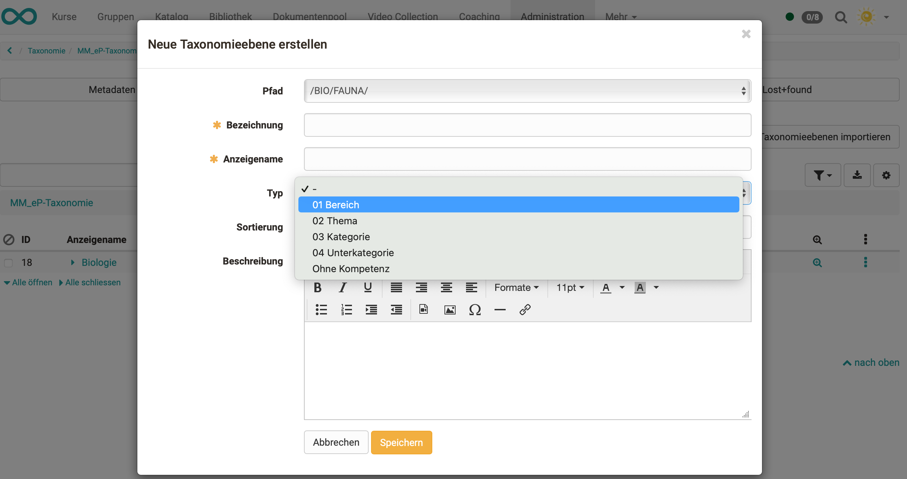{ class="shadow lightbox" }

In der Übersicht ist nun die hierarchische Struktur sichtbar.

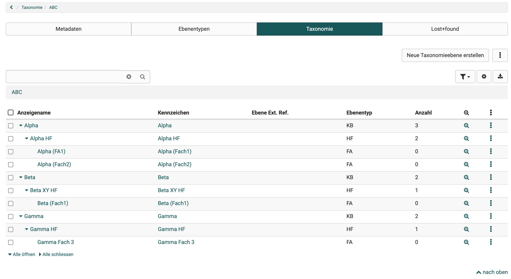{ class="shadow lightbox" }

!!! tip "Kompetenzen"
    In der Detailansicht können anschliessend Kompetenzen hinzugefügt werden. So erhalten Benutzer die "Zugriffsrechte" für die einzelnen Taxonomieebenen. 

Es werden 4 verschiedene Kompetenzen unterschieden. Diese werden im Folgenden
kurz umrissen:

* **Dozieren**: Ein Benutzer mit einer Dozierkompetenz ist in dieser Kompetenz befähigt. Meist bedeutet dies, er hat ein gewisses Fachwissen, das er weitergeben kann. Die Dozierkompetenz wird dem Benutzer entweder manuell oder durch ein externes Verwaltungssystem hinzugefügt. Diese Kompetenz steuert den Zugriff sowohl im [Dokumentenpool](Modules_Document_pool.de.md) als auch im Fragenpool.
* **Verwalten**: Benutzer können für gewisse Bereiche in der Taxonomie eine verwaltende Funktion haben. Dabei müssen Sie nicht zwingend auch die Dozierkompetenz haben. Diese Kompetenz wird vor allem im Fragenpool benutzt.
* **Haben**: Diese Kompetenz wird momentan im OpenOlat noch nicht verwendet. Diese Kompetenz sollen zukünftig Lernende durch eine Lernaktivität im OpenOlat (z.B. absolvierter Test) erhalten. Diese Kompetenz wird auch ein Verfallsdatum haben.
* **Ziel**: Ein Lernender hat ein Ziel, das er erreichen möchte. Sein Ziel ist es, diese Kompetenz zu erwerben.

!!! note "Hinweis zu Ziel"
    Diese Kompetenz wird momentan im OpenOlat noch nicht verwendet. 

### Taxonomie exportieren {: #export}

Die Taxonomie wird mit Klick auf den Menüpunkt (siehe Bild) als .zip Archiv heruntergeladen. Darin enthalten ist eine EXCEL-Tabelle mit der hierarchischen Struktur der Taxonomieebenen und eine Ordnerstruktur (media/ebene1/background;media/ebene1/teaser;) mit Teaser- und Hintergrundbildern der Taxonomie, wenn welche vorhanden sind. (mehr unter -> [Katalog 2.0](../../manual_user/area_modules/catalog2.0.de.md))
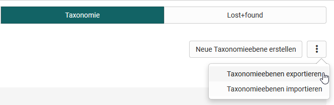{ class="shadow lightbox" }

### Taxonomie importieren {: #import}

**Daten Einfügen**

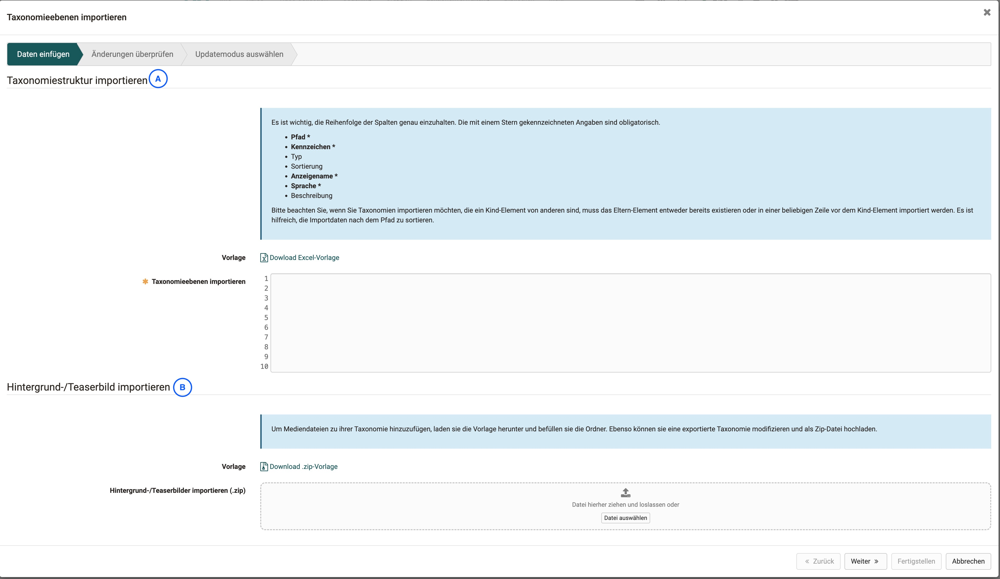{ class="shadow lightbox" }

Sie können die verschiedenen Teile der Taxonomie importieren. Möglich ist, nur die Struktur zu importieren (**A**), Bilder zu einer vorhandenen Struktur hinzuzufügen (**B**) oder eine neue Struktur inkl. Bilder zu importieren (**A+B**).

**Änderungen überprüfen**

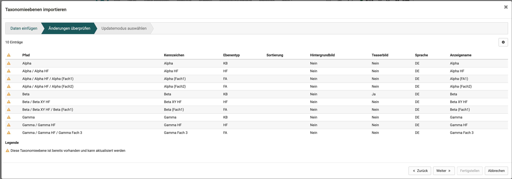{ class="shadow lightbox" }

Nach dem Import werden im zweiten Schritt die Taxonomie und die hinzugefügten Bilder nochmals überprüft. Ein Icon zeigt an, ob die Taxonomieebene bereits vorhanden ist und mit den Dateien und hochgeladen Informationen ergänzt und überschrieben werden soll.

**Updatemodus auswählen**

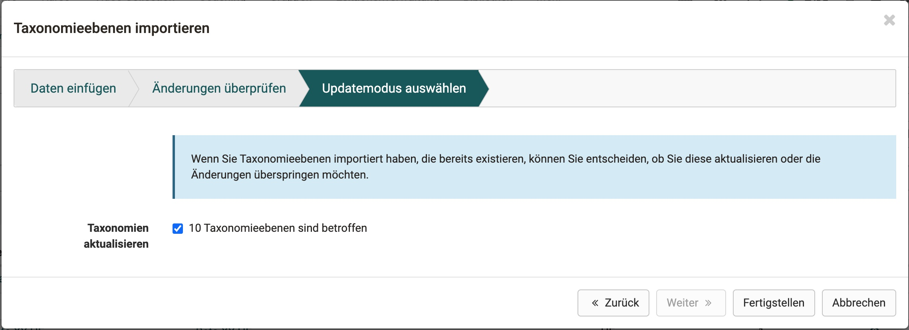{ class="shadow lightbox" }

Hier entscheiden Sie, ob Sie die existierenden Taxonomieebenen überschreiben lassen oder nur neue Taxonomieebenen hinzufügen wollen. Falls Sie Medien hinzufügen möchten, müssen Sie die Änderungen hier überschreiben lassen.

### Nur Taxonomie Struktur importieren/hinzufügen {: #import_add_structure}

1. Laden Sie die aktuelle Taxonomie herunter oder nutzen Sie die Vorlage unter dem entsprechenden Punkt

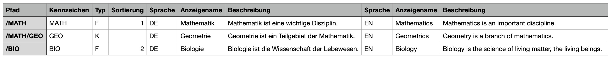{ class="shadow lightbox" }

2. In der Excel fügen Sie die neuen Ebenen hinzu oder verändern bestehende. Der Pfad muss vollständig angegeben werden. Ist dieser fehlerhaft, können gewisse Ebenen nicht importiert werden.
 Haben Sie verschiedene Sprachen in OpenOlat aktiviert und benutzen den [Katalog 2.0](../../manual_user/area_modules/catalog2.0.de.md), ist es ratsam, Anzeigename und Beschreibung sprachabhängig zu gestalten. Zusätzliche Sprachen fügen Sie hinzu, indem Sie die Spalten "Sprache", "Anzeigename" & "Beschreibung" kopieren, diese hinten anhängen und eine neue, existierende Sprache, Anzeigename + Beschreibung für jede Taxonomieebene ergänzen.

3. Die geänderte Tabelle wird _ohne_ die Kopfzeile markiert und in das Eingabefeld kopiert. Im Schritt "Änderungen überprüfen" werden die Zellen auf Richtigkeit überprüft. Bei Fehlern erscheinen die Fehlermeldungen direkt am Eingabefeld.

### Nur Hintergrund-/Teaserbild importieren/hinzufügen {: #import_add_media}

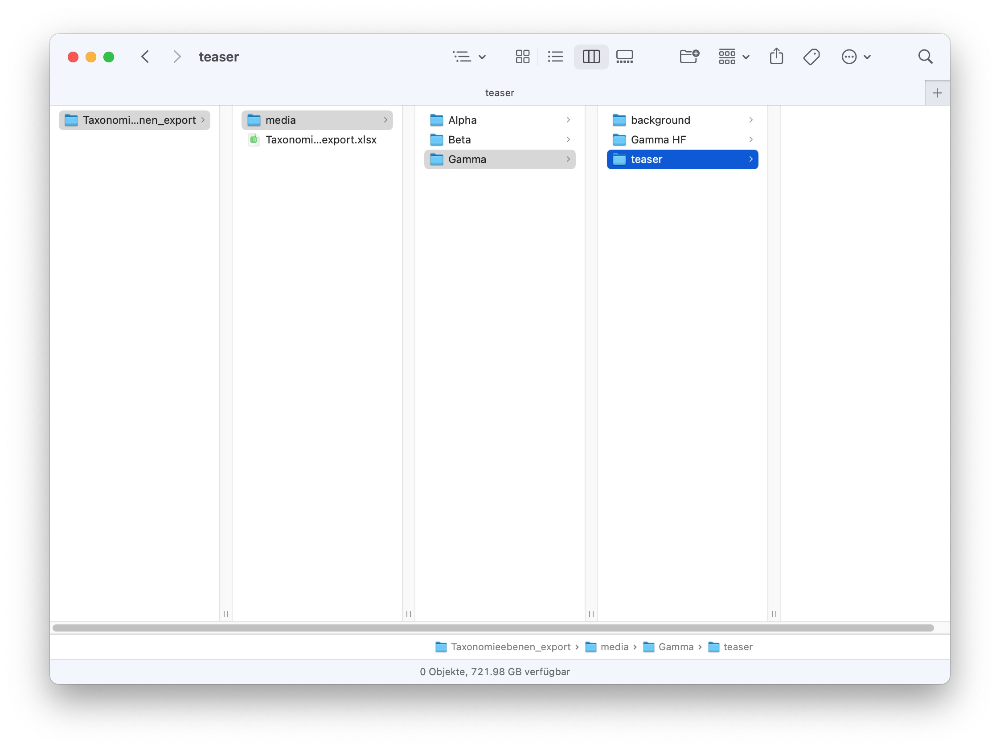{ class="shadow lightbox" }

1. Wenn Sie Hintergrundbilder zu einer existierenden Taxonomie hinzufügen möchten, exportieren Sie diese im ersten Schritt.
2. Entzippen Sie das Archiv und legen Sie die betreffenden Bilder im Ordner "media" ab.
3. Zippen Sie das gesamte Archiv wieder und fügen Sie es unter Absatz B im Wizard ein.

Alternativ ist es auch möglich, die vorhandenen Vorlagen unter den jeweiligen Links herunterzuladen und diese entsprechend anzupassen.

## Lost+Found {: #lost_found}
**Letzter Tab in der Übersicht**

Hier werden alle gelöschten Elemente aus dem Tab "Taxonomie" abgelegt.

!!! note "Hinweis"
    Gelöschte Objekte können momentan nicht wiederhergestellt werden.

## Weiterführende Informationen {: #further_information}

**Auf dieser Seite erwähnt** 
[Dokumentenpool >](Modules_Document_pool.de.md) 
[Fragenpool >](../../manual_user/area_modules/Question_Bank.de.md) 
[ePortfolio >](eAssessment_ePortfolio.de.md) 
[Katalog >](Modules_Catalog_2.0.de.md) 
[Katalog 2.0 >](../../manual_user/area_modules/catalog2.0.de.md)

**Weiterführend** 
[Media Center >](Modules_Media_Center.de.md) 
[Course Planner >](Modules_Course_Planner.de.md)

[Zum Seitenanfang ^](#module_taxonomy)