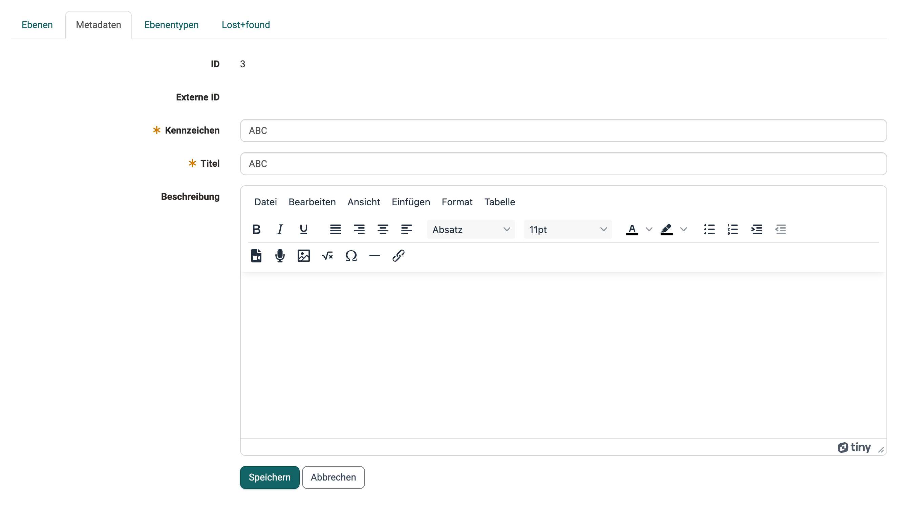
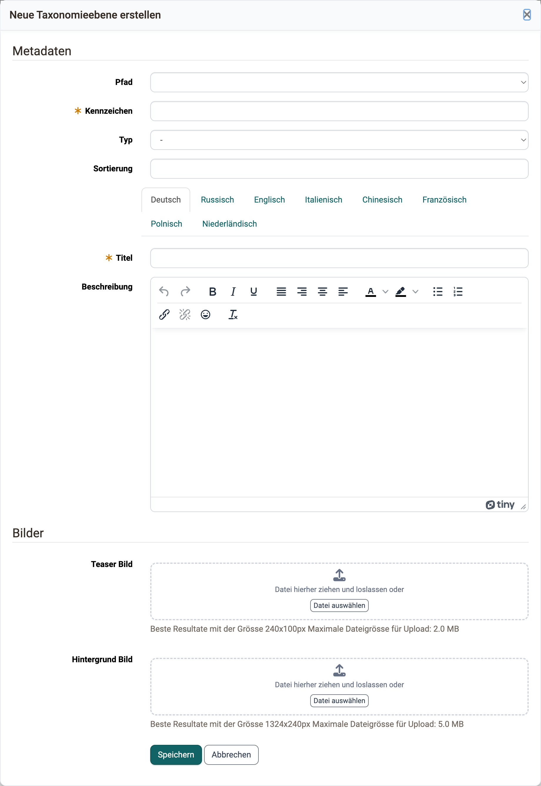
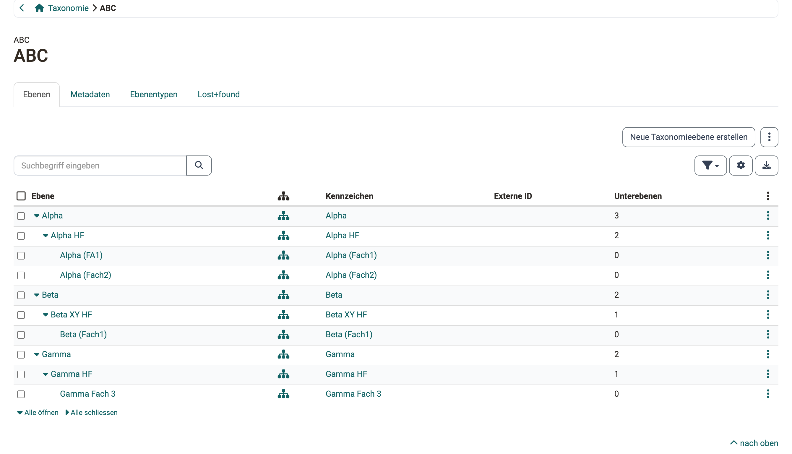

# Modul Taxonomie {: #module_taxonomy}

Sie finden das Modul in der System-Administration unter: 
`Administration > Module > Taxonomie`

!!! note "Was ist eine Taxonomie?"

    Im OpenOlat ist eine Taxonomie eine hierarchische Verschlagwortung,
    oftmals mit einem Kompetenzansatz.

    Taxonomie kann in mehreren OpenOlat Bereichen aktiviert und eingesetzt werden:

    * [Dokumentenpool](Modules_Document_pool.de.md)
    * [Fragenpool](../../manual_user/area_modules/Question_Bank.de.md)
    * [ePortfolio](eAssessment_ePortfolio.de.md)
    * [Katalog](Modules_Catalog_2.0.de.md)

{ class="shadow lightbox" }

Direkt auf der Übersichtsseite kann eine neue Taxonomiestruktur erstellt werden.

Es können mehrere Taxonomiestrukturen erstellt und für verschiedene Zwecke aktiviert
werden. Die Übersicht zeigt je Taxonomie, für welche Bereiche sie aktiviert ist:
Lernressourcen / Katalog, Fragenpool, Dokumentenpool, ePortfolio, Course Planner und
Media Center. [:octicons-tag-16:{ title="ab Release 20.3.0 (OO-9185)" }](https://track.frentix.com/issue/OO-9185){:target="_blank"}

Zum einen können also Taxonomiestrukturen beispielsweise in Form einer
 Fächer-, Handlungsfeld- oder Kompetenzstruktur abgebildet werden. Zum anderen
 können den Benutzer:innen Kompetenzen zugeordnet werden, welche ihnen den Zugriff
 auf die Taxonomie erlauben.

**Beispiel** einer ausgearbeiteten Taxonomiestruktur, nach Fächern für den Dokumentenpool:

{ class="shadow lightbox" }

## Metadaten {: #metadata}

Beim Erstellen werden die Metadaten Kennzeichen und Titel, und falls gewünscht
die Beschreibung eingetragen. Diese Daten können anschliessend im Tab
"Metadaten" bearbeitet werden. Hier wird zudem automatisch eine ID erstellt
und sofern ein externes Verwaltungssystem die Ebenen angelegt hat, wird die
Externe ID erstellt.
{ class="shadow lightbox" }

## Ebenentypen {: #level_types}

Ebenentypen werden gebraucht, um der Taxonomiestruktur eine Bedeutung zu
geben. So können beispielsweise die Ebenentypen Kompetenz → Handlungsfeld →
Fach erstellt und untereinander als Unterkategorien angelegt werden. Es ist
dabei nicht notwendig, dass ein Ebenentyp immer an derselben Stelle oder auf
derselben Ebene der Taxonomiestruktur vorzufinden ist.

Zu Ebenentypen werden gewisse Konfigurationen hinzugefügt.

Im Tab "Ebenentypen" kann mit "Neuer Ebenentyp erstellen" ein neuer Typ
erstellt werden.

#### Kennzeichen {: #level_type_identifier}

Kennung für die Taxonomieebene. Dieses Kennzeichen wird in der Tabelle im Tab "Ebenen" in der Spalte "Ebenentyp" angezeigt. Die Spalte ist nicht voreingestellt, Sie blenden sie über das Zahnrad über der Tabelle unter "Spalten auswählen" ein. Wählen Sie ein eindeutiges und logisches Kennzeichen.

#### Titel {: #level_type_display_name}

Der Titel ist sprachabhängig und wird an unterschiedlichen Stellen verwendet: Katalog 2.0, Dokumentenpool, e-Portfolio.

#### CSS class {: #level_type_css_class}

Sofern eine entsprechende css class im Theme hinterlegt ist, können Sie diese hier auswählen. Es können so nur Icons hinterlegt werden.

#### Sichtbar {: #level_type_visible}

Definiert, ob alle Taxonomieebenen von diesem Typ sichtbar sein sollen.

#### Kompetenzen {: #level_type_competences}

Wenn aktiviert, steht dieser Ebenentyp als Kompetenz zur Verfügung und kann z.B. zur kompetenzbasierten Verschlagwortung in ePortfolio-Einträgen genutzt werden.

#### Leistungsnachweise {: #level_type_achievements}

Hier können Taxonomieebenen mit diesem Ebenentyp für die Gruppierung von Leistungsnachweisen freigeschaltet werden.

#### Beschreibung {: #level_type_description}

Eine kurze Beschreibung des Ebenentyps (optional).

#### Untertypen {: #level_type_sub_types}

Aus den bereits bestehenden Ebenentypen kann nun ein Untertyp ausgewählt werden. So ist es möglich, eine hierarchische Struktur zu schaffen. Diese wird dann beim Erstellen der Taxonomieebenen sichtbar.

{ class="shadow lightbox" }

## Taxonomie erstellen {: #taxonomy}

In diesem Tab werden nun die einzelnen Taxonomieebenen erstellt, importiert, exportiert und angezeigt.

Beim Erstellen werden folgende Angaben benötigt:

#### Pfad {: #level_path}

Mit dem Pfad kann direkt die Position der neuen Taxonomieebene definiert werden.

#### Kennzeichen {: #level_identifier}

Als Kennzeichen kann wiederum ein Kürzel für die Ebene verwendet werden.

#### Typ {: #level_type}

Beim Typ wird nun der zuvor definierte Ebenentyp ausgewählt.

#### Sortierung {: #level_sort_order}

*Aktuell Beta Feature.* Hier können Zahlen eingetragen werden, nach dem die Taxonomien sortiert werden. ( z.B. 1, 2, 3, 4, .. / 01, 02, 03, 04, ...)

#### Teaser Bild {: #level_teaser_image}

Das Bild wird als Datei hochgeladen. Beste Resultate mit der Grösse 240x100px, maximal 2 MB.

#### Hintergrund Bild {: #level_background_image}

Das Bild wird als Datei hochgeladen. Beste Resultate mit der Grösse 1324x240px, maximal 5 MB.

#### Titel {: #level_display_name}

Der Titel ist sprachabhängig und wird an unterschiedlichen Stellen verwendet: Katalog 2.0, Dokumentenpool, e-Portfolio.

#### Beschreibung {: #level_description}

Beschreibung der Taxonomieebene. Wird im Katalog unter der Ebene angezeigt.

{ class="shadow lightbox" }

In der Übersicht ist nun die hierarchische Struktur sichtbar.

{ class="shadow lightbox" }

!!! tip "Kompetenzen"
    In der Detailansicht können anschliessend Kompetenzen hinzugefügt werden. So erhalten Benutzer:innen die "Zugriffsrechte" für die einzelnen Taxonomieebenen. 

Es werden 4 verschiedene Kompetenzen unterschieden. Diese werden im Folgenden
kurz umrissen:

* **Dozieren**: Eine Benutzer:in mit einer Dozierkompetenz ist in dieser Kompetenz befähigt. Meist bedeutet dies, sie hat ein gewisses Fachwissen, das sie weitergeben kann. Die Dozierkompetenz wird der Benutzer:in entweder manuell oder durch ein externes Verwaltungssystem hinzugefügt. Diese Kompetenz steuert den Zugriff sowohl im [Dokumentenpool](Modules_Document_pool.de.md) als auch im Fragenpool.
* **Verwalten**: Benutzer:innen können für gewisse Bereiche in der Taxonomie eine verwaltende Funktion haben. Dabei müssen sie nicht zwingend auch die Dozierkompetenz haben. Diese Kompetenz wird vor allem im Fragenpool benutzt.
* **Haben**: Diese Kompetenz wird momentan im OpenOlat noch nicht verwendet. Diese Kompetenz sollen zukünftig Lernende durch eine Lernaktivität im OpenOlat (z.B. absolvierter Test) erhalten. Diese Kompetenz wird auch ein Verfallsdatum haben.
* **Ziel**: Ein Lernender hat ein Ziel, das er erreichen möchte. Sein Ziel ist es, diese Kompetenz zu erwerben.

!!! note "Hinweis zu Ziel"
    Diese Kompetenz wird momentan im OpenOlat noch nicht verwendet. 

### Taxonomie exportieren {: #export}

Die Taxonomie wird mit Klick auf den Menüpunkt (siehe Bild) als .zip Archiv heruntergeladen. Darin enthalten ist eine EXCEL-Tabelle mit der hierarchischen Struktur der Taxonomieebenen und eine Ordnerstruktur (media/ebene1/background;media/ebene1/teaser;) mit Teaser- und Hintergrundbildern der Taxonomie, wenn welche vorhanden sind. (mehr unter -> [Katalog 2.0](../../manual_user/area_modules/catalog2.0.de.md))
{ class="shadow lightbox" }

### Taxonomie importieren [:octicons-tag-16:{ title="ab Release 15.4 (OO-5177)" }](https://track.frentix.com/issue/OO-5177){:target="_blank"} {: #import}

**Daten Einfügen**

{ class="shadow lightbox" }

Sie können die verschiedenen Teile der Taxonomie importieren. Möglich ist, nur die Struktur zu importieren (**A**), Bilder zu einer vorhandenen Struktur hinzuzufügen (**B**) oder eine neue Struktur inkl. Bilder zu importieren (**A+B**).

**Änderungen überprüfen**

{ class="shadow lightbox" }

Nach dem Import werden im zweiten Schritt die Taxonomie und die hinzugefügten Bilder nochmals überprüft. Ein Icon zeigt an, ob die Taxonomieebene bereits vorhanden ist und mit den Dateien und hochgeladen Informationen ergänzt und überschrieben werden soll.

**Updatemodus auswählen**

{ class="shadow lightbox" }

Hier entscheiden Sie, ob Sie die existierenden Taxonomieebenen überschreiben lassen oder nur neue Taxonomieebenen hinzufügen wollen. Falls Sie Medien hinzufügen möchten, müssen Sie die Änderungen hier überschreiben lassen.

### Nur Taxonomie Struktur importieren/hinzufügen {: #import_add_structure}

1. Laden Sie die aktuelle Taxonomie herunter oder nutzen Sie die Vorlage unter dem entsprechenden Punkt

2. In der Excel fügen Sie die neuen Ebenen hinzu oder verändern bestehende. Der Pfad muss vollständig angegeben werden. Ist dieser fehlerhaft, können gewisse Ebenen nicht importiert werden.
 Haben Sie verschiedene Sprachen in OpenOlat aktiviert und benutzen den [Katalog 2.0](../../manual_user/area_modules/catalog2.0.de.md), ist es ratsam, Titel und Beschreibung sprachabhängig zu gestalten. Zusätzliche Sprachen fügen Sie hinzu, indem Sie die Spalten "Sprache", "Titel" & "Beschreibung" kopieren, diese hinten anhängen und eine neue, existierende Sprache, Titel + Beschreibung für jede Taxonomieebene ergänzen.

3. Die geänderte Tabelle wird _ohne_ die Kopfzeile markiert und in das Eingabefeld kopiert. Im Schritt "Änderungen überprüfen" werden die Zellen auf Richtigkeit überprüft. Bei Fehlern erscheinen die Fehlermeldungen direkt am Eingabefeld.

### Nur Hintergrund-/Teaserbild importieren/hinzufügen {: #import_add_media}

{ class="shadow lightbox" }

1. Wenn Sie Hintergrundbilder zu einer existierenden Taxonomie hinzufügen möchten, exportieren Sie diese im ersten Schritt.
2. Entzippen Sie das Archiv und legen Sie die betreffenden Bilder im Ordner "media" ab.
3. Zippen Sie das gesamte Archiv wieder und fügen Sie es unter Absatz B im Wizard ein.

Alternativ ist es auch möglich, die vorhandenen Vorlagen unter den jeweiligen Links herunterzuladen und diese entsprechend anzupassen.

## Automatische Zuordnung per KI [:octicons-tag-16:{ title="ab Release 21.0 (OO-9428)" }](https://track.frentix.com/issue/OO-9428){:target="_blank"} {: #ai_matching}

Die KI liest aus einem Bild oder einem Text heraus, worum es inhaltlich geht, und ordnet das Ergebnis selbständig einer Taxonomieebene zu. Sie vergleicht dabei die Bedeutung, nicht den Wortlaut. Ein englischer Text findet deshalb auch eine deutsch benannte Ebene, ein Synonym findet die gemeinte Ebene, und ein verwandter Begriff findet die inhaltlich nächste.

Die Zuordnung wirkt beim Hochladen eines Bildes im [Media Center](../../manual_user/basic_concepts/Media_Center_Items.de.md#metadata_ai) und beim [Import von Markdown-Dateien in den Content Editor](../../manual_user/basic_concepts/Content_Editor.de.md#markdown). Das Ergebnis steht im Feld "Themen/Fachbereiche" der Metadaten und lässt sich dort ändern. Eine Taxonomieebene, die an einem Medium oder an einer Lernressource hängt, heisst dort Fachbereich.

OpenOlat durchsucht nur die Taxonomien, die für das Media Center ausgewählt sind. Welche das sind, legen Sie in der System-Administration unter `Administration > Module > Media Center` im Feld "Verknüpfte Taxonomien" fest, siehe [Modul Media Center: Taxonomie](Modules_Media_Center.de.md#taxonomy). Die Übersicht unter `Administration > Module > Taxonomie` zeigt je Taxonomie, für welche Bereiche sie aktiviert ist.

### Voraussetzungen {: #ai_matching_requirements}

Die Zuordnung per Einbettungsmodell braucht drei Einstellungen im KI Modul, siehe [Externe Werkzeuge: KI Modul](External_Tools_AI.de.md#ai_functions):

* Die KI Funktion "Taxonomie-Zuordnung (Embeddings)" ist aktiviert.
* Ein KI Anbieter ist gewählt, der ein Einbettungsmodell anbietet.
* Ein Einbettungsmodell ist gewählt.

Fehlt eine dieser Einstellungen, ordnet OpenOlat eine Ebene nur dann zu, wenn das Ergebnis der KI wortgleich mit dem Titel oder dem Kennzeichen der Ebene ist. Gross- und Kleinschreibung spielt dabei keine Rolle.

### Womit die KI vergleicht {: #ai_matching_maintenance}

Titel und Beschreibung einer Taxonomieebene entscheiden, ob die KI sie findet. Beide pflegen Sie unter `Administration > Module > Taxonomie` im Tab "Ebenen", nicht im Media Center.

OpenOlat vergleicht das Ergebnis der KI mit drei Angaben je Taxonomieebene, und zwar auf Deutsch und auf Englisch:

* dem Titel,
* dem Titel zusammen mit den übergeordneten Ebenen,
* dem Titel, den übergeordneten Ebenen und der Beschreibung zusammen.

Die dritte Angabe entfällt, wenn die Ebene keine Beschreibung hat. Eine Ebene mit sprechendem Titel und einer Beschreibung wird deshalb zuverlässiger gefunden als eine Ebene, die nur ein Kürzel trägt. Pflegen Sie beide Angaben auch in der zweiten Sprache.

### Zusammenspiel von KI und Fachbereichen {: #ai_matching_interplay}

Welchen Fachbereich ein Medium erhält, hängt vom Auslöser ab:

| Auslöser | Was OpenOlat zuordnet | Was dafür nötig ist |
|---|---|---|
| Button "Metadaten mit KI generieren" beim Hochladen eines Bildes | den am besten passenden Fachbereich, genau einen | Die KI Funktion "Bildbeschreibungs-Generator" liefert, worum es im Bild geht. |
| Import einer Markdown-Datei in den Content Editor | alle passenden Fachbereiche, bis zu drei je Taxonomie | Dieselbe KI Funktion. Die Zuordnung läuft nach dem Speichern im Hintergrund. |
| Metadaten von Hand erfassen | nichts | Sie wählen den Fachbereich selbst im Feld "Themen/Fachbereiche". |

Die KI liefert also, worum es im Medium geht, und die Taxonomie-Zuordnung sucht dazu den passenden Fachbereich. Ohne die KI Funktion "Bildbeschreibungs-Generator" bleibt diese Angabe leer, und die Taxonomie-Zuordnung hat nichts zu vergleichen. Der zugeordnete Fachbereich ist ein Vorschlag und lässt sich in den Metadaten jederzeit ändern.

Bleibt das Feld "Themen/Fachbereiche" leer, obwohl die KI Titel, Beschreibung und Tags erzeugt hat, prüfen Sie zuerst, ob für das Media Center eine Taxonomie ausgewählt ist.

[Zum Seitenanfang ^](#module_taxonomy)

## Lost+Found {: #lost_found}
**Letzter Tab in der Übersicht**

Hier werden alle gelöschten Elemente aus dem Tab "Ebenen" abgelegt.

!!! note "Hinweis"
    Gelöschte Objekte können momentan nicht wiederhergestellt werden.

## Weiterführende Informationen {: #further_information}

**Auf dieser Seite erwähnt** 
[Dokumentenpool >](Modules_Document_pool.de.md) 
[Fragenpool >](../../manual_user/area_modules/Question_Bank.de.md) 
[ePortfolio >](eAssessment_ePortfolio.de.md) 
[Katalog >](Modules_Catalog_2.0.de.md) 
[Katalog 2.0 >](../../manual_user/area_modules/catalog2.0.de.md) 
[Media Center: Informationen und Einstellungen zu Einzelmedien >](../../manual_user/basic_concepts/Media_Center_Items.de.md) 
[Content Editor >](../../manual_user/basic_concepts/Content_Editor.de.md) 
[Externe Werkzeuge: KI Modul >](External_Tools_AI.de.md) 
[Modul Media Center >](Modules_Media_Center.de.md)

**Weiterführend** 
[Course Planner >](Modules_Course_Planner.de.md)

[Zum Seitenanfang ^](#module_taxonomy)