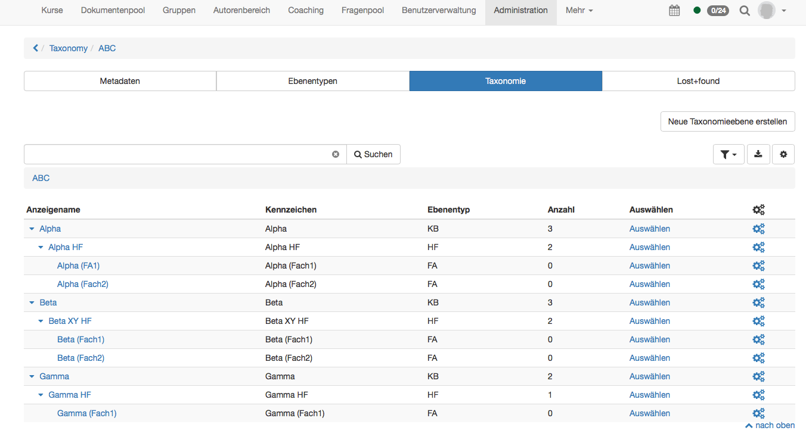

# Modules: Taxonomie

!!! info "Was ist eine Taxonomie?"

    Im OpenOlat ist eine Taxonomie eine hierarchische Verschlagwortung,
    üblicherweise mit einem Kompetenzansatz.

    Taxonomie kann in mehreren OpenOlat Bereichen aktiviert und eingesetzt werden:

    * [Dokumentenpool](Modules_Document_pool.de.md)
    * [Fragenpool](../../manual_user/question_bank/index.de.md)
    * [ePortfolio](../../manual_user/portfolio/Competences_tags.de.md)
    * Verknüpfung mit Lernressourcen

 Die Verwendung der Taxonomie in OpenOlat wird laufend erweitert.

 Zum einen können also Taxonomiestrukturen beispielsweise in Form einer
 Fächer-, Handlungsfeld- oder Kompetenzstruktur abgebildet werden. Zum anderen
 können den Benutzern Kompetenzen zugeordnet werden, welche ihnen den Zugriff
 auf die Taxonomie erlauben.

Beispiel einer Taxonomiestruktur nach Fächern für den Dokumentenpool:

{ class="shadow lightbox" }

Direkt auf der Übersichtsseite kann eine neue Taxonomie erstellt werden.
Sofern Sie im Fragenpool bereits eine Fachbereichsstruktur angelegt haben,
wird diese hier mit dem Titel "Question Pool" angezeigt.

Es können mehrere Taxonomiestrukturen erstellt und für verschiedene Zwecke
(Fragenpool oder Dokumentenpool) aktiviert werden.

{ class="shadow lightbox" }

Lässt man sich eine Taxonomie anzeigen gelangt man zur folgenden Übersicht:

{ class="shadow lightbox" }

## Metadaten

Beim Erstellen werden die Metadaten Kennzeichen und Name, und falls gewünscht
die Beschreibung eingetragen. Diese Daten können anschliessend im Tab
"Metadaten" bearbeitet werden. Hier wird zudem automatisch eine ID erstellt
und sofern ein externes Verwaltungssystem die Ebenen angelegt hat, wird die
Externe ID erstellt.

## Ebenentypen

Ebenentypen werden gebraucht, um der Taxonomiestruktur eine Bedeutung zu
geben. So können beispielsweise die Ebenentypen Kompetenz → Handlungsfeld →
Fach erstellt und untereinander als Unterkategorien angelegt werden. Es ist
dabei nicht notwendig, dass ein Ebenentyp immer an derselben Stelle oder auf
demselben Leven der Taxonomiestruktur vorzufinden ist.

Zu Ebenentypen werden gewisse Konfigurationen hinzugefügt.

Im Tab "Ebenentypen" kann mit "Neuer Ebenentyp erstellen" ein neuer Typ
erstellt werden.

* **Kennzeichen:** Hier wird oft ein Kürzel der entsprechenden Ebene hinzugefügt. Diese Kennzeichen wird in der Tabelle im Tab "Taxonomie" in der Spalte "Ebenentyp" angezeigt. Es ist deshalb empfehlenswert, eine eindeutige und logische Kennzeichen zu wählen.
* **Anzeigename:** Dieser Name wird unter Modules → Dokumentenpool im Tab Zugangsberechtigung in ausgeschriebener Form angezeigt und kann deshalb länger sein als die Kennzeichen.
* **CSS class:** Sofern eine entsprechende css class im Theme hinterlegt ist, kann diese hier ausgewählt werden. Es können so nur Icons hinterlegt werden.
* **Sichtbar:** Hier wird definiert, ob alle Taxonomieebenen von diesem Typ sichtbar sein sollen.
* **Kompetenzen:** Wenn aktiviert, steht dieser Ebenentyp als Kompetenz zur Verfügung und kann z.B. zur kompetenzbasierten Verschlagwortung in ePortfolio-Einträgen genutzt werden.
* **Beschreibung:** Falls gewünscht kann eine kurze Beschreibung des Ebenentyps hinzugefügt werden.
* **Sub types:** Aus den bereits bestehenden Ebenentypen kann nun ein Untertyp ausgewählt werden. So ist es möglich, eine hierarchische Struktur zu schaffen. Diese wird dann beim Erstellen der Taxonomieebenen sichtbar.

{ class="shadow lightbox" }

## Taxonomie

In diesem Tab werden nun die einzelnen Taxonomieebenen erstellt und angezeigt.

Beim Erstellen werden folgende Angaben benötigt:

* **Pfad**: Mit dem Pfad kann direkt die Position der neuen Taxonomieebene definiert werden.
* **Kennzeichen**: Als Kennzeichen kann wiederum ein Kürzel für die Ebene verwendet werden.
* **Anzeigename**: Der Anzeigename ist jener Name, welcher dann im entsprechenden Pool tatsächlich angezeigt wird.
* **Typ**: Beim Typ wird nun der zuvor definierte Ebenentyp ausgewählt.
* **Sortierung**: ::octicons-tag-24: *aktuell Beta Feature* Hier können Zahlen eingetragen werden, nach dem die Taxonomien sortiert werden. ( z.B. 1, 2, 3, 4, .. / 01, 02,03,04,...)
* **Beschreibung**: Falls gewünscht kann eine kurze Beschreibung der Taxonomieebene hinzugefügt werden.

{ class="shadow lightbox" }

In der Übersicht ist nun die hierarchische Struktur sichtbar.

{ class="shadow lightbox" }

In der Detailansicht können anschliessend Kompetenzen hinzugefügt werden. So
erhalten Benutzer die Zugriffsrechte für die einzelnen Taxonomieebenen. Im
OpenOlat wurde die Kompetenz auf den Release 12.2 neu hinzugefügt.

Es werden 4 verschiedene Kompetenzen unterschieden. Diese werden im Folgenden
kurz umrissen:

* Dozieren: Ein Benutzer mit einer Dozierkompetenz ist in dieser Kompetenz befähigt. Meist bedeutet dies, er hat ein gewisses Fachwissen, das er weitergeben kann. Somit hat ein Lernender nie eine Dozierkompetenz, denn eine Dozierkompetenz kann im OpenOlat nicht erworben werden. Die Dozierkompetenz wird dem Benutzer entweder manuell oder durch ein externes Verwaltungssystem hinzugefügt. Diese Kompetenz steuert den Zugriff sowohl im [Dokumentenpool](Modules_Document_pool.de.md) als auch im Fragenpool.
* Verwalten: Benutzer können für gewisse Bereiche in der Taxonomie eine verwaltende Funktion haben. Dabei müssen sie nicht zwingend auch die Dozierkompetenz haben. Diese Kompetenz wird vor allem im Fragenpool benutzt.
* Haben: Diese Kompetenz wird momentan im OpenOlat noch nicht verwendet. Diese Kompetenz sollen zukünftig Lernende durch eine Lernaktivität im OpenOlat (z.B. absolvierter Test) erhalten. Diese Kompetenz wird auch ein Verfallsdatum haben.
* Ziel: Diese Kompetenz wird momentan im OpenOlat noch nicht verwendet. Ein Lernender hat ein Ziel, das er erreichen möchte. Sein Ziel ist es, diese Kompetenz zu erwerben.

{ class="shadow lightbox" }

## Lost+Found

Hier werden alle gelöschten Elemente aus dem Tab "Taxonomie" abgelegt.
Momentan können diese jedoch nicht wiederhergestellt werden.
