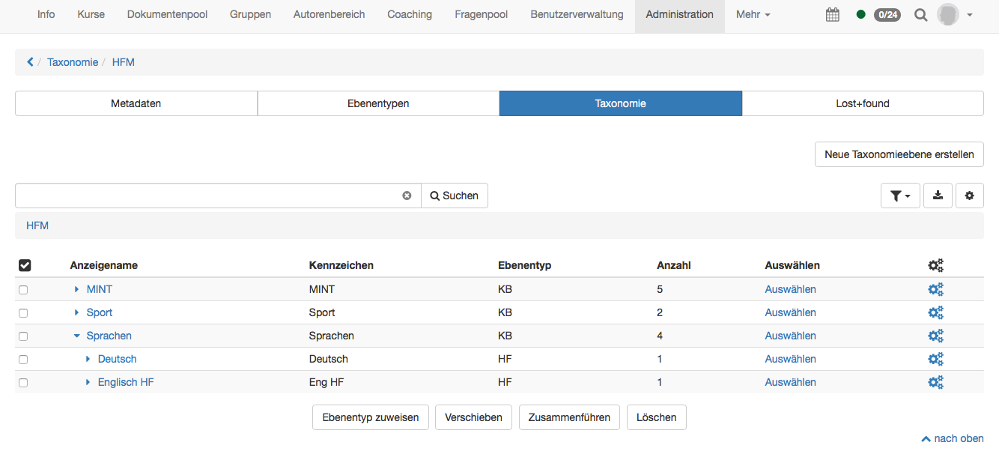
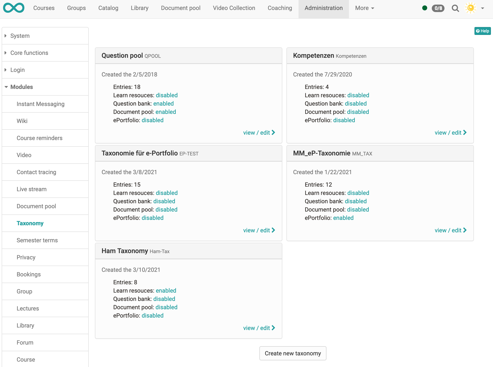
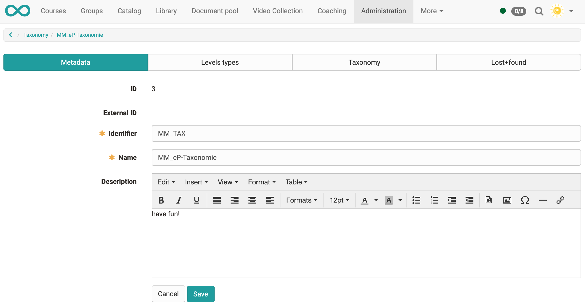
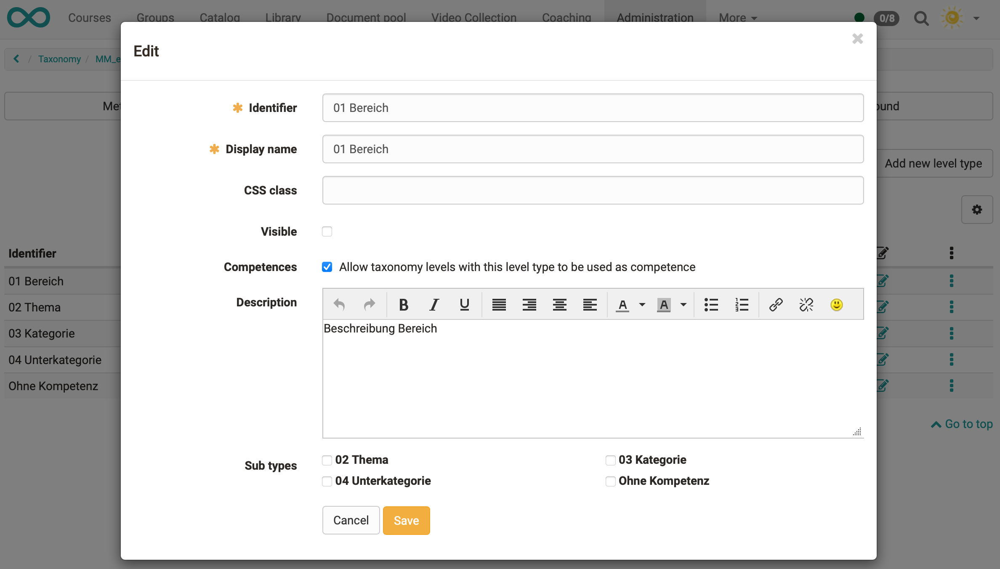
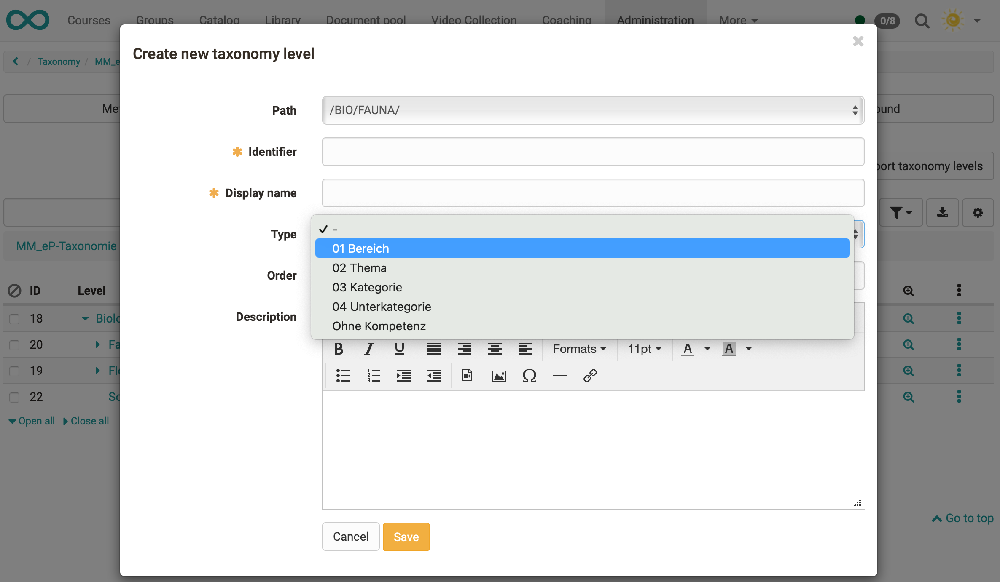
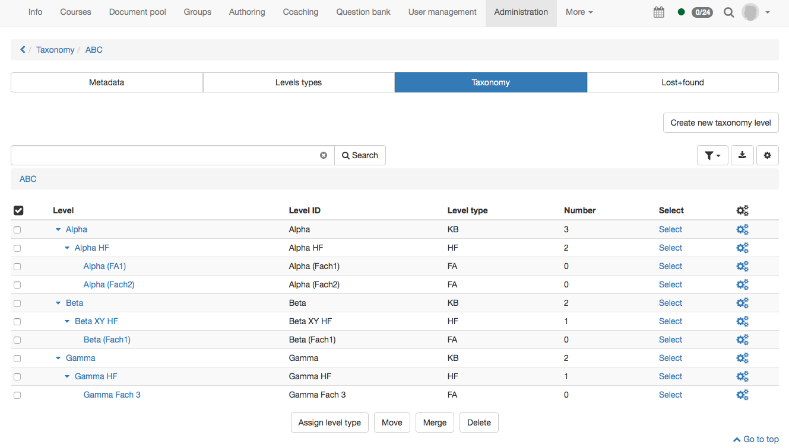
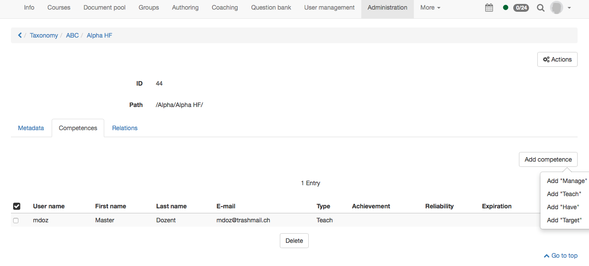

# Modules: Taxonomy

What is a taxonomy?

In OpenOlat, a taxonomy is a hierarchical indexing, usually with a competence
approach.

Taxonomy can be activated and used in several OpenOlat areas:

  * [Document pool](Modules_Document_pool.md)
  * [Question bank](Question+Bank.html)
  * [ePortfolio](Competences+tags.html)
  * Linking with learning resources

The usage of the taxonomy will be developed continuously.

Thus on one hand taxonomy structures can for example be built in the form of
subject, sphere of activity or competence structures. On the other hand
competences can be added to users which allows them access to the taxonomy.

Example of a taxonomy structure according to subjects for the document pool:

Directly on the overview page a new taxonomy can be created. If a subject
structure has already been created in the question pool, it will be shown here
with the title Question pool.

Several taxonomy structures can be created and used for different reasons
(question bank or document pool).

If you display a taxonomy, you will get to the following overview:

## Metadata

When creating the metadata identifier, name and if desired a description can
be inserted. These data can be edited in the tab "Metadata" afterward.
Additionally an ID is created automatically and if an external management
system has created the taxonomy, an external ID is created as well.

  

## Level types

Level types are used to give a significance to the taxonomy structure. The can
for example be created for competence → sphere of activity → subject and sub
types can be created underneath each other. Therefore it is not necessary that
a level type is alway at the same place or on the same level of the taxonomy
structure.

To the level types certain configurations can be added.

In the tab "Level types" a new type can be created with "Add new level type".

  *  _Identifier:_ Often an abbreviation of the corresponding level is added here. The identifier is shown in the table in the tab "Taxonomy" in the column "Level type". It is thus recommended to choose a unique and logic identifier. 
  *  _Display name:_ This name is shown under Modules → document pool in the tab "Access permissions" in a written form and can therefore be longer than the identifier. 
  *  _CSS class:_ If a corresponding css class is added in the theme it can be chosen here. Only icons can be added.  
  *  _Visible:_ Here can be defined if the taxonomy level of this type should be visible.
  *  _ Competences:_ If activated, this level type is available as a competence and can be used e.g. for competence-based keywording in ePortfolio entries.
  *  _Description:_ If desired a short description of the level type can be added.
  *  _Sub types:_ Out of the already existing level types a sub type can be chosen. Like this it becomes possible to create a hierarchical structure. It will get visible when creating the taxonomy level.

## Taxonomy

In this tab the single taxonomy levels are created and shown.

When creating the following attributes are necessary:

  * Path: With the path the position of the taxonomy level can be defined directly.
  * Identifier: With the identifier an abbreviation of the level can be defined.
  * Display name: The display name is the name which is actually shown in the corresponding pool. 
  * Type: In the type the beforehand created level type can be chosen.
  * Order: Hereby a manual order is possible.
  * Description: If desired a short description of the taxonomy level can be added.

In the overview a hierarchical structure is now visible.

In the detail view competences can be added afterwards. Like this users get
access rights for the single taxonomy levels. In OpenOlat competences have
been added in the release 12.2.

4 different competences are distinguished. Following they are outlined
shortly:

  * Teach: A user with teach competence is qualified in this competence. Mostly this means he has a certain expert knowledge which he can hand over. Therefore learners will never have teach competences as the teach competence cannot be gained in OpenOlat. The teach competence is either added to a user manually or by an external management system. This competence manages the access to the [document pool](https://confluence.openolat.org/display/OO123DE/Modules%3A+Document+pool) as well as to the question bank.
  * Manage: User can have a managing function for a certain area of the taxonomy. Therefore the must not have teach competence at the same time. This competence is mainly used in the question bank.
  * Have: This competence is not yet used in OpenOlat. In the future this competence can be gained by a learner through learning activities in OpenOlat (e.g. test). This competence has an expiry date.
  * Target: This competence is not yet used in OpenOlat. A learner has a target he wants to reach. It is the target to gain this competence.

## Lost+Found

All deleted elements of the tab "Taxonomy" end up here. For the moment they
cannot be reset.

