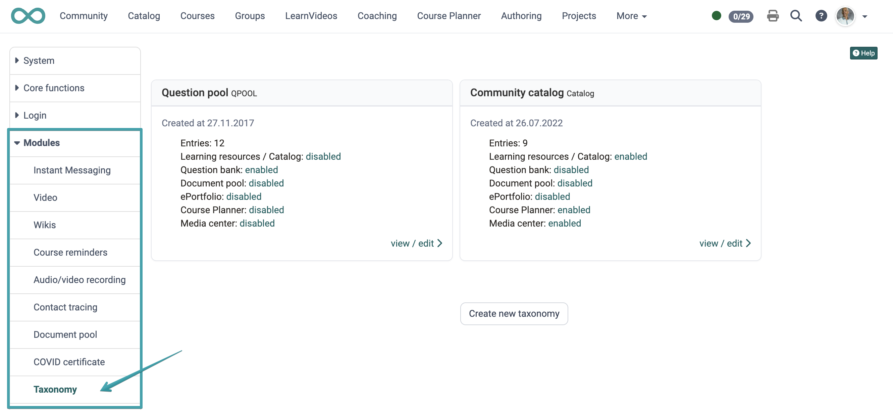
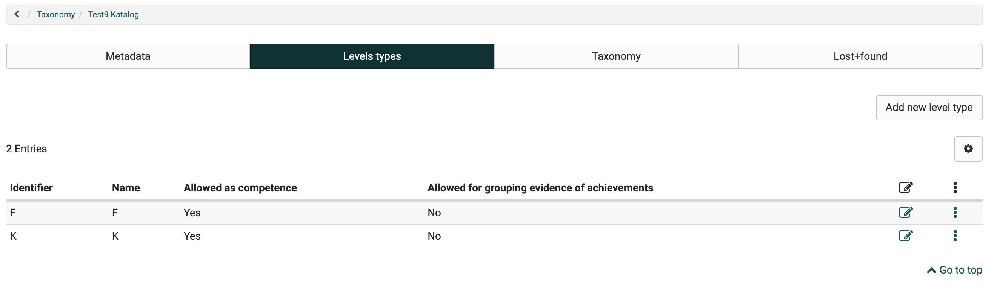
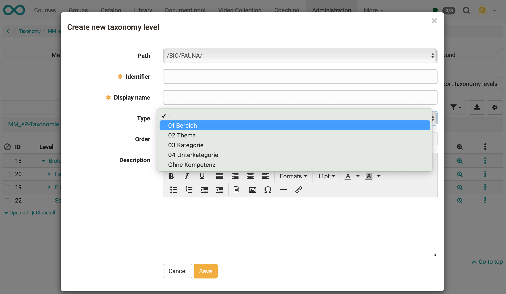
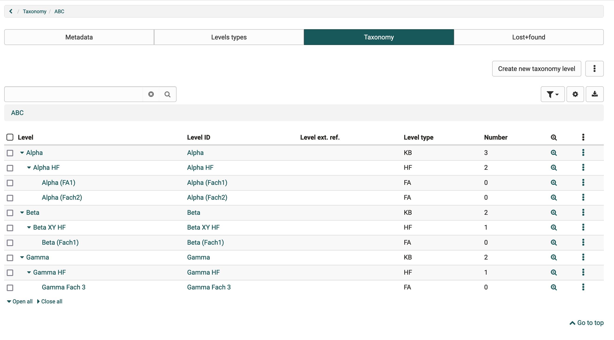
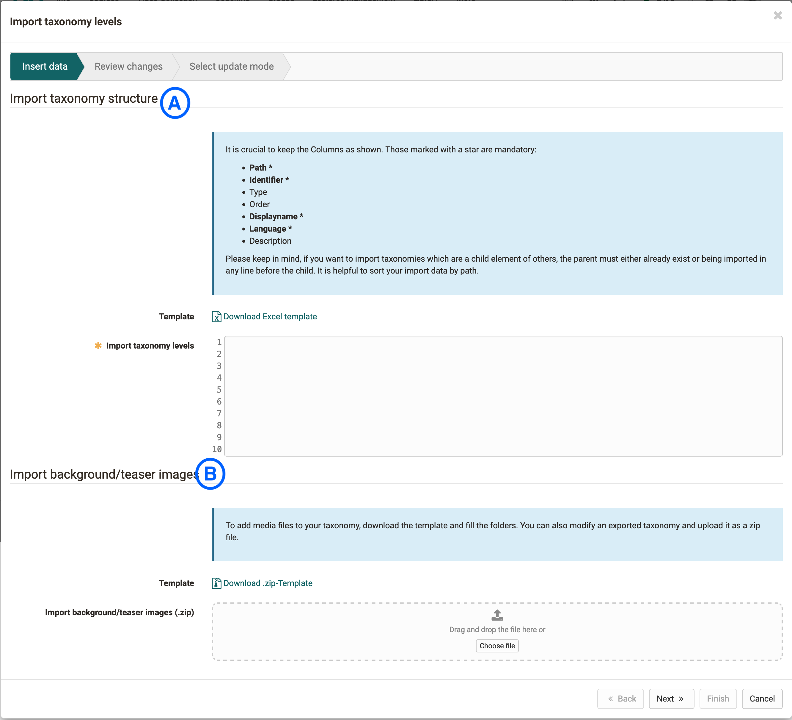
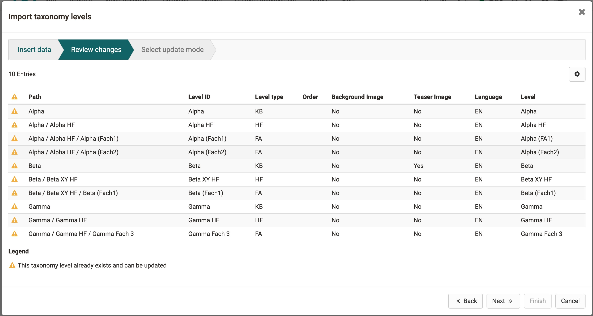
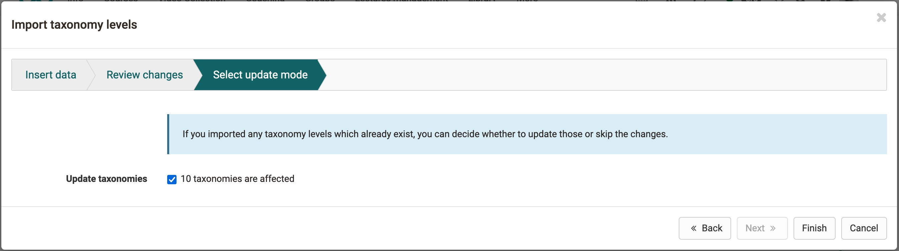

# Module Taxonomy {: #module_taxonomy}

You find the module in the system administration under: 
`Administration > Modules > Taxonomy`

!!! note "What is a taxonomy?"

    In OpenOlat, a taxonomy is a hierarchical indexing, often with a competence approach.
    Taxonomy can be activated and used in several OpenOlat areas:

    * [Document pool](Modules_Document_pool.md)
    * [Question bank](../../manual_user/area_modules/Question_Bank.md)
    * [ePortfolio](eAssessment_ePortfolio.md)
    * [Catalog](Modules_Catalog_2.0.md)

{ class="shadow lightbox" }

Directly on the overview page a new taxonomy structure can be created.

Several taxonomy structures can be created and activated for different purposes. Per taxonomy, the overview card shows for which areas it is activated: Question bank, Document pool, ePortfolio, Learning resources / Catalog, Course Planner and Media Center. [:octicons-tag-16:{ title="Available from Release 20.3.0 (OO-9185)" }](https://track.frentix.com/issue/OO-9185){:target="_blank"}

Thus on one hand taxonomy structures can for example be built in the form of
subject, sphere of activity or competence structures. On the other hand
competences can be added to users which allows them access to the taxonomy.

**Example** of an elaborated taxonomy structure, according to subjects for the document pool:

{ class="shadow lightbox" }

## Metadata {: #metadata}

When creating the metadata identifier, name and if desired a description can
be inserted. These data can be edited in the tab "Metadata" afterward.
Additionally an ID is created automatically and if an external management
system has created the taxonomy, an external ID is created as well.
{ class="shadow lightbox" }

## Level types {: #level_types}

Level types are used to give a significance to the taxonomy structure. The can
for example be created for competence → sphere of activity → subject and sub
types can be created underneath each other. Therefore it is not necessary that
a level type is alway at the same place or on the same level of the taxonomy
structure.

To the level types certain configurations can be added.

In the tab "Level types" a new type can be created with "Add new level type".

#### Identifier {: #level_type_identifier}

Often an abbreviation of the corresponding level is added here. The identifier is shown in the table in the tab "Taxonomy" in the column "Level type". It is thus recommended to choose a unique and logic identifier.

#### Display name {: #level_type_display_name}

This name is shown under Modules → document pool in the tab "Access permissions" in a written form and can therefore be longer than the identifier.

#### CSS class {: #level_type_css_class}

If a corresponding css class is added in the theme it can be chosen here. Only icons can be added.

#### Visible {: #level_type_visible}

Here can be defined if the taxonomy level of this type should be visible.

#### Competences {: #level_type_competences}

If activated, this level type is available as a competence and can be used e.g. for competence-based keywording in ePortfolio entries.

#### Evidence of achievement {: #level_type_achievements}

Taxonomy levels with this level type can be activated here for the grouping of certificates of achievement.

#### Description {: #level_type_description}

If desired a short description of the level type can be added.

#### Sub types {: #level_type_sub_types}

Out of the already existing level types a sub type can be chosen. Like this it becomes possible to create a hierarchical structure. It will get visible when creating the taxonomy level.

{ class="shadow lightbox" }

## Create taxonomy {: #taxonomy}

In this tab the single taxonomy levels are created, imported, exported and shown.

When creating the following attributes are necessary:

#### Path {: #level_path}

With the path the position of the taxonomy level can be defined directly.

#### Identifier {: #level_identifier}

With the identifier an abbreviation of the level can be defined.

#### Type {: #level_type}

In the type the beforehand created level type can be chosen.

#### Order {: #level_sort_order}

::octicons-tag-24: *currently Beta Feature* Hereby a manual order is possible by adding a number from 1-XX. The taxonomy-tiers will get ordered ascending by the numbers ( 1,2,3,4, / 01,02,03,04,..)

#### Teaser image {: #level_teaser_image}

#### Background image {: #level_background_image}

#### Display name {: #level_display_name}

The display name depends on the language and is used in different places: Catalog 2.0, Document Pool, e-Portfolio.

#### Description {: #level_description}

If desired a short description of the taxonomy level can be added. Displayed in the catalog below the level.

{ class="shadow lightbox" }

In the overview a hierarchical structure is now visible.

{ class="shadow lightbox" }

!!! tip "Competences"
    In the detail view competences can be added afterwards. Like this users get "access rights" for the single taxonomy levels.

4 different competences are distinguished. Following they are outlined
shortly:

  * **Teach**: A user with teach competence is qualified in this competence. Mostly this means he has a certain expert knowledge which he can hand over. Therefore learners will never have teach competences as the teach competence cannot be gained in OpenOlat. The teach competence is either added to a user manually or by an external management system. This competence manages the access to the [document pool](Modules_Document_pool.md) as well as to the question bank.
  * **Manage**: User can have a managing function for a certain area of the taxonomy. Therefore the must not have teach competence at the same time. This competence is mainly used in the question bank.
  * **Have**: This competence is not yet used in OpenOlat. In the future this competence can be gained by a learner through learning activities in OpenOlat (e.g. test). This competence has an expiry date.
  * **Target**: A learner has a target he wants to reach. It is the target to gain this competence.

!!! note "Note on Target"
    This competence is not yet used in OpenOlat.

### Export taxonomy  {: #export}

The taxonomy is downloaded as a .zip archive by clicking on the menu item (see image). This contains an EXCEL table with the hierarchical structure of the taxonomy level and a folder structure (media/level1/background;media/level1/teaser;) with teaser and background images of the taxonomy, if any are available. (more under -> [Catalog 2.0](../../manual_user/area_modules/catalog2.0.md))
{ class="shadow lightbox" }

### Import taxonomy {: #import}

**Insert data**

{ class="shadow lightbox" }

Here we have the choice between different options:
We can import only the structure (**A**), add images to an existing structure (**B**) or import a structure including images (**A+B**).

**Review changes**

{ class="shadow lightbox" }

After the import, the taxonomy and the added images are reviewed again in the second step. An icon indicates whether the taxonomy level already exists and should be completed and overwritten with the files and uploaded information.

**Select update mode**

{ class="shadow lightbox" }

Here you can decide whether you want to overwrite the existing taxonomy levels or just add new taxonomy levels. If you want to add media, you _must_ overwrite the changes here.

### Import/add taxonomy structure only {: #import_add_structure}

1. First download the current taxonomy. If you don't have one yet, use the template.

{ class="shadow lightbox" }

2. Inside the excel sheet you add new taxonomy levels or change existing ones. The path that indicates the hierarchical structure is important. If this is incorrect, certain layers cannot be imported.
If you have activated different languages in OpenOlat and use the [Catalog 2.0](../../manual_user/area_modules/catalog2.0.md), it is advisable to make the display name and description language-dependent. Additional languages can be added by copying the columns "Language", "Display name" & "Description" and adding a new, existing language, display name + description for each taxonomy level.

3. The modified table is now selected _without_ the header and copied into the input field. When proceeding to the next wizard step, the cells are checked for correctness. In case of errors, error messages appear directly at the input field.

### Import/add background/teaser image only {: #import_add_media}

{ class="shadow lightbox" }

1. If you want to add background images to an existing taxonomy, you should first export the taxonomy.
2. Unzip the archive and place the images in the "media" folder.
3. zip the entire archive again and insert it under paragraph B in the wizard.

Alternatively, it is also possible to download the existing templates under the respective links and adapt them accordingly.

## Lost+Found {: #lost_found}
**Last tab in the overview**

All deleted elements of the tab "Taxonomy" end up here.

!!! note "Note"
    Deleted objects cannot currently be restored.

## Further information {: #further_information}

**Mentioned on this page** 
[Document pool >](Modules_Document_pool.md) 
[Question bank >](../../manual_user/area_modules/Question_Bank.md) 
[ePortfolio >](eAssessment_ePortfolio.md) 
[Catalog >](Modules_Catalog_2.0.md) 
[Catalog 2.0 >](../../manual_user/area_modules/catalog2.0.md)

**Further reading** 
[Media Center >](Modules_Media_Center.md) 
[Course Planner >](Modules_Course_Planner.md)

[To the top of the page ^](#module_taxonomy)