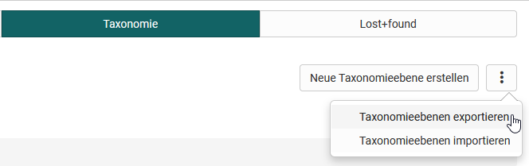
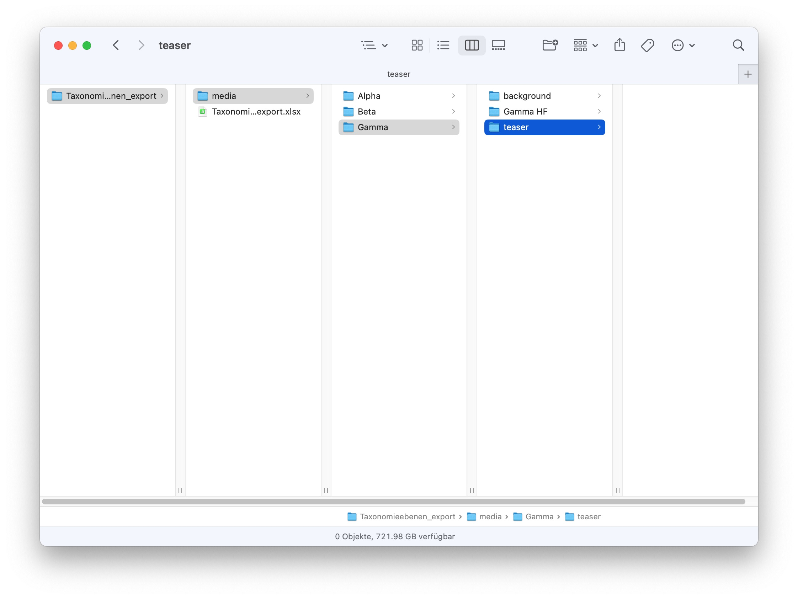

# Modules: Taxonomy

!!! info "What is a taxonomy?"

    In OpenOlat, a taxonomy is a hierarchical indexing, usually with a competence approach.
    Taxonomy can be activated and used in several OpenOlat areas:
    
    * [Document pool](Modules_Document_pool.md)
    * [Question bank](../../manual_user/area_modules/Question_Bank.md)
    * [ePortfolio](../../manual_user/area_modules/Competences_tags.md)
    * Catalog [Catalog](../Modules_Catalog2.0.md)
    
The usage of the taxonomy will be developed continuously.
    
Thus on one hand taxonomy structures can for example be built in the form of
subject, sphere of activity or competence structures. On the other hand
competences can be added to users which allows them access to the taxonomy.

Example of a taxonomy structure according to subjects for the document pool:

{ class="shadow lightbox" }

Directly on the overview page a new taxonomy can be created. If a subject
structure has already been created in the question pool, it will be shown here
with the title Question pool.

Several taxonomy structures can be created and used for different reasons
(question bank or document pool).

{ class="shadow lightbox" }

If you display a taxonomy, you will get to the following overview:

{ class="shadow lightbox" }

## Metadata

When creating the metadata identifier, name and if desired a description can
be inserted. These data can be edited in the tab "Metadata" afterward.
Additionally an ID is created automatically and if an external management
system has created the taxonomy, an external ID is created as well.

## Level types

Level types are used to give a significance to the taxonomy structure. The can
for example be created for competence → sphere of activity → subject and sub
types can be created underneath each other. Therefore it is not necessary that
a level type is alway at the same place or on the same level of the taxonomy
structure.

To the level types certain configurations can be added.

In the tab "Level types" a new type can be created with "Add new level type".

  * **Identifier:** Often an abbreviation of the corresponding level is added here. The identifier is shown in the table in the tab "Taxonomy" in the column "Level type". It is thus recommended to choose a unique and logic identifier. 
  * **Display name:** This name is shown under Modules → document pool in the tab "Access permissions" in a written form and can therefore be longer than the identifier. 
  * **CSS class:** If a corresponding css class is added in the theme it can be chosen here. Only icons can be added.  
  * **Visible:** Here can be defined if the taxonomy level of this type should be visible.
  * **Competences:** If activated, this level type is available as a competence and can be used e.g. for competence-based keywording in ePortfolio entries.
  * **Leistungsnachweise:** Hier können Taxonomieebenen mit diesem Leveltyp für die Gruppierung von Leistungsnachweisen freigeschaltet werden.
  * **Description:** If desired a short description of the level type can be added.
  * **Sub types:** Out of the already existing level types a sub type can be chosen. Like this it becomes possible to create a hierarchical structure. It will get visible when creating the taxonomy level.

{ class="shadow lightbox" }

## Taxonomy

In this tab the single taxonomy levels are created, imported, exported and shown.

### Create taxonomy

When creating the following attributes are necessary:

  * **Path:** With the path the position of the taxonomy level can be defined directly.
  * **Identifier:** With the identifier an abbreviation of the level can be defined.
  * **Type:** In the type the beforehand created level type can be chosen.
  * **Order:** Hereby a manual order is possible by adding a number from 1-XX. The taxonomy-tiers will get ordered ascending by the numbers ( 1,2,3,4, / 01,02,03,04,..):octicons-tag-24: _experimental Feature_  * **Display name:** The display name is the name which is actually shown in the corresponding pool. 
  * **Teaser Bild**
  * **Hintergrund bild**
  * **Anzeigename**: Der Anzeigename ist sprachabhängig und wird an unterschiedlichen Stellen verwendet: Katalog 2.0, Dokumentenpool, e-Portfolio.  
  * **Description:** If desired a short description of the taxonomy level can be added. Wird im Katalog unter der Ebene angezeigt.

{ class="shadow lightbox" }

In the overview a hierarchical structure is now visible.

{ class="shadow lightbox" }

In the detail view competences can be added afterwards. Like this users get
access rights for the single taxonomy levels.

4 different competences are distinguished. Following they are outlined
shortly:

  * **Teach**: A user with teach competence is qualified in this competence. Mostly this means he has a certain expert knowledge which he can hand over. Therefore learners will never have teach competences as the teach competence cannot be gained in OpenOlat. The teach competence is either added to a user manually or by an external management system. This competence manages the access to the [document pool](Modules_Document_pool.md) as well as to the question bank.
  * **Manage**: User can have a managing function for a certain area of the taxonomy. Therefore the must not have teach competence at the same time. This competence is mainly used in the question bank.
  * **Have**: This competence is not yet used in OpenOlat. In the future this competence can be gained by a learner through learning activities in OpenOlat (e.g. test). This competence has an expiry date.
  * **Target**: This competence is not yet used in OpenOlat. A learner has a target he wants to reach. It is the target to gain this competence.

{ class="shadow lightbox" }

### Export taxonomy

The taxonomy is downloaded as a .zip archive by clicking on the menu item. This contains an EXCEL table with the hierarchical structure of the taxonomy level and a folder structure (media/level1/background;media/level1/teaser;) with teaser and background images of the taxonomy, if any are available. (more under -> [Catalog 2.0](../../manual_user/area_modules/catalog2.0.md))

### Import taxonomy

**Insert data**

{ class="shadow lightbox" }

Here we have the choice between different options:
We can import only the structure (**A**), add images to an existing structure (**B**) or import a structure including images (**A+B**).

**Review changes**

{ class="shadow lightbox" }

After the import, the taxonomy and the added images are reviewed again in the second step. An icon indicates whether the taxonomy level already exists and should be completed and overwritten with the files and uploaded information.

**Select update mode**

{ class="shadow lightbox" }

Here you can decide whether you want to overwrite the existing taxonomy levels or just add new taxonomy levels. If you want to add media, you _must_ overwrite the changes here.

### Import/add taxonomy structure only

1. First download the current taxonomy. If you don't have one yet, use the template.

{ class="shadow lightbox" }

2. Inside the excel sheet you add new taxonomy levels or change existing ones. The path that indicates the hierarchical structure is important. If this is incorrect, certain layers cannot be imported.
If you have activated different languages in OpenOlat and use the [Catalog 2.0](../../manual_user/area_modules/catalog2.0.md), it is advisable to make the display name and description language-dependent. Additional languages can be added by copying the columns "Country code", "Display name" & "Description" and adding a new, existing country code, display name + description for each taxonomy level.

3. The modified table is now selected _without_ the header and copied into the input field. When proceeding to the next wizard step, the cells are checked for correctness. In case of errors, error messages appear directly at the input field.

### Import/add background/teaser image only

1. If you want to add background images to an existing taxonomy, you should first export the taxonomy.
2. Unzip the archive and place the images in the "media" folder.
3. zip the entire archive again and insert it under paragraph B in the wizard.

Alternatively, it is also possible to download the existing templates under the respective links and adapt them accordingly.

## Lost+Found

All deleted elements of the tab "Taxonomy" end up here. For the moment they cannot be reset.