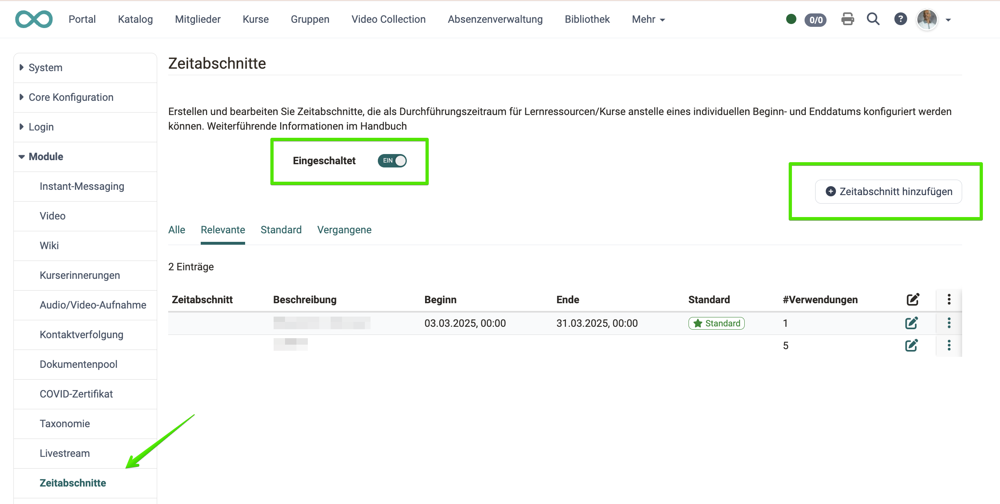

# Zeitabschnitte {: #zeitabschnitte}

## Zeitabschnitte helfen beim filtern und sortieren [:octicons-tag-16:{ title="ab Release 20.3 (OO-9218)" }](https://track.frentix.com/issue/OO-9218){:target="_blank"}

Das Modul "Zeitabschnitte" muss durch die Systemadministration befüllt werden. Die Zeitabschnitte sind frei definierbar und sollen das Filtern von Durchführungungen innerhalb bestimmter Zeiträume unterstützen (zum Beispiel: Semester a, b, c).
{ class="shadow lightbox" }

**Die damit erzeugten Bereiche sind im Autorenbereich als Filter verfügbar.**
{ class="shadow lightbox" }
