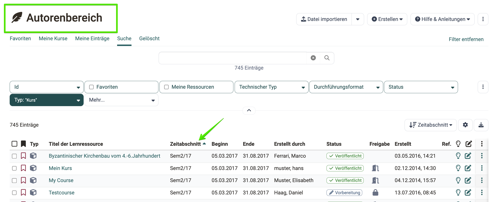

# Modul Zeitabschnitte {: #zeitabschnitte}

## Zeitabschnitte helfen beim Filtern und Sortieren [:octicons-tag-16:{ title="ab Release 20.3 (OO-9218)" }](https://track.frentix.com/issue/OO-9218){:target="_blank"}

Das Modul "Zeitabschnitte" muss durch die Systemadministration befüllt werden. Sie finden es in der System-Administration unter: 
`Administration > Module > Zeitabschnitte`

Die Zeitabschnitte sind frei definierbar und sollen das Filtern von Durchführungen innerhalb bestimmter Zeiträume unterstützen (zum Beispiel: Semester a, b, c).

{ class="shadow lightbox" }

Die Spalte "#Verwendungen" zeigt, wie viele Lernressourcen den Zeitabschnitt nutzen. Über die Tabs schränken Sie die Liste auf die relevanten, die als Standard markierten oder die vergangenen Zeitabschnitte ein.

**Die erzeugten Zeitabschnitte stehen im Autorenbereich als Spalte zur Verfügung und lassen sich dort sortieren.**

{ class="shadow lightbox" }

## Zeitabschnitt anlegen und bearbeiten

Klicken Sie auf **Zeitabschnitt hinzufügen**, um einen Zeitabschnitt zu erstellen. Über das Stiftsymbol in der Zeile bearbeiten Sie einen bestehenden Zeitabschnitt.

{ class="shadow lightbox" }

Kurze Hinweise zum Dialog und dessen Felder:

Feld | Bedeutung
---------|----------
Zeitabschnitt | Kurzbezeichnung, zum Beispiel "HS26". Pflichtangabe, maximal 64 Zeichen.
Beschreibung | Ausgeschriebener Name, zum Beispiel "Herbst Semester 2026". Optional, maximal 250 Zeichen.
Als Standard für Kurse festlegen | Der Zeitabschnitt ist beim Erstellen einer Lernressource vorausgewählt. Es gibt immer nur einen Standard: Beim Setzen verliert der bisherige Standard die Markierung.

!!! info "Wichtig"
    Die Kurzbezeichnung im Feld **Zeitabschnitt** ist die Pflichtangabe. Das Feld **Beschreibung** dürfen Sie leer lassen. Listen, die nach der Beschreibung sortieren, stellen Einträge ohne Beschreibung ans Ende.

!!! note "Zeitabschnitt im Kurs"
    Wie Autorinnen und Autoren einen Zeitabschnitt als Durchführungszeitraum eines Kurses wählen. 
    [Durchführungszeitraum im Kurs >](../../manual_user/learningresources/Course_Settings_Execution.de.md)

---

## Weiterführende Informationen {: #further_information}

[Kurseinstellungen - Tab Durchführung >](../../manual_user/learningresources/Course_Settings_Execution.de.md) 
[Autorenbereich - Übersicht >](../../manual_user/area_modules/Authoring.de.md) 
[Katalog 2.0 - Sortierung/Reihenfolge >](../../manual_user/area_modules/catalog2.0_sort_offers.de.md)

[Zum Seitenanfang ^](#zeitabschnitte)
