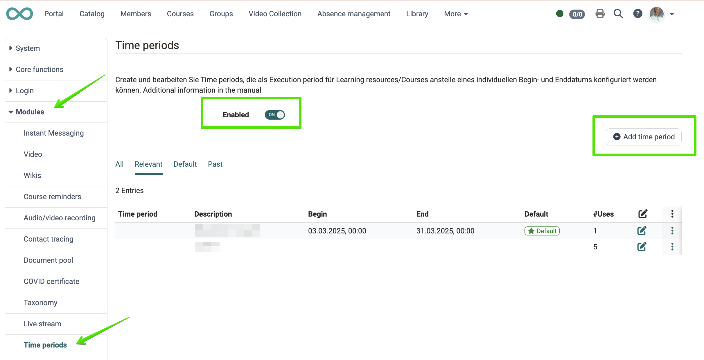
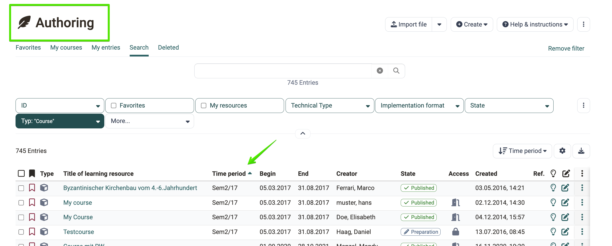

# Module Time periods {: #zeitabschnitte}

## Time periods help with filtering and sorting [:octicons-tag-16:{ title="ab Release 20.3 (OO-9218)" }](https://track.frentix.com/issue/OO-9218){:target="_blank"}

The "Time periods" module must be populated by the system administration. Time periods are freely definable and are intended to support filtering implementations within specific time ranges (for example: Semester a, b, c).
{ class="shadow lightbox" }

**The areas created in this way are available as filters in the Authoring area.**
{ class="shadow lightbox" }