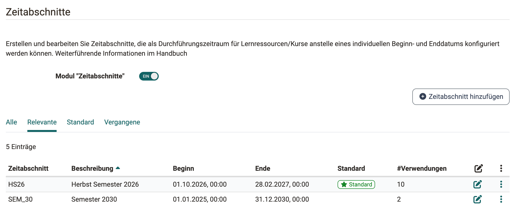
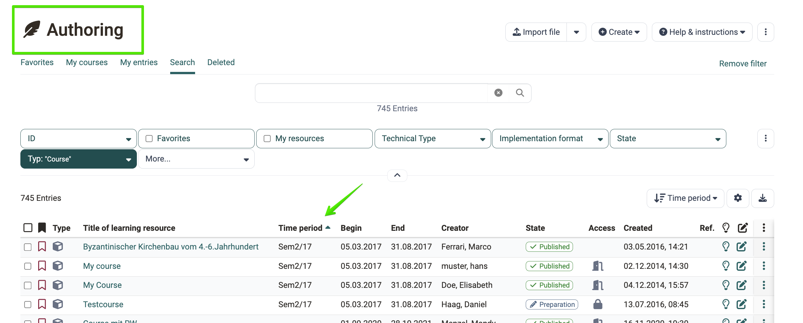
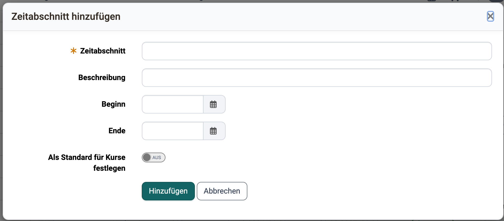

# Module Time periods {: #zeitabschnitte}

## Time periods help with filtering and sorting [:octicons-tag-16:{ title="from Release 20.3 (OO-9218)" }](https://track.frentix.com/issue/OO-9218){:target="_blank"}

The "Time periods" module must be populated by the system administration. You find it in the system administration under: 
`Administration > Modules > Time periods`

Time periods are freely definable and are intended to support filtering implementations within specific time ranges (for example: Semester a, b, c).

{ class="shadow lightbox" }

The "#Uses" column shows how many learning resources use the time period. Use the tabs to restrict the list to the relevant, the default or the past time periods.

**The time periods created here are available as a column in the Authoring area and can be sorted there.**

{ class="shadow lightbox" }

## Create and edit a time period

Click **Add time period** to create a time period. Use the pencil symbol in the row to edit an existing time period.

{ class="shadow lightbox" }

The dialog contains the following fields:

Field | Meaning
---------|----------
Time period | Short label, for example "HS26". Mandatory entry, maximum 64 characters.
Description | Full name, for example "Autumn semester 2026". Optional, maximum 250 characters.
Begin | Start date of the time period.
End | End date of the time period.
Set as default for courses | The time period is preselected when a learning resource is created. There is only ever one default: setting it removes the mark from the previous default.

!!! info "Important"
    The short label in the **Time period** field is the mandatory entry. You may leave the **Description** field empty. Lists that sort by the description place entries without a description at the end.

!!! note "Time period in the course"
    How authors select a time period as the execution period of a course. 
    [Execution period in the course >](../../manual_user/learningresources/Course_Settings_Execution.md)

---

## Further information {: #further_information}

[Course Settings - Tab Execution >](../../manual_user/learningresources/Course_Settings_Execution.md) 
[Authoring - Overview >](../../manual_user/area_modules/Authoring.md) 
[Catalog 2.0 - Sorting/order >](../../manual_user/area_modules/catalog2.0_sort_offers.md)

[To the top of the page ^](#zeitabschnitte)
