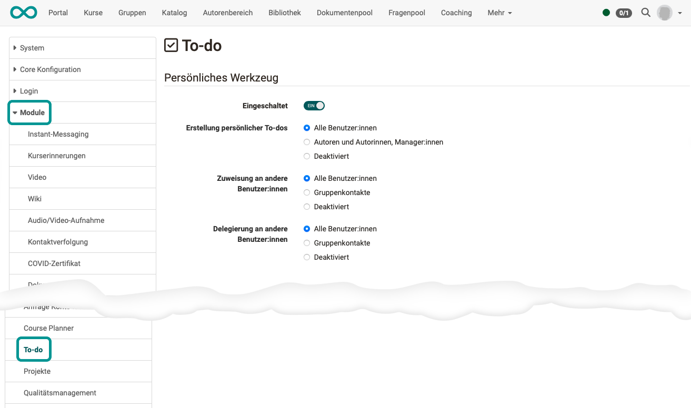

# Modul To-do {: #To-Do}

## Aktivierung des Moduls {: #activation}

Das Modul "To-Do" als persönliches Werkzeug muss durch einen/eine Administrator:in vorgenommen werden.

{ class="shadow lightbox" }