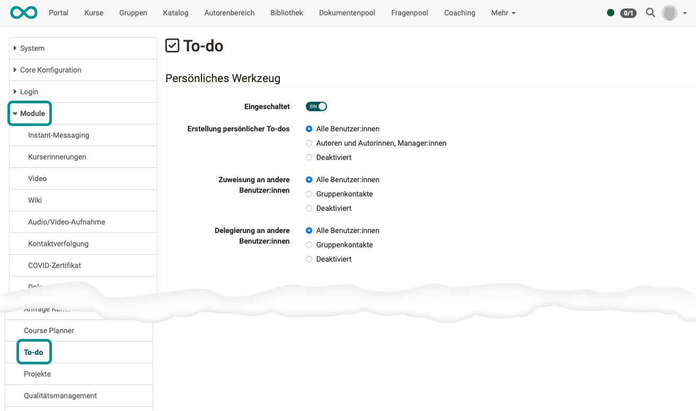

# Module To-do {: #To-Do}

## Activation {: #activation}

The module "To-do" as a personal tool must be activated by an administrator.

{ class="shadow lightbox" }

### User tool {: #personal_tool}

#### Enabled {: #enabled}

Switches the personal "To-do" tool on or off for the OpenOlat instance. If the field is off, the tool is not available in the personal menu, and the following fields are hidden.

#### Creation of personal to-do {: #create}

Defines who may create personal to-dos: all users, only authors and managers, or nobody (disabled).

#### Assignment to other users {: #assignee}

Defines which users are available as recipients of an assignment: all users, only group peers, or none (disabled).

#### Delegation to other users {: #delegatee}

Defines to which users a to-do may be delegated: to all users, only to group peers, or to none (disabled).