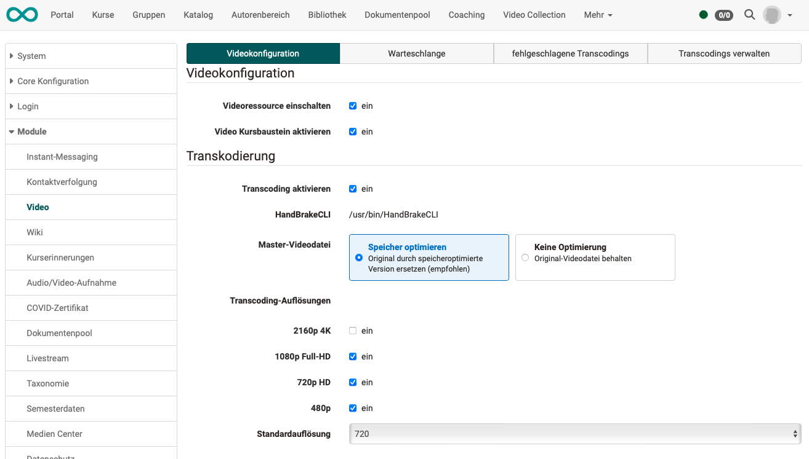
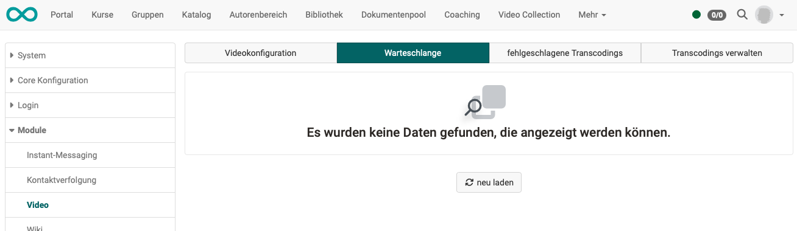
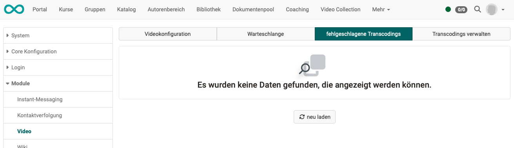
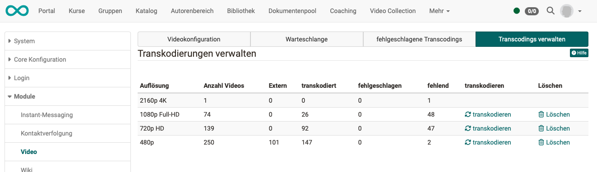

# Modul Video

Als Administrator:in aktivieren/deaktivieren Sie im **Tab Videokonfiguration**,

- ob Videoressourcen generell in der OpenOlat-Instanz zugelassen sind.  Beachten Sie: Es handelt sich um Videos, die im Autorenbereich gelistet sind (Lernressourcen). Direkt verlinkte Videos (z.B. in einer HTML-Seite) sind davon nicht betroffen.

- ob durch Autor:innen der **Kursbaustein Video** verwendet werden darf.

- Einstellungen zum Transcoding 
Es kann festgelegt werden, welche Auflösungen erstellt werden.  
Ab Version 19.0 kann die Originaldatei (Master) zur Speicherplatzoptimierung auch gelöscht bzw. ersetzt werden.

!!! tip "Tipp"

    Wird ein Transcoding-/Konvertierungsservice in einer Cloud genutzt, wird die lokale Audio- und Videokonvertierung deaktiviert.  Sind weder ein Service in der Cloud noch die lokale Audio- und Videokonvertierung aktiv, liegt es in der Regel daran, dass HandBrake oder ffmpeg nicht gefunden oder gestartet werden konnten.

## Tab Videokonfiguration

{ class="shadow lightbox" }

## Tab Warteschlange

{ class="shadow lightbox" }

## Tab Fehlgeschlagene Transcodings

{ class="shadow lightbox" }

## Tab Transcodings verwalten

{ class="shadow lightbox" }