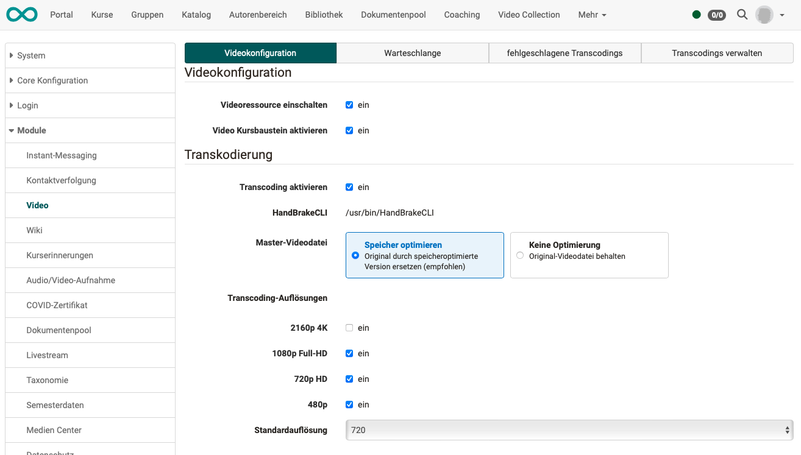
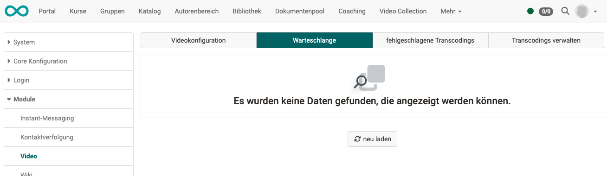
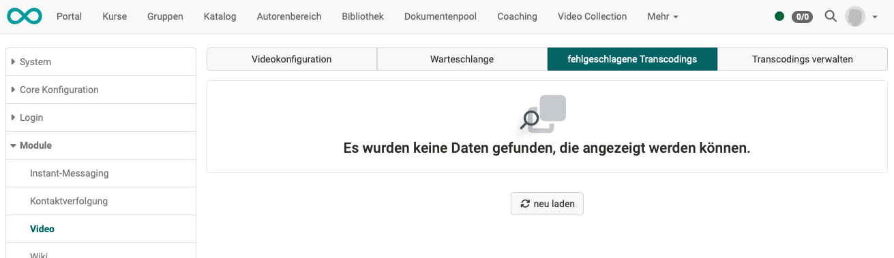
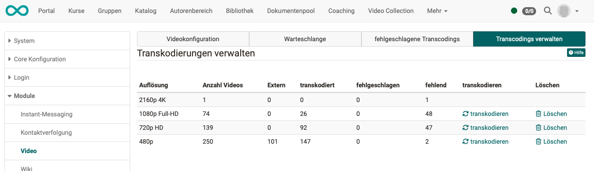

# Modul Video {: #module_video}

Als Administrator:in aktivieren/deaktivieren Sie im **Tab Videokonfiguration**,

- ob Videoressourcen generell in der OpenOlat-Instanz zugelassen sind.  Beachten Sie: Es handelt sich um Videos, die im Autorenbereich gelistet sind (Lernressourcen). Direkt verlinkte Videos (z.B. in einer HTML-Seite) sind davon nicht betroffen.
- ob durch Autor:innen der **Kursbaustein Video** verwendet werden darf.

- Einstellungen zum Transcoding. Es kann festgelegt werden, welche Auflösungen erstellt werden. Die Originaldatei (Master) kann zur Speicherplatzoptimierung auch gelöscht bzw. ersetzt werden.

Der frentix Cloud-Transcodingservice kann beim Transcodieren zusätzlich automatisch Untertitel (Transkripte) für Videos erzeugen [:octicons-tag-16:{ title="ab Release 20.2.6 (OO-9347)" }](https://track.frentix.com/issue/OO-9347){:target="_blank"}. Diese Funktion ist Teil des frentix Cloud-Service und nicht in der Standard-Distribution von OpenOlat enthalten. Details dazu finden Sie im Benutzerhandbuch im Kapitel [Lernressource: Video](../../manual_user/learningresources/Learning_resource_Video.de.md#video_subtitles_auto).

!!! info "Wichtig"

    Wird der frentix Cloud-Transcodingservice genutzt, wird die lokale Audio- und Videokonvertierung deaktiviert.  Sind weder der frentix Cloud-Transcodingservice noch die lokale Audio- und Videokonvertierung aktiv, liegt es in der Regel daran, dass HandBrake oder ffmpeg nicht gefunden oder gestartet werden konnten.

## Tab Videokonfiguration {: #video_config}

{ class="shadow lightbox" }

## Tab Warteschlange {: #pending_transcodings}

{ class="shadow lightbox" }

## Tab Fehlgeschlagene Transcodings {: #failed_transcodings}

{ class="shadow lightbox" }

## Tab Transcodings verwalten {: #manage_transcodings}

{ class="shadow lightbox" }