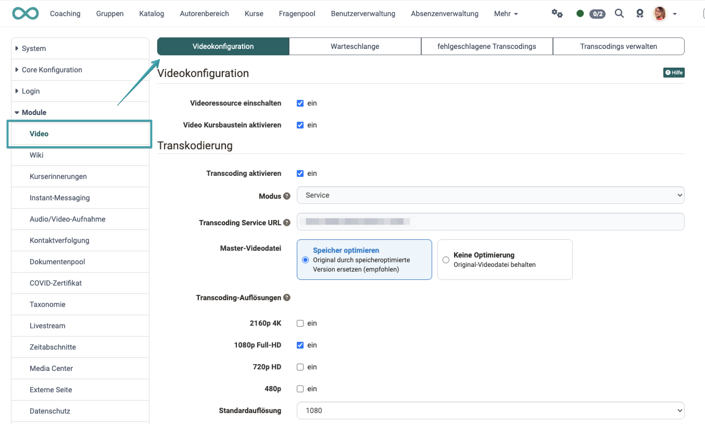
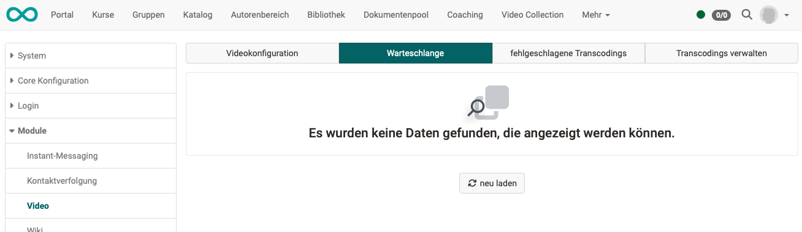
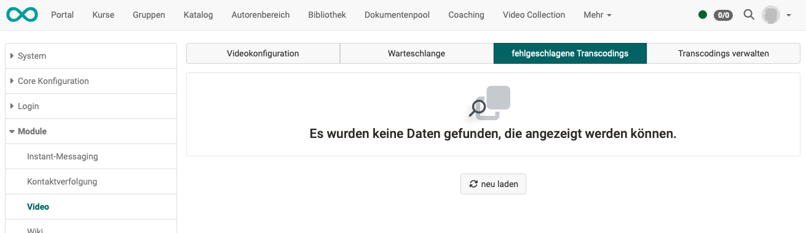
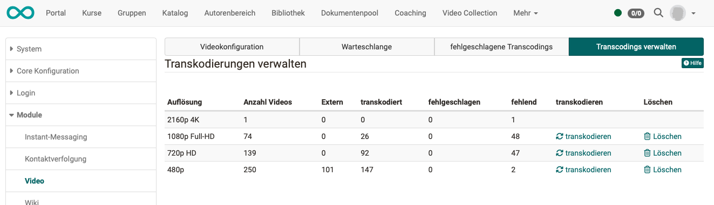

# Modul Video {: #module_video}

Das Modul Video wird in der System-Administration unter `Administration > Module > Video` konfiguriert.

Im Tab Videokonfiguration aktivieren/deaktivieren Sie als Administrator:in,

- ob Videoressourcen generell in der OpenOlat-Instanz zugelassen sind.  Beachten Sie: Es handelt sich um Videos, die im Autorenbereich gelistet sind (Lernressourcen). Direkt verlinkte Videos (z.B. in einer HTML-Seite) sind davon nicht betroffen.
- ob durch Autor:innen der Kursbaustein "Video" verwendet werden darf.

- Einstellungen zum Transcoding. Es kann festgelegt werden, welche Auflösungen erstellt werden. Die Originaldatei (Master) kann zur Speicherplatzoptimierung auch gelöscht bzw. ersetzt werden.

Der frentix Cloud-Transcodingservice kann beim Transcodieren zusätzlich automatisch Untertitel (Transkripte) für Videos erzeugen [:octicons-tag-16:{ title="ab Release 20.2.6 (OO-9347)" }](https://track.frentix.com/issue/OO-9347){:target="_blank"}. Diese Funktion ist Teil des frentix Cloud-Service und nicht in der Standard-Distribution von OpenOlat enthalten. Details dazu finden Sie im Benutzerhandbuch im Kapitel [Lernressource: Video](../../manual_user/learningresources/Learning_resource_Video.de.md#video_subtitles_auto).

!!! info "Wichtig"

    Wird der frentix Cloud-Transcodingservice genutzt, wird die lokale Audio- und Videokonvertierung deaktiviert.  Sind weder der frentix Cloud-Transcodingservice noch die lokale Audio- und Videokonvertierung aktiv, liegt es in der Regel daran, dass HandBrake oder ffmpeg nicht gefunden oder gestartet werden konnten.

## Tab Videokonfiguration {: #video_config}

{ class="shadow lightbox" }

### Transcoding-Modus {: #transcoding_mode}

Bei aktiviertem Transcoding legen Sie im Feld **Modus** fest, wo OpenOlat die Videodateien umwandelt [:octicons-tag-16:{ title="ab Release 20.2.2 (OO-9141)" }](https://track.frentix.com/issue/OO-9141){:target="_blank"}.

| Modus | Bedeutung |
|-------|-----------|
| **Lokal** | Die Umwandlung läuft auf dem OpenOlat-Server. Das Feld **HandBrakeCLI** zeigt den Pfad zum verwendeten Programm. |
| **Service** | Die Umwandlung übernimmt ein externer Transcodingservice. Seine Adresse tragen Sie im Feld **Transcoding Service URL** ein, die Angabe ist zwingend. |

Für Installationen, deren Transcoding-Verzeichnis ausserhalb des OpenOlat-Datenbereichs liegt, gilt der Modus **Remote**. Er erscheint als reine Textanzeige und lässt sich nicht umstellen.

Die automatische Untertitelgenerierung steht im Modus **Service** in Verbindung mit dem frentix Cloud-Transcodingservice zur Verfügung.

### Transcoding-Auflösungen {: #transcoding_resolutions}

Für neu hochgeladene Videodateien erzeugt OpenOlat transcodierte Dateien in den ausgewählten Auflösungen. Bei neu aktiviertem Transcoding ist **1080p Full-HD** als einzige Auflösung und als Standardauflösung gesetzt [:octicons-tag-16:{ title="ab Release 20.3.0 (OO-9187)" }](https://track.frentix.com/issue/OO-9187){:target="_blank"}. Jede zusätzlich aktivierte Auflösung erzeugt eine weitere Videodatei pro Video.

### Gesperrte Transcoding-Einstellungen {: #transcoding_readonly}

Die Transcoding-Einstellungen können durch die Serverkonfiguration gegen Änderungen gesperrt sein [:octicons-tag-16:{ title="ab Release 20.2.4 (OO-9242)" }](https://track.frentix.com/issue/OO-9242){:target="_blank"}. Gesperrte Felder sind nicht editierbar und tragen den Hinweis «Diese Einstellung wird durch die Datei olat.local.properties gesteuert.». Für eine Anpassung wenden Sie sich an Ihren OpenOlat Hosting-Partner.

## Tab Warteschlange {: #pending_transcodings}

{ class="shadow lightbox" }

## Tab Fehlgeschlagene Transcodings {: #failed_transcodings}

{ class="shadow lightbox" }

## Tab Transcodings verwalten {: #manage_transcodings}

{ class="shadow lightbox" }

## Weiterführende Informationen {: #further_information}

**Auf dieser Seite erwähnt** 
[Lernressource: Video >](../../manual_user/learningresources/Learning_resource_Video.de.md)

[Zum Seitenanfang ^](#module_video)