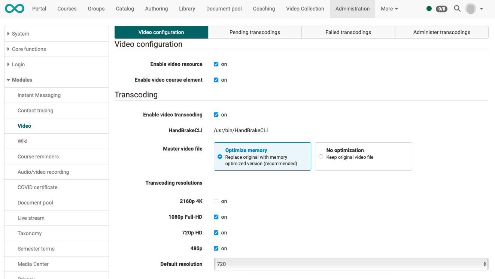
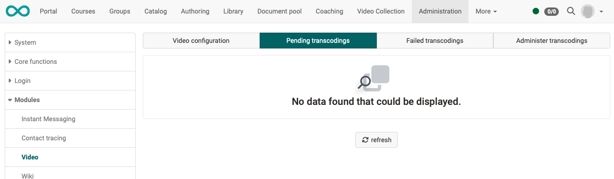
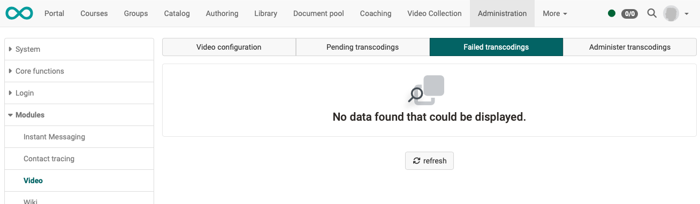
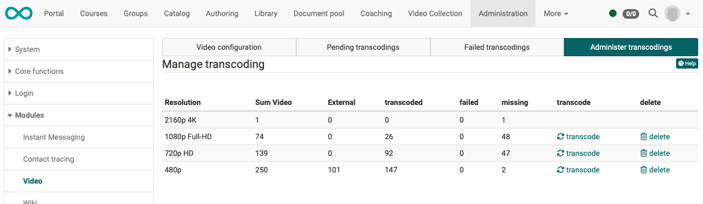

# Module Video

As an administrator activate/deactivate in the **Video configuration** tab,

- whether video resources are generally permitted in the OpenOlat instance.  Please note: These are videos that are listed in the authoring area (learning resources). Directly linked videos (e.g. in an HTML page) are not affected.

- whether the **course element video** may be used by authors.

- Settings for transcoding 
You can specify which resolutions are to be created.  
From version 19.0, the original file (master) can also be deleted or replaced to optimise storage space.

!!! tip "Hint"

    If a transcoding/conversion service is used in a cloud, local audio and video conversion is deactivated.  If neither a service in the cloud nor the local audio and video conversion are active, it is usually because HandBrake or ffmpeg could not be found or started.

## Tab Video Configuration

{ class="shadow lightbox" }

## Tab Pending Transcodings

{ class="shadow lightbox" }

## Tab Failed Transcodings

{ class="shadow lightbox" }

## Tab Administer Transcodings

{ class="shadow lightbox" }