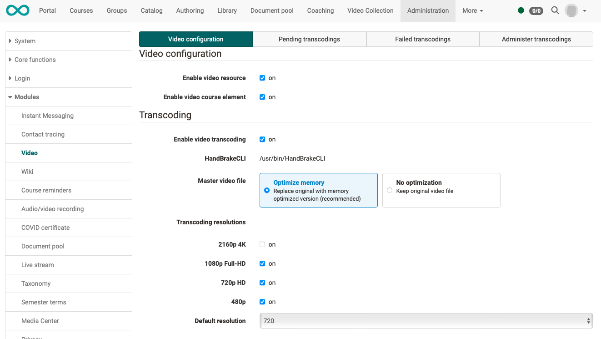
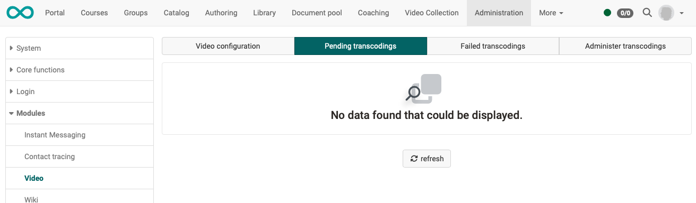
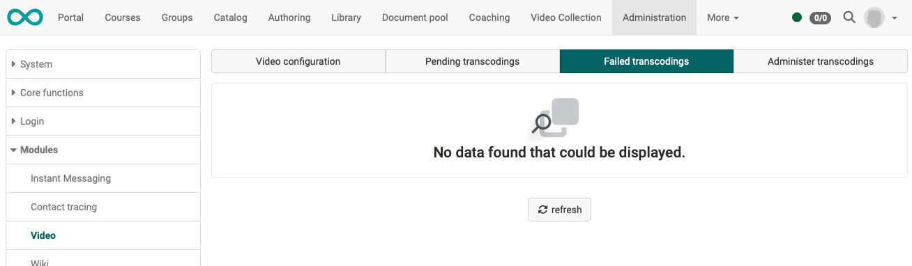
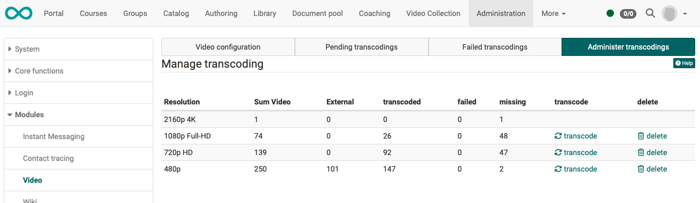

# Module Video {: #module_video}

As an administrator activate/deactivate in the **Video configuration** tab,

- whether video resources are generally permitted in the OpenOlat instance.  Please note: These are videos that are listed in the authoring area (learning resources). Directly linked videos (e.g. in an HTML page) are not affected.

- whether the **course element video** may be used by authors.

- Settings for transcoding. You can specify which resolutions are to be created. The original file (master) can also be deleted or replaced to optimise storage space.

The frentix cloud transcoding service can also automatically generate subtitles (transcripts) for videos during transcoding [:octicons-tag-16:{ title="from Release 20.2.6 (OO-9347)" }](https://track.frentix.com/issue/OO-9347){:target="_blank"}. This function is part of the frentix cloud service and is not included in the standard distribution of OpenOlat. For details, see the chapter [Learning resource: Video](../../manual_user/learningresources/Learning_resource_Video.md#video_subtitles_auto) in the user manual.

!!! info "Important"

    If a transcoding/conversion service is used in a cloud, local audio and video conversion is deactivated.  If neither a service in the cloud nor the local audio and video conversion are active, it is usually because HandBrake or ffmpeg could not be found or started.

## Tab Video Configuration {: #video_config}

{ class="shadow lightbox" }

## Tab Pending Transcodings {: #pending_transcodings}

{ class="shadow lightbox" }

## Tab Failed Transcodings {: #failed_transcodings}

{ class="shadow lightbox" }

## Tab Manage Transcodings {: #manage_transcodings}

{ class="shadow lightbox" }