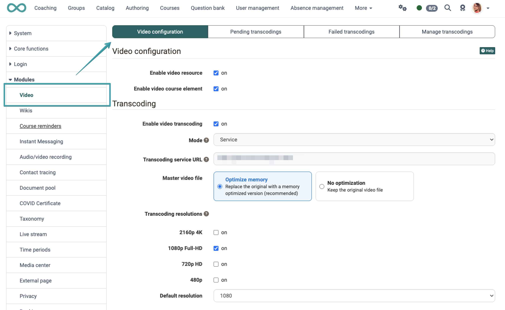
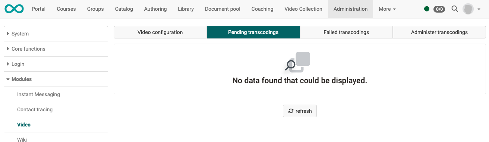
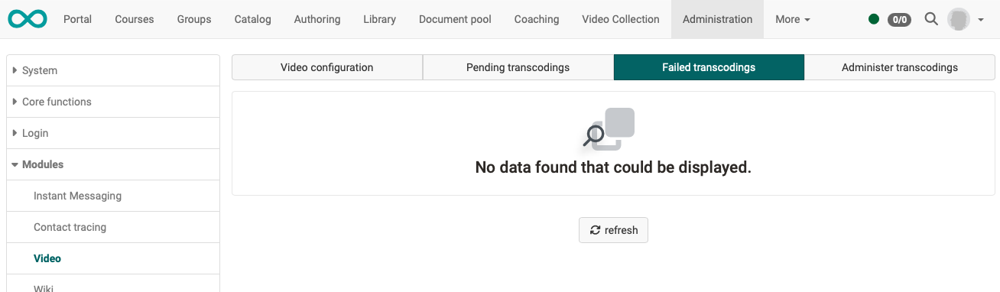
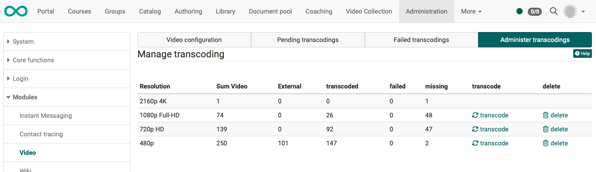

# Module Video {: #module_video}

The Video module is configured in the system administration under `Administration > Modules > Video`.

In the Video configuration tab, as an administrator you activate/deactivate,

- whether video resources are generally permitted in the OpenOlat instance.  Please note: These are videos that are listed in the authoring area (learning resources). Directly linked videos (e.g. in an HTML page) are not affected.

- whether the course element "Video" may be used by authors.

- Settings for transcoding. You can specify which resolutions are to be created. The original file (master) can also be deleted or replaced to optimise storage space.

The frentix cloud transcoding service can also automatically generate subtitles (transcripts) for videos during transcoding [:octicons-tag-16:{ title="from Release 20.2.6 (OO-9347)" }](https://track.frentix.com/issue/OO-9347){:target="_blank"}. This function is part of the frentix cloud service and is not included in the standard distribution of OpenOlat. For details, see the chapter [Learning resource: Video](../../manual_user/learningresources/Learning_resource_Video.md#video_subtitles_auto) in the user manual.

!!! info "Important"

    If the frentix cloud transcoding service is used, local audio and video conversion is deactivated.  If neither the frentix cloud transcoding service nor the local audio and video conversion are active, it is usually because HandBrake or ffmpeg could not be found or started.

## Tab Video Configuration {: #video_config}

{ class="shadow lightbox" }

### Transcoding mode {: #transcoding_mode}

When transcoding is enabled, the **Mode** field determines where OpenOlat converts the video files [:octicons-tag-16:{ title="from Release 20.2.2 (OO-9141)" }](https://track.frentix.com/issue/OO-9141){:target="_blank"}.

| Mode | Meaning |
|------|---------|
| **Local** | The conversion runs on the OpenOlat server. The **HandBrakeCLI** field shows the path to the program used. |
| **Service** | An external transcoding service handles the conversion. Enter its address in the **Transcoding service URL** field, this entry is mandatory. |

For installations whose transcoding directory is located outside the OpenOlat data area, the **Remote** mode applies. It appears as plain text only and cannot be changed.

Automatic subtitle generation is available in **Service** mode in combination with the frentix cloud transcoding service.

### Transcoding resolutions {: #transcoding_resolutions}

For newly uploaded video files, OpenOlat generates transcoded files in the selected resolutions. When transcoding is newly enabled, **1080p Full-HD** is set as the only resolution and as the default resolution [:octicons-tag-16:{ title="from Release 20.3.0 (OO-9187)" }](https://track.frentix.com/issue/OO-9187){:target="_blank"}. Each additional resolution enabled generates a further video file per video.

### Locked transcoding settings {: #transcoding_readonly}

The transcoding settings can be locked against changes by the server configuration [:octicons-tag-16:{ title="from Release 20.2.4 (OO-9242)" }](https://track.frentix.com/issue/OO-9242){:target="_blank"}. Locked fields cannot be edited and carry the note "This setting is controlled by the olat.local.properties file.". Please contact your OpenOlat hosting partner for an adjustment.

## Tab Pending Transcodings {: #pending_transcodings}

{ class="shadow lightbox" }

## Tab Failed Transcodings {: #failed_transcodings}

{ class="shadow lightbox" }

## Tab Manage Transcodings {: #manage_transcodings}

{ class="shadow lightbox" }

## Further information {: #further_information}

**Mentioned on this page** 
[Learning resource: Video >](../../manual_user/learningresources/Learning_resource_Video.md)

[To the top of the page ^](#module_video)