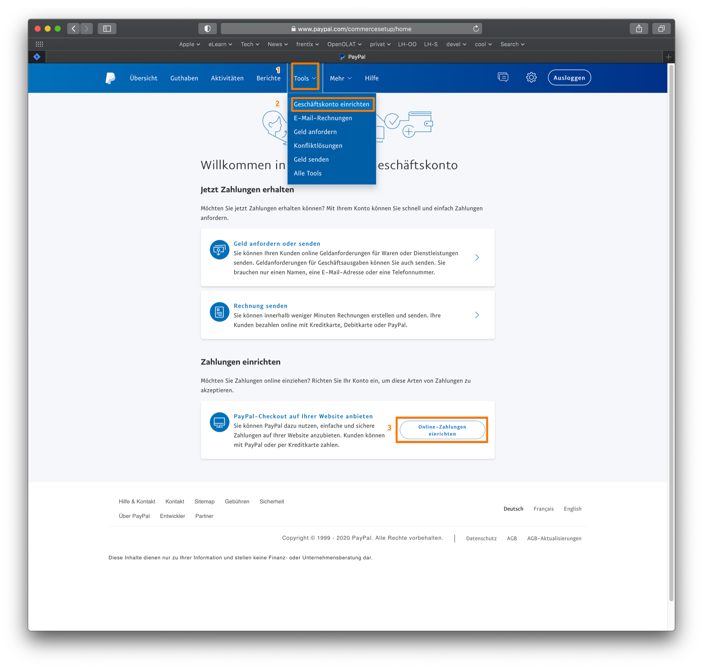
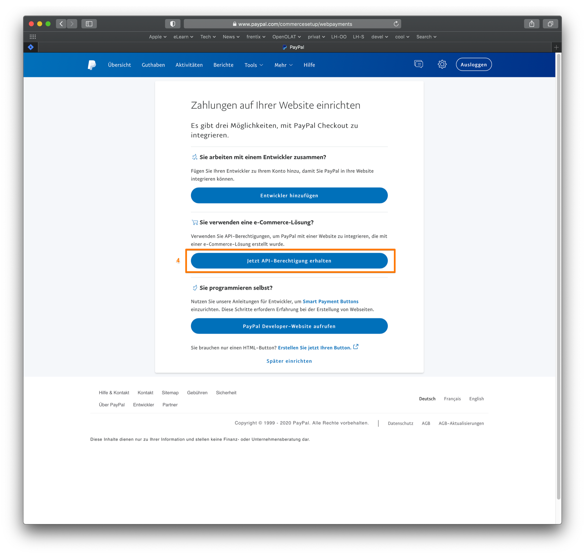
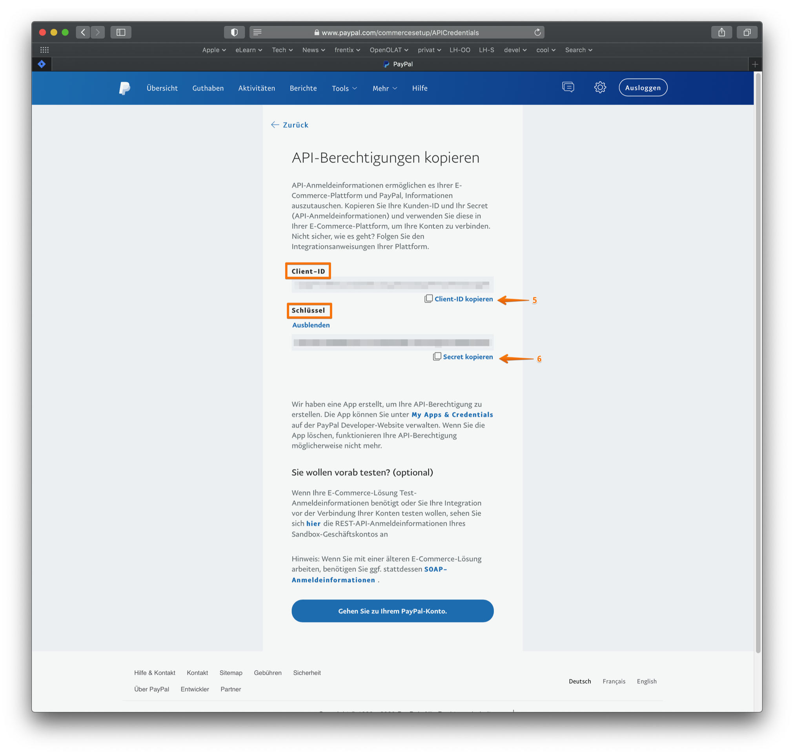
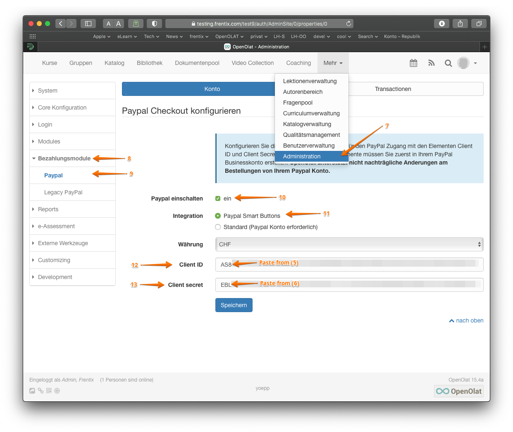

#  [PayPal Konfiguration](PayPal+Konfiguration.html)

Das PayPal Buchungsmodul erlaubt es Autoren Kurse und Arbeitsgruppen gegen
Geld freizuschalten. Ihre Kunden können dabei entweder mit Kreditkarte oder
direkt über PayPal bezahlen sofern sie einen PayPal Account besitzen. Dieser
ist aber für Ihre Kunden nicht zwingend notwendig. In der PayPal Konfiguration
der Systemadministration können Sie die PayPal Kontoinformationen hinterlegen,
die für alle Bezahlprozesse verwendet werden sollen.

Um die PayPal Buchungsmethode verwenden zu können müssen Sie über einen PayPal
Firmenkonto verfügen. Einen solches Konto können Sie bei PayPal ohne weitere
Kosten erstellen. In Ihrem PayPal Konto können Sie anschliessend eine
sogenannte API-Berechtigung erstellen. Diese besteht aus der Client-ID und dem
Schlüssel. Diese beiden Sicherheitselemente müssen Sie in der PayPal
Konfiguration von OpenOlat hinterlegen, damit das System die Bezahlungen Ihrer
Kunden auf Ihr Konto abwickeln kann. Weiter unten finden Sie Hinweise wie Sie
diese Sicherheitselemente auf der PayPal Webseite erstellen können.

##### Verwendung in Kursen und Arbeitsgruppen

Um Kurse und Arbeitsgruppen gegen Geld freizuschalten können Sie nach
erfolgreicher Konfiguration des PayPal Moduls auf der Detailseite des Kurses
oder in der Administrationsumgebung der Arbeitsgruppe die PayPal
Buchungsmethode auswählen. Weitere Informationen finden Sie unter
[Zugangskonfiguration](Zugangskonfiguration.html).

Je nach Währung, Land und Betrag verlangt PayPal eine Transaktionsgebühr.
Diese beträgt ca. 5% des Betrages und wird von dem jeweiligen Betrag
abgezogen.

##### PayPal API Berechtigung erstellen

Loggen Sie sich in Ihr PayPal Firmenkonto ein und vollziehen Sie die folgenden
Schritte nach:

  

Schritt 1: klicken Sie auf den Tab "Tools" (1) und wählen Sie den Punkt
"Geschäftskonto einrichten" (2) aus. Klicken Sie auf den Button "Online
Zahlungen einrichten" (3).|

  
  
---|---  
  
Schritt 2: klicken Sie auf den Button "Jetzt API-Berechtigung erhalten" (4).

|

  
  
Schritt 3: auf der Seite "API-Berechtigung kopieren" sehen Sie die Client-ID
(5) und den Schlüssel (6). Kopieren Sie beide Werte in ein Dokument zum
Zwischenspeichern.|

  
  
Schritt 4: Achten Sie darauf, dass die von Ihnen gewünschte Währung
eingestellt ist.

Klicken Sie dafür im Menu auf die Einstellungen und dann auf "Profil und
Einstellungen". Anschliessend links in der Navigation auf "Geld, Bankkoten und
Kreditkarten". Unter "Währungen verwalten" sehen Sie die für Ihr Konto
eingestellte Währung.

|

  
  
Schritt 5: Wenn Sie eine Währung erhalten, die von Ihnen nicht akzeptiert ist,
wird die Buchung auf den Status "pendent" gestellt. Damit das nicht passiert,
können Sie eine Einstellung anpassen.

Klicken Sie dafür wieder auf die Einstellungen und dann auf "Profil und
Einstellungen". Anschliessend links in der Navigation auf
"Zahlungseinstellungen". Unter "Zahlungen blockieren" klicken Sie auf
"Bearbeiten. Es erscheint ein neues Fenster.

  

|

  
  
Schritt 6: In dem neuen Fenster klicken Sie bei "Zahlungseingänge in einer
anderen Währung zulassen" auf "Ja, akzeptieren und umrechnen in Schweizer
Franken". Bei "Doppelte Zahlungen vermeiden" sollte "Ja, versehentlich doppelt
gesendete Zahlungen pro Rechnungsnummer ablehnen" angeklickt sein.|

  
  
Schritt 7: loggen Sie sich nun mit einem Systemadministrator-Account bei Ihrem
OpenOlat System ein.

Klicken Sie auf den Tab "Administration" (7). Klicken Sie links in der
Navigation auf "Bezahlungsmethode" (8) und dann auf "PayPal" (9).

Aktivieren Sie das PayPal-Modul in OpenOlat, in dem Sie PayPal einschalten
(10).

Wählen Sie als Integration den Wert "PayPal Smart Buttons" (11). Nur mit
dieser Variante ist ein Bezahlen mit Kreditkarte möglich, ohne dass der Käufer
ein PayPal-Konto eröffnen muss.

Wählen Sie die Währung und geben anschliessend die "Client ID" (12) und den
"Client secret" (=Schlüssel) (13) ein, den Sie zuvor in einem Dokument
zwischengespeichert haben.

|

  
  
