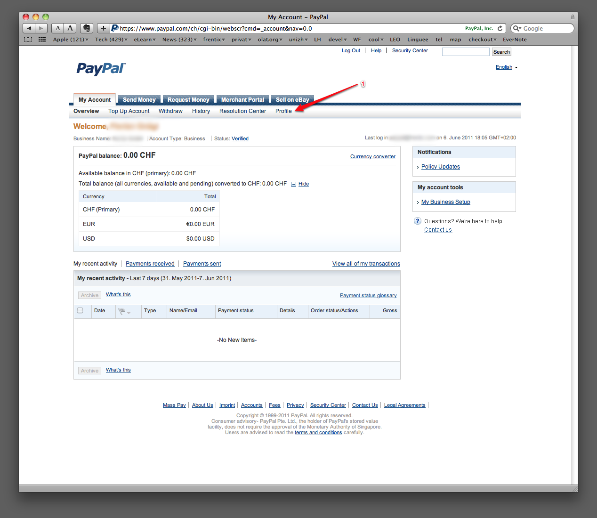
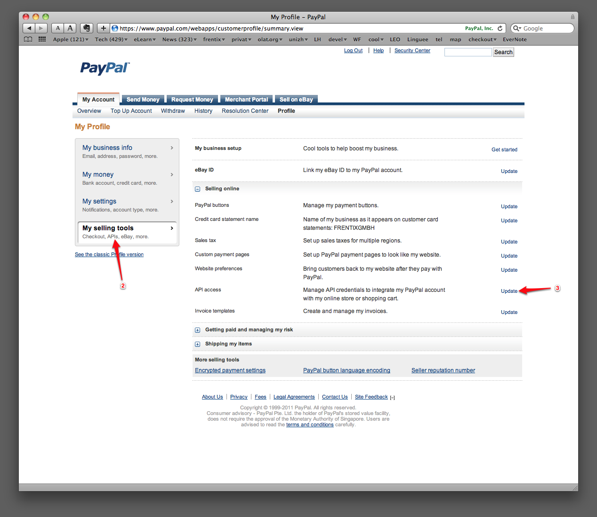
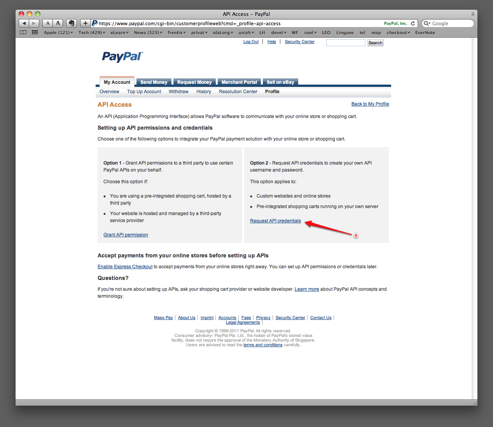
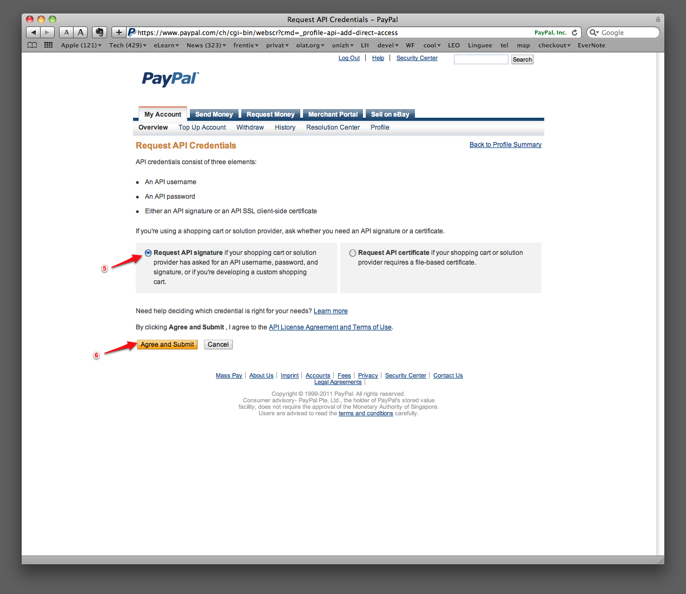
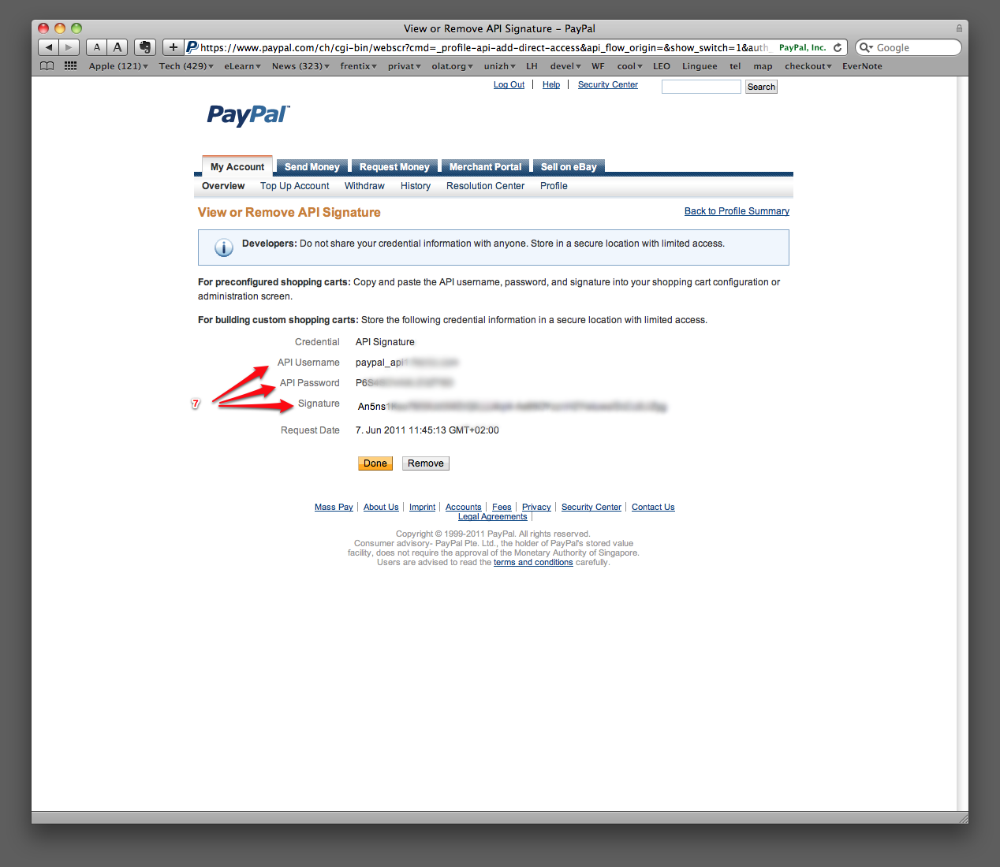
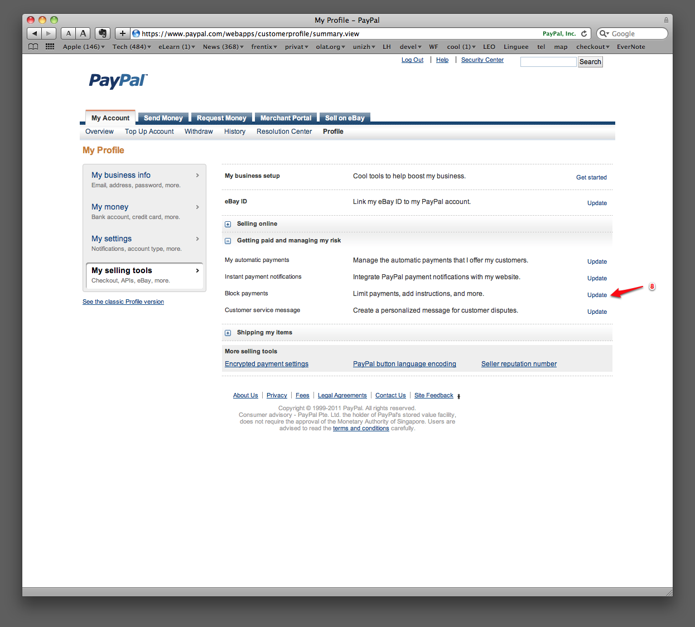
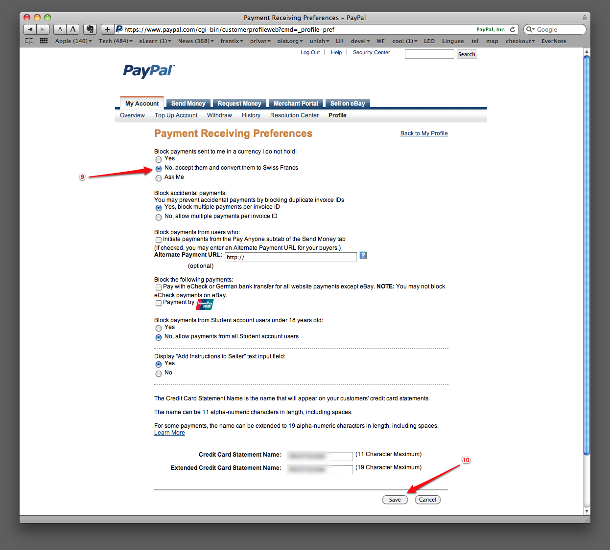

# PayPal Configuration

The PayPal booking module allows authors of courses and project groups to
charge money to grant access to those resources. Your clients can either pay
by credit card or by their PayPal account if they have one. Note that your
clients must not have a PayPal account to use this service, a credit card is
enough. In the PayPal configuration in the system administration you can
configure your PayPal business account information that is used for all
payment processes on this system.

In order to use the PayPal booking method you must have a PayPal business
account. Such an account can be created at the PayPal website at no cost.
Within your PayPal account you can then create the so called API-Credentials.
The API-Credentials consist of the API-username, the API-password and the API-
signature. Those three security elements must be configured in the PayPal
configuration section in the system administration. Below you find more
information how to create the API-Credentials at the PayPal website.

## Usage in courses and project groups

In order to publish courses and project groups with payment restrictions you
can select the PayPal booking method on the course details page or in the
administration section of a project group. Make sure the PayPal module is
configured properly in the system administration. You can find more
information [here](../../manual_user/learningresources/Access_configuration.md){ class="shadow lightbox" }

!!! warning "Attention"
	Depending on the used currency, the country and the amount PayPal will charge
	you a transaction fee. The fee will be about 5% of the resource price you
	define and will be subtracted from the payment made by your clients.

## Create the API Credentials

Log into your PayPal business account and perform the following steps:

- [x] Step 1: select "Profile"  
{ class="shadow lightbox" }

- [x]  Step 2: select "My selling tools"  
{ class="shadow lightbox" }  

- [x] Step 3: select "API access"  

- [x] Step 4: selection option 2 to request the API-Credentials  
{ class="shadow lightbox" }  

- [x] Step 5: select the method with the API-Signature  
{ class="shadow lightbox" }  

- [x] Step 6: submit the form  

- [x] Step 7: copy the API Username, the API Password and the Signature to the
PayPal configuration form in OLAT  
{ class="shadow lightbox" }  

- [x] Step 8: go back in PayPal to step 2 and select "Block payments" in the selling
tools 
{ class="shadow lightbox" }  

- [x] Step 9: select the option "No, accept them and convert" for the configuration
"Block payments sent to me in a currency I do not hold" Step 10: Don't forget
to save  
{ class="shadow lightbox" }

