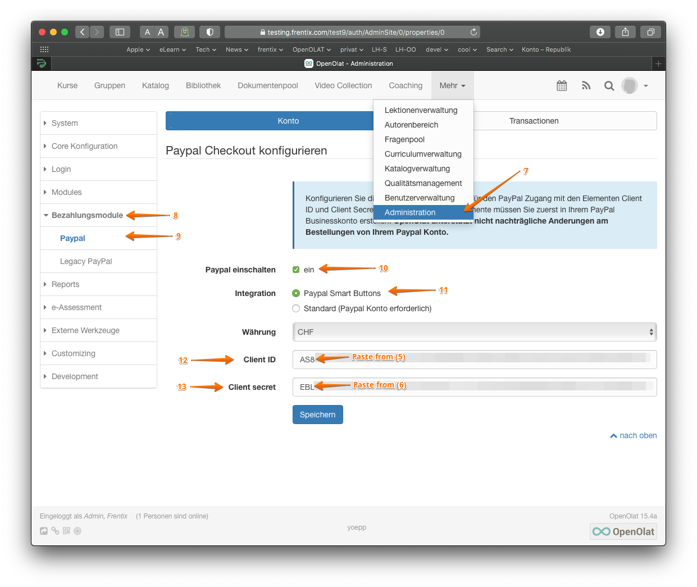

# PayPal Configuration

The PayPal booking module allows authors of courses and project groups to
charge money to grant access to those resources. Your clients can either pay
by credit card or by their PayPal account if they have one. Note that your
clients must not have a PayPal account to use this service, a credit card is
enough. In the PayPal configuration in the system administration you can
configure your PayPal business account information that is used for all
payment processes on this system.

In order to use the PayPal booking method you must have a PayPal business
account. Such an account can be created at the PayPal website at no cost.
Within your PayPal account you can then create the so called API-Credentials.
The API-Credentials consist of the API-username, the API-password and the API-
signature. Those three security elements must be configured in the PayPal
configuration section in the system administration. Below you find more
information how to create the API-Credentials at the PayPal website.

## Usage in courses and project groups

In order to publish courses and project groups with payment restrictions you
can select the PayPal booking method on the course details page or in the
administration section of a project group. Make sure the PayPal module is
configured properly in the system administration. You can find more
information [here](../../manual_user/learningresources/Access_configuration.md){ class="shadow lightbox" }

!!! warning "Attention"
	Depending on the used currency, the country and the amount PayPal will charge
	you a transaction fee. The fee will be about 5% of the resource price you
	define and will be subtracted from the payment made by your clients.

## Create the API Credentials

Log into your PayPal business account and perform the following steps:

- [x] Step 1: Click on the "Tools" tab (1) and select the item
"Set up business account" (2). Click on the button "Set up online
Set up online payments" (3).
{ class=" lightbox" }

- [x]  Step 2: Click on the "Get API authorization now" button (4).
{ class=" lightbox" }   

- [x] Step 3: On the "Copy API authorization" page, you will see the client ID
(5) and the key (6). Copy both values into a document for
cache.

- [x] Step 4: selection option 2 to request the API-Credentials  
{ class="shadow lightbox" } 
	
  -  To do this, click on the settings in the menu and then on "Profile and settings". Then click on "Money, bank cards and credit cards" in the navigation bar on the left. Under "Manage currencies" you can see the currency set for your account. 
{ class="shadow lightbox" } 

- [x] Step 5: If you receive a currency that is not accepted by you, the booking is set to "pending" status. To prevent this from happening, you can adjust a setting.

   -  To do this, click on the settings again and then on "Profile and settings". Then click on "Payment settings" in the navigation on the left. Under "Block payments", click on "Edit". A new window will appear.    
{ class="shadow lightbox" }

- [x] Step 6: In the new window, click on "Yes, accept and convert to Swiss francs" under "Allow incoming payments in another currency". Under "Avoid duplicate payments", "Yes, reject accidentally duplicate payments per invoice number" should be ticked.
{ class="shadow lightbox" } 

- [x] Step 7: Now log in to your OpenOlat system with a system administrator account.
  
  - Click on the "Administration" tab (7). Click on "Payment method" (8) in the navigation on the left and then on "PayPal" (9).

  -  Activate the PayPal module in OpenOlat by activating PayPal (10).  

  - Select the value "PayPal Smart Buttons" (11) as the integration. Only with this variant is it possible to pay by credit card without the buyer having to open a PayPal account.

  - Select the currency and then enter the "Client ID" (12) and the "Client secret" (=key) (13) that you have previously saved temporarily in a document. 

{ class=" lightbox" }

