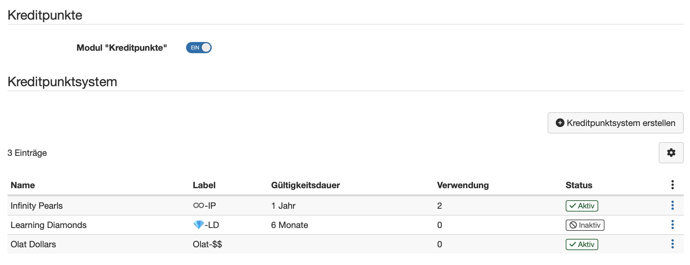

# Kreditpunkte {: #credit_points}

!!! warning "Achtung"

    Dieser Artikel ist noch in Bearbeitung.

Ab  Release 20.1.1 steht die erste Fassung des Moduls "Kreditpunkte" zur Verfügung, welches in Zukunft auch in Verbindung mit Zertifizierungsprogrammen in OpenOlat relevant ist.

Über das Modul können eigene Kreditpunktesysteme global definiert werden. Diese ermöglichen später den Teilnehmenden für das Bestehen von Kursen Bildungspunkte/Credits, wie zum Beispiel ECTS oder LearnCoins, zu sammeln.

In der nächsten Ausbaustufe können die Credits dann wiederum als Währung verwendet werden, um weitere Kurse zu kaufen oder um im Rahmen einer Rezertifizierung die gesammelten Credits für die Erneuerung des Zertifikats einzulösen.

Ein reines Wiederholen des initialen Zertifikatskurses ist somit nicht mehr erforderlich.

{ class="shadow lightbox }

[Zum Seitenanfang ^](#credit_points)