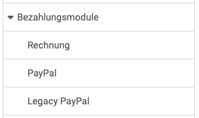

# Bezahlungsmodule: Übersicht {: #payment}

{ class="shadow lightbox aside-left-lg" }

Es stehen derzeit folgende Bezahlungsmodule zur Verfügung und können konfiguriert werden:

---

## Rechnung {: #payment_invoice}

Verfügbar ab :octicons-tag-24: Release 20

Wird ein OpenOlat-Curriculum verwendet, kann per Rechnung bestellt werden.

[Zu den Details >](Payment_Invoice.de.md) 
[Zum Seitenanfang ^](#payment)

  
## Paypal {: #payment_paypal}

Im Bereich "Paypal" wird Paypal aktiviert. Konfigurieren Sie die PayPal API-
Berechtigung für den PayPal Zugang mit den Elementen Client ID und Client
Secret. Diese zwei Sicherheitselemente müssen Sie zuerst in Ihrem PayPal
Businesskonto erstellen. OpenOlat unterstützt nicht nachträgliche Anderungen
am Bestellungen von Ihrem Paypal Konto.

[Zu den Details >](PayPal_Configuration.de.md) 
[Zum Seitenanfang ^](#payment)

## Legacy Paypal {: #payment_legacy_paypal}

[Zum Seitenanfang ^](#payment)