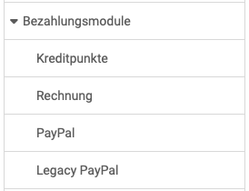

# Bezahlungsmodule: Übersicht {: #payment}

{ class="shadow lightbox aside-left-lg" }

Es stehen derzeit folgende Bezahlungsmodule zur Verfügung und können konfiguriert werden:

---

## Kreditpunkte {: #payment_credit_points}

Verfügbar ab :octicons-tag-24: Release 20.1

Über das Modul können eigene Kreditpunktesysteme global definiert werden. Diese ermöglichen später den Teilnehmenden für das Bestehen von Kursen Bildungspunkte/Credits, wie zum Beispiel ECTS oder LearnCoins, zu sammeln.

In Planung:
Die Credits können wiederum als Währung verwendet werden, um weitere Kurse zu kaufen oder um im Rahmen einer Rezertifizierung die gesammelten Credits für die Erneuerung des Zertifikats einzulösen.

[Zu den Details >](Credit_Points.de.md) 
[Zum Seitenanfang ^](#payment)

---

## Rechnung {: #payment_invoice}

Verfügbar ab :octicons-tag-24: Release 20

Wird ein OpenOlat-Produkt angeboten, kann per Rechnung bestellt werden.

[Zu den Details >](Payment_Invoice.de.md) 
[Zum Seitenanfang ^](#payment)

---

  
## Paypal {: #payment_paypal}

Im Bereich "Paypal" wird Paypal aktiviert. Konfigurieren Sie die PayPal API-
Berechtigung für den PayPal Zugang mit den Elementen Client ID und Client
Secret. Diese zwei Sicherheitselemente müssen Sie zuerst in Ihrem PayPal
Businesskonto erstellen. OpenOlat unterstützt nicht nachträgliche Anderungen
am Bestellungen von Ihrem Paypal Konto.

[Zu den Details >](PayPal_Configuration.de.md) 
[Zum Seitenanfang ^](#payment)

---

## Legacy Paypal {: #payment_legacy_paypal}

[Zum Seitenanfang ^](#payment)

---

## Angaben, die alle Bezahlungsarten betreffen: Mehrwertsteuer {: #payment_VAT}

Auf dem Eingangsbildschirm zu "Bezahlungsmodule" werden Ihnen Angaben ermöglicht, die alle Zahlungsarten betreffen. Insbesondere sind dies Angaben zur Mehrwertsteuer.

{ class="shadow lightbox }

[Zum Seitenanfang ^](#payment)
