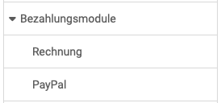

# Bezahlungsmodule: Übersicht {: #payment}

{ class="shadow lightbox aside-left-lg" }

Es stehen derzeit folgende Bezahlungsmodule zur Verfügung und können konfiguriert werden:

---

## Rechnung [:octicons-tag-16:{ title="ab Release 20.0.0 (OO-8210)" }](https://track.frentix.com/issue/OO-8210) {: #payment_invoice}

Wird ein OpenOlat-Produkt angeboten, kann per Rechnung bestellt werden.

[Zu den Details >](Payment_Invoice.de.md) 
[Zum Seitenanfang ^](#payment)

---

## PayPal {: #payment_paypal}

Im Bereich "PayPal" wird PayPal aktiviert. Konfigurieren Sie die PayPal API-Berechtigung für den PayPal Zugang mit den Elementen Client ID und Client Secret. Diese zwei Sicherheitselemente müssen Sie zuerst in Ihrem PayPal Businesskonto erstellen. OpenOlat unterstützt nicht nachträgliche Änderungen an Bestellungen von Ihrem PayPal Konto.

[Zu den Details >](Payment_PayPal.de.md) 
[Zum Seitenanfang ^](#payment)

---

## Angaben, die alle Zahlungsarten betreffen: Mehrwertsteuer {: #payment_VAT}

Auf dem Eingangsbildschirm zu "Bezahlungsmodule" werden Ihnen Angaben ermöglicht, die alle Zahlungsarten betreffen. Insbesondere sind dies Angaben zur Mehrwertsteuer.

{ class="shadow lightbox" }

[Zum Seitenanfang ^](#payment)
