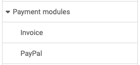

# Payment modules: Overview {: #payment}

{ class="shadow lightbox aside-left-lg" }

The following payment modules are currently available and can be configured:

---

## Invoice {: #payment_invoice}

Available from :octicons-tag-24: Release 20

If an OpenOlat product is offered, it can be ordered by invoice.

[See the details >](Payment_Invoice.md) 
[To the top of the page ^](#payment)

---

  
## Paypal {: #payment_paypal}

In the Paypal section, Paypal is enabled.
Configure the PayPal API authorization for PayPal access with the Client ID and Client Secret elements.
You must first create these two security elements in your PayPal business account. 
OpenOlat does not support subsequent changes to orders from your Paypal account.

[See the details >](Payment_PayPal.md) 
[To the top of the page ^](#payment)

---

## Information concerning all payment methods:  VAT {: #payment_VAT}

On the initial screen for ‘Payment modules’, you can enter information relating to all payment methods. In particular, this includes information on value added tax.

{ class="shadow lightbox }

[To the top of the page ^](#payment)
