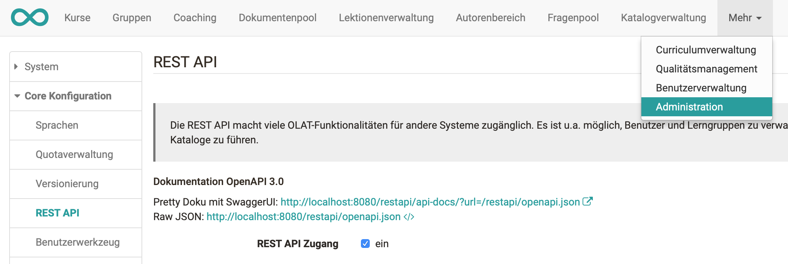

# REST API

  

Das ziel des REST API ist es einen einfachen Austausch von URLs zu
ermöglichen. Es ist beispielsweise möglich, Benutzer und Lerngruppen zu
verwalten, Kurse zu importieren, oder Kataloge zusammenzustellen. Es kann auch
zur Integration in andere Systeme benutzt werden, so wie Schülerverwaltung,
externe Kursverwaltung und/oder externe Lerngruppen-Verwaltung. Es unterstützt
ebenfalls den Prozess vom Hinzufügen von mehreren System-spezifischen Objekten
und Kreieren von verschiedensten strukturellen Eigenschaften.

Das REST API kann unter Administration aktiviert / deaktiviert werden.

{ class="shadow lightbox" }
  

## Konzept

„Representational State Transfer“, oder REST ist ein Architekturstil, der
primär, aber nicht ausschliesslich, mit dem HTTP Protokoll genutzt werden
soll. Im Falle von HTTP, benutzt es alle dessen Eigenschaften: URIs um
Ressourcen zu beschreiben, HTTP Methoden als „Verben“ um Ressourcen zu
manipulieren (GET um Ressourcen abzurufen, PUT um neue zu kreieren, POST um
sie zu modifizieren, DELETE um sie zu löschen), HTTP Headers und Mediale Typen
um Inhalt zu vermitteln…

In OpenOlat wird die JSR-311: JAX-RS (Das Java API für RESTful Web Services)
als Backendimplementierung für das REST API genutzt. JSR-311 ist ein Standard
von J2EE. Wir benutzten die Referenzimplementierung vom folgenden Standard:
[Jersey](https://jersey.dev.java.net/).

### Benutzung

Das OpenOlat REST API wurde im Sinne von fernen Verwaltungsapplikationen
entwickelt. Es beinhaltet nicht alle Funktionen, die im web UI vorhanden sind
und viele Anfragen sind limitiert auf administrative Benutzer so wie Admin,
Benutzer- oder Gruppenverwalter und Autoren.

Einige der Hauptfunktionen des OpenOlat REST API beinhalten beispielsweise das
Kreieren und Organisieren von Benutzern, Kursen, Gruppen, Organisationen,
Lehrgängen (Curriculum) oder Kalenderereignissen (Events).

Das REST API ist allerdings nicht in der Lage „Roll Calls“ auszuführen oder
spezifische Einstellungen zu ändern.

Obwohl rein theoretisch möglich, ist es nicht im Sinne des Konzepts das API
als Endbenutzer für eine Implementierung für einen alternativen UI Client zu
benutzen.

## Sicherheit

Die Sicherheit basiert auf einem Zwei-Level-Mechanismus, so wie es in OpenOlat
entsprechend implementiert wurde.

  1. Das erste Level ist ein Servletfilter, der alle Anfragen des REST API sammelt. Dieser Filter entscheidet, ob die URI offen für jeden (`/api`, `/ping`, `/auth`…) ist, oder ob es  eine Authentifizierung benötigt. Die Authentifizierung selbst ist zu einem Web Service delegiert.
  2. Das zweite Level passiert in allen Eingangspunkten im REST API. Jede Methode überprüft, ob der Benutzer (wenn dieser authentifiziert sein muss) genügend Rechte hat, um auf der entsprechenden Ressource agieren zu können.

Um eine gültige Authentifizierung über mehrere Anfragen aufrecht zu erhalten,
schlägt der Filter folgende zwei Methoden vor:

  1. Benutze das Session Cookie wieder auf jeder Anfrage. Der Vorteil dieser Methode ist, dass OpenOlat nicht eine neue Session kreieren muss mit jeder Anfrage.
  2. Wenn Sie kein Session Cookie benutzen, dann fügt der Filter immer einen HTTP Header (`X-OLAT-TOKEN`) der Antwort hinzu. Senden Sie dieses Token um ihre Rechte zu erhalten. 

  

### Bewährte Vorgehensweise

Wenn das REST API benutzt wird um spezifische Funktionen im OpenOlat Web-
Benutzeroberfläche zu implementieren, wie z.B. die Verwendung der
Kursdatenbank, kann das OpenOlat Websession-Cookie wiederverwendet werden
(Methode 1). Der Benutzer ist schon authentifiziert im Browser.

Wenn das REST API von einer externen (Server basierten) Applikation genutzt
wird, dann ist es empfehlenswert die „Basic Authentication“ zu benutzen und
Session Cookies im HTTP client der fernen Applikation zu aktivieren.

Wenn die zwei genannten Methoden nicht möglich sind, dann benutzen Sie die
Methode 2 mit em `X-OLAT-TOKEN`. Beachten Sie, dass ein Benutzer nur ein `X-OLAT-
TOKEN` zu einem beliebigen Zeitpunkt haben kann. Wenn Ihre ferne Applikation
mehrere (gleichzeitige) Arbeiter hat, dann sollte „basic authentication“
benutzt werden.

Wenn Sie ein fernes Portal und einen eigenen single-sign-on Prozess
implementieren möchten, dann kann Methode 2 benutzt werden um ein X-OLAT-TOKEN
für jeden Benutzer als Serveranfrage zu generieren. Das Token kann dann jedem
Link im Portal hinzugefügt werden, um den Benutzer basierend auf dem Token zu
authentifizieren (`?X-OLAT-TOKEN=xyz`). Wenn auf den Link geklickt wird,
identifiziert OpenOlat den Benutzter basierend auf dem Token und kreiert eine
gültige Benutzer Session. Sicherheitstechnisch gibt es besser Optionen um das
selbe Resultat zu erhalten. Wir empfehlen oAuth als alternative, was ebenfalls
von OpenOlat unterstützt wird.

## Konfiguration

Ein Spring Bean erlaubt es Ressourcen, Singletons und Provider zu
konfigurieren; entweder statisch mit der XML-Konfiguration des Beans (
`/org/Olat/restapi/_spring/restApiContext.xml` ), oder programmatisch mit dem
Hinzufügen oder Entfernen von Klassen und Singletons zum/vom Bean (Bean Id ist
die selbe wie im Interface: `org.Olat.restapi.support.RestRegistrationService`
).

OpenOlat benutzt den Standart-JAXB-Provider von Jersey um XML von Javaobjekten
zu generieren, sowie auch JSON-Provider von
[Jackson](http://jackson.codehaus.org/), welches die selben JAXB-Annotationen
wiederbenutzt.  

!!! important
	Alle Konfigurationen müssen vor dem Start des Jersey-Servlets eingestellt werden.

### Beispiel

Hier ist ein kleines Beispiel wie Sie einen Benutzer kreieren und diesen einer
Lerngruppe hinzufügen:
    
    PUT https://your.openolat.domain/olat/restapi/users
    HTTP Header: Content-Type application/json
    Response: 200
    GET https://your.openolat.domain/olat/restapi/groups
    HTTP Header: Accept application/json
    Response: 200
    Choose a group
    PUT https://your.openolat.domain/olat/restapi/groups/{groupId}/users/{identityKey}
    Response: 200

  

## Dokumentation

Die Dokumentation basiert auf der OpenAPI-Spezifikation (früher Swagger-
Spezifikation), welche ein API-Beschreibungsformat ist für REST APIs. Das
OpenAPI beschreibt verfügbare Endpunkte und Opertationen auf den
entsprechenden Endpunkten, Parameter und Input sowie Output für jede
Operation. Die Werteobjekte die vom REST API benutzt werden, sind ebenfalls
aufgelistet.

Das OpenAPI ist aus einem einzelnen Dokument erstellt und enthält mehrere
Komponenten, welche alle in der openapi.json (
`/org/Olat/restapi/openapi.json`) beschrieben sind.

Das OpenAPI erlaubt es ein spezifisches Server-Prefix auszuwählen und es ist
möglich gelistete Anfragen auszuführen, indem Sie den „try it out“ Button
benutzen. Es muss Ihnen bewusst sein, dass diese Anfragen verbindlich sind und
direkt mit dem adressierten System interagieren.

  

##  Extern verwaltete (managed) Kurse und Gruppen {: #managed}

Kurse und Gruppen können über das REST API erstellt werden. Solch extern
erstellte Kurse und Gruppen werden als "managed" bezeichnet, da ein externes
System das datenführende System ist. Die Verwendung dieser Funktion können Sie
hier ein- und ausschalten.

Über das REST API können für Kurse und Gruppen die ID des externen Systems
hinterlegt werden. Bei Kursen kann zudem eine externe Referenz verwendet
werden, die aus Benutzersicht eine Identifikation des Kurses ermöglicht.

Verwendet man die externen ID's für Kurse oder Gruppen, so ist zusätzlich zu
definieren welche Elemente einer sochen extern erstellten Ressource in
OpenOlat nicht verwaltet werden dürfen. Dies wird mit sogenannten "managed
Flags" definiert. Es können entweder alle Elemente extern verwaltet sein, oder
feingranular verwaltet sein; z.B. nur die Metadaten und die
Benutzerverwaltung. Die Konfiguration der "managed Flags" entnehmen Sie der
technischen dokumentation des REST API.

Ist die externe Verwaltung eingeschaltet, so werden in der OpenOlat
Benutzerschnittstelle für entsprechende Ressourcen die mit den "managed Flags"
konfigurierten Elemente als nicht editierbar dargestellt. Zudem werden die
externen Id's in Suchfeldern, Anzeigen und Tabellen verwendet. Andere, nicht
extern erstellte Ressourcen können parallell dazu normal verwendet und
verwaltet werden.

??? abstract "Managed Organisationen"

	* Vollständige externe Verwaltung (all)
	    * Bezeichnung (identifier)
	    * Anzeigename (displayName)
	    * Beschreibung (description)
	    * Externe Id (externalId)
	    * Typ der Organisation (type)
	    * Organisation bewegen (move)
	    * Organisation löschen (delete)
	    * Mitgliederverwaltung (members)

??? abstract "Managed Organisationstypen"
	
	* Vollständige externe Verwaltung (all)
	    * Bezeichnung (identifier)
	    * Anzeigename (displayName)
	    * Beschreibung (description)
	    * css Klasse (cssClass)
	    * Externe Id (externald)
	    * Untertypen Verwaltung (subTypes)
	    * Typ löschen (delete)
	
??? abstract "Managed Curriculum"
	
	* Vollständige externe Verwaltung (all)
	    * Bezeichnung (identifier)
	    * Anzeigename (displayName)
	    * Beschreibung (description)
	    * Externe Id (exernalId)
	    * Curriculum löschen (delete)
	    * Mitgliederverwaltung (members)
	
??? abstract "Managed Curriculumelemente"
	
	* Vollständige externe Verwaltung (all)
	    * Bezeichnung (identifier)
	    * Anzeigename (displayName)
	    * Beschreibung (description)
	    * Externe Id (externalId)
	    * Status (status)
	    * Angaben zum Datum (dates)
	    * Typ (type)
	    * Kalender (calendars)
	    * Lektionen (lectures)
	    * Mitgliederverwaltung (members)
	    * Ressourcen (resources)
	    * Element verschieben (move)
	    * Unterelemente hinzufügen (addChildren)
	    * Element löschen (delete)
	
??? abstract "Managed Curriculumelementtypen"
	
	* Vollständige externe Verwaltung (all)
	    * Bezeichnung (identifier)
	    * Anzeigename (displayName)
	    * css Klasse (cssClass)
	    * Beschreibung (description)
	    * Externe Id (externalId)
	    * Kalender (calendars)
	    * Lektionen (lectures)
	    * Untertypen (subTypes)
	    * Kopieren (copy)
	    * Den Typen löschen (delete)
	
??? abstract "Managed Gruppen"
	
	* Vollständige externe Verwaltung (all)
	    * Titel, Beschreibung und Einstellungen Plätze/Warteliste (details)
	        * Gruppentitel (title)
	        * Beschreibung (description) 
	        * Einstellungen Plätze/Warteliste (settings)
	    * Werkzeuge konfigurieren (tools)
	    * Mitgliederverwaltung und Sichtbarkeit Mitglieder (members)
	        * Sichtbarkeit Mitglieder (display)
	        * Mitgliederverwaltung (membersmanagement)
	    * Kurse einbinden (resources)
	    * Buchungsregeln (bookings)
	    * Gruppe Löschen (delete)
	
??? abstract "Managed Lernressourcen (Kurse)"
	
	* Vollständige externe Verwaltung (all)
	    * Kurseditor (editcontent)
	    * Details (details) 
	        * Titel (title)
	        * Beschreibung (description)
	        * Ziele (objectives)
	        * Anforderungen (requirements)
	        * Credits (credits)
	        * Angaben zum Ort (location)
	        * Organisationen (organisations)
	    * Einstellungen (settings)
	        * Einstellung für Zugriff (access)
	        * Einstellung für Suche (search)
	        * Einstellung für Chat (chat)
	        * Einstellung für Layout (layout)
	        * Einstellung für Ressourcenordner (resourcefolder)
	        * Einstellung für Leistungsnachweis (efficencystatement)
	        * Einstellung für Kalender (calendar)
	        * Einstellung für Glossar (glossary)
	    * Lektion (lecture)
	        * Lektionseinstellungen (lectureconfig)
	        * Lektionenverwaltung (lecturemanagement)
	    * Buchungsregeln (bookings)
	    * Mitgliederverwaltung (memebersmanagement)
	    * Gruppenverwaltung (groups)
	    * Kurs schliessen (close)
	    * Kurs löschen (delete)
	    * Kurs kopieren (copy)
	
??? abstract "Managed Lektionenblöcke"
	
	* Vollständige externe Verwaltung (all)
	    * Details (details)
	        * Titel (title)
	        * Anwesenheit obligatorisch (compulsory)
	        * Geplante Lektionen (plannedLectures)
	        * Dozenten (teachers)
	        * Gruppen (groups)
	        * Beschreibung (description)
	        * Vorbereitung/Nachbereitung (preparation)
	        * Angaben zum Ort (location)
	        * Angaben zum Datum (dates)
	    * Einstellungen (settings)
	    * Lektionenblock löschen (delete)
	
??? abstract "Managed Taxonomien"
	
	* Vollständige externe Verwaltung (all)
	    * Bezeichnung (identifier)
	    * Anzeigename (displayName)
	    * Beschreibung (description)
	    * Externe Id (externalId)
	    * Bibliothek Einstellungen (librarySettings)
	
??? abstract "Managed Taxonomiebenen"
	
	* Vollständige externe Verwaltung (all)
	    * Bezeichnung (identifier)
	    * Anzeigename (displayName)
	    * Beschreibung (description)
	    * Externe Id (externalId) 
	    * Sortierung (sortOrder)
	    * Typ (type)
	    * Alle Kompetenzen (competences)
	        * Kompetenz "Verwalten" (manageCompetence)
	        * Kompetenz "Dozieren" (teachCompetence)
	        * Kompetenz "Haben" (haveCompetence)
	        * Kompetenz "Ziel" (targetCompetence)
	    * Ebene verschieben (move)
	    * Ebene löschen (delete)
	
??? abstract "Managed Taxonomieebenentypen"
	
	* Vollständige externe Verwaltung (all)
	    * Bezeichnung (identifier)
	    * Anzeigename (displayName)
	    * Beschreibung (description)
	    * css Klasse (cssClass)
	    * Externe Id (externalId)
	    * Sichtbarkeit (visibility)
	    * Unterelemente verwalten (subTypes)
	    * Kopieren (copy)
	    * Bibliothek Einstellungen (librarySettings)
	    * Typ löschen (delete)
	
??? abstract "Managed Kalender"
	
	* Vollständige externe Verwaltung (all)
	    * Details (details)  	
	        * Fach (subject)
	        * Beschreibung (description)
	        * Angaben zum Ort (location)
	        * Angaben zum Datum (dates)
	        * Livestream URL (liveStreamUrl)
	    * Klassifizierung (classification)
	    * Links (links)
	
??? abstract "Managed Rollen"
	
	* Vollständige externe Verwaltung (all)
	    * Name (name)
	    * Rechte (rights)
	    * Rolle löschen (delete)
	
??? abstract "Managed Identität zu Identität Verhältnis"
	
	* Vollständige externe Verwaltung (all)
	    * Verhältnis löschen (delete)

  

  

