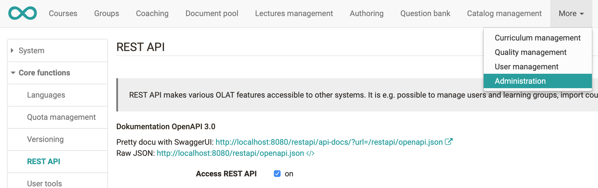

# REST API

The goal of the REST API is to provide an easy way to exchange URLs. It is
e.g. possible to manage users and learning groups, import courses, or assemble
catalogs. It is also used to integrate with other systems such as student
administration, external course administration and/or external learning group
administration. It also supports the process of adding multiple system
specific objects and creating various amounts of structural behaviors.

The REST API can be activated / deactivated under administration.

  * 1Concepts
    * 1.1Usage
  * 2Security
    * 2.1Best practice usage
  * 3Configuration
    * 3.1Example
  * 4Documentation
  * 5 Externally managed courses and groups

  

### **Concepts**

Representational State Transfer or REST is a style of architecture to be
primarily used with the HTTP protocol, but not exclusively. In the case of
HTTP, it utilizes all its features: URIs to describe resources, HTTP Methods
as "verbs" to manipulate resources (GET to retrieve resources, PUT to create
new ones, POST to modify them, DELETE...), HTTP Headers and Media Types for
content negotiation...

In OpenOlat, the JSR-311: JAX-RS (The Java API for RESTful Web Services) is
used as a backend for the implementation of our REST API. JSR-311 is a
standard from J2EE. We use the reference implementation from the following
standard: [Jersey](https://jersey.dev.java.net/).

####  **Usage**

The OpenOlat REST API has been developed with remote management applications
in mind. It does not implement all features available in the web UI and many
of the requests are limited to administrative users such as admin, user- or
group managers and authors.

Some of the main abilities of the OpenOlat REST API are capable to create and
organize users, courses, groups, organisations, curricula or calendar events
for example.

The REST API is however not able to execute roll calls or to edit specific
settings.

While theoretically possible, it is not meant as an API to implement
alternative UI clients for end users. Keep this in mind when using the API.

###  **Security**

The security is based on a two level mechanism, as it is in OpenOlat.

  1. The first level is a servlet filter which collects all requests to the REST API. This filter determines whether the URI is open to everyone (/api, /ping, /auth...) or if it needs an authentication. The authentication itself is delegated to a web service.
  2. The second level happens in all entry points in the REST API. Every method checks if the user (if a user must be authenticated) has enough privileges to operate on the desired resource.

To maintain a valid authentication over several requests, the filter proposes
two methods:

  1. Reuse the session cookie on every request. The advantage of this method is that OpenOlat doesn't need to create a session on every request.
  2. If you cannot use the session cookie, the filter always adds an HTTP Header (X-OLAT-TOKEN) to the response. Send this token with the next request to maintain your privileges.

####  **Best practice usage**

If the REST API is used to implement specific features in the OpenOlat web
user interface such as using the course database, the OpenOlat web session
cookie can be reused (method 1). The user is already authenticated in the
browser

If the REST API is used by an external (server based) application, best-
practice is to use basic authentication to authenticate the user and enable
session cookies in the http client of the remote application.

If none of the above is possible, use method 2 using the X-OLAT-TOKEN. Note
that a user can have only one X-OLAT-TOKEN at any time. If your remote
application has several (concurrent) workers, basic authentication should be
used.

If you are building a remote portal and want to implement some kind of home-
brew single-sign-on process, method 2 can be used to generate the X-OLAT-TOKEN
for every user as a server request. The Token can then be added to each link
in the portal to login the user based on the token (?X-OLAT-TOKEN=xyz). When
clicking the link, OpenOlat will identify the user based on the token and
create a valid user session. Security wise there are better options to achieve
the same. We recommend using oAuth instead which is supported by OpenOlat as
well.

  

###  **Configuration**

A spring bean allows to configure Resources, Singletons and Providers; either
statically with the XML configuration of the bean (
_/org/Olat/restapi/_spring/restApiContext.xml_ ) or programmatically by adding
or removing classes and singletons to/from the bean (bean id is the same as
its interface: _org.Olat.restapi.support.RestRegistrationService_ ).

OpenOlat uses the standard JAXB provider from Jersey to produce XML from java
objects, as well as the JSON provider from
[Jackson](http://jackson.codehaus.org/), which reuses the same JAXB
annotations.

 **Very important!** All configuration settings must be done before the
Jersey's servlet starts.

####  **Example**

Here is a little example on how to create a user and add it to a learning
group:

    
    
    PUT http://www.frentix.com/Olat/restapi/users
    HTTP Header: Content-Type application/json
    Response: 200
    GET http://www.frentix.com/Olat/restapi/groups
    HTTP Header: Accept application/json
    Response: 200
    Choose a group
    PUT http://www.frentix.com/Olat/restapi/groups/{groupId}/users/{identityKey}
    Response: 200

### **Documentation**

The documentation is based on the OpenAPI specification (formerly Swagger
Specification), which is an API description format for REST APIs. The OpenAPI
describes available endpoints and operations on each endpoint, operation
parameters, input and output for each operation as well as the value objects
used in the REST API.  
The OpenAPI is made up of a single document and contains multiple components,
which are all described in the openapi.json ( _/org/Olat/restapi/openapi.json_
)

The OpenAPI allows to choose a custom server prefix in and it is possible to
execute the listed requests by pressing the „try it out“ button. Be aware that
these requests are binding and directly interacting with the addressed system.

  

###  Externally managed courses and groups

Courses and groups can be created via REST API. Such externally managed
courses and groups are called "managed" as an external system is responsible
for their lifecycle. This functionality can be enabled/disabled in the
checkboxes below.

Via REST API an optional external ID can be attached to courses and groups.
For courses an additional external reference can be used to help identify the
resource for end users.

If such external ID's are used for courses or groups, the external systems
must also configure for each external resource which elements in OpenOlat are
managed by the external system and which can be modified within the OpenOlat
user interface. This is configured with so called "managed flags". Either all
elemens are managed or the managed elements are listed in detail. The
configuration of the "managed flags" are described in the technical
documentation of the REST API.

If the external management is enabled, the user elements in the OpenOlat user
interface configured to be "managed" are displayed non-editable. In addition,
the external ID's are used in search fields, detail pages and tables. Other
non managed resources can be used and managed within OpenOlat as usual.

  

 Managed organisations

  * all
    * identifier
    * displayName
    * description
    * externalId
    * type
    * move
    * members
    * delete

 Managed organisation types

  * all
    * identifier
    * displayName
    * description
    * cssClass
    * externalId
    * subTypes
    * delete

 Managed curriculum

  * all
    * identifier
    * displayName
    * description
    * externalId
    * delete
    * members

 Managed curriculum elements

  * all
    * identifier
    * displayName
    * description
    * externalId
    * status
    * dates
    * type
    * calendars
    * lectures
    * members
    * resources
    * move
    * addChildren
    * delete

 Managed curriculum element types

  * all
    * identifier
    * displayName
    * cssClass
    * description
    * externalId
    * calendars
    * lectures
    * subTypes
    * copy
    * delete

 Managed groups

  * Fully externally managed (all)
    * Title, description and available seats/waiting list configuration (details)
      * Group title (title)
      * Description (description)
      * Available seats/waiting list configuration (settings)
    * Tools configuration (tools)
    * Members management and configuration of members visibility (members)
      * Visibility members (display)
      * Members management (membersmanagement)
    * Adding courses (resources)
    * Booking rules (bookings)
    * Delete group workflow (delete)

 Managed learning resources (courses)

  * Fully externally managed (all)
    * Course Editor (editcontent)
    * Details (details) 
      * Title (title)
      * Description (description)
      * Objectives (objectives)
      * Requirements (requirements)
      * Credits (credits)
      * Location (location)
      * Organisations (organisations)
    * Settings (settings)
      * Access configuration (access)
      * Search settings (search)
      * Chat settings (chat)
      * Layout settings (layout)

      * Resource folder configuration (resourcefolder)
      * Efficiency statement settings (efficencystatement)
      * Calendar settings (calendar)
      * Glossary settings (glossary)
    * Lectures (lecture)
      * Lecture configurations (lectureconfig)
      * Lecture management (lecturemanagement)
    * Booking rules (bookings)
    * Members management (memebersmanagement)
    * Group management (groups)
    * Close course workflow (close)
    * Delete course (delete)
    * Cope Course (copy)

 Managed lecture blocks

  * all
    * details
      * title
      * compulsory
      * plannedLectures
      * teachers
      * groups
      * description
      * preparation
      * location
      * dates
    * settings
    * delete

 Managed taxonomies

  * all
    * idientifier
    * displayName
    * description
    * externalId
    * librarySettings

 Managed taxonomy levels

  * all
    * idientifier
    * displayName
    * description
    * externalId
    * sortOrder
    * type
    * competences
      * manageCompetence
      * teachCompetence
      * haveCompetence
      * targetCompetence
    * move
    * delete

 Managed taxonomy level types

  * all
    * idientifier
    * displayName
    * description
    * cssClass
    * externalId
    * visibility
    * subTypes
    * librarySettings
    * copy
    * delete

 Managed calendars

  * all
    * details
      * description
      * location
      * dates
      * liveStreamIrl
    * classification
    * links

 Managed role to role

  * all
    * name
    * rights
    * delete

 Managed identity to identity relations

  * all
    * delete

