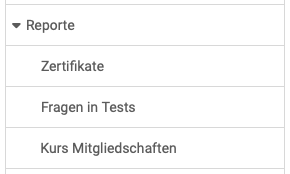

# Reports: Übersicht {: #reports}

{ class="shadow lightbox aside-left-lg" }

Sie finden die Reports in der System-Administration unter: 
`Administration > Reports`

Administrator:innen können Reports zu folgenden Bereichen abfragen:

---

## Zertifikate {: #certificates}

Hier kann nach bestimmten Zertifikaten gesucht werden, z.B. alle Zertifikate für ein bestimmtes Datum oder einem bestimmten Kurs. Nach der Suche kann der passende Report heruntergeladen werden. So erhält man eine Übersicht über alle Personen, die das Zertifikat für die jeweiligen Suchkriterien bestanden haben.

[Zu den Details der Zertifikate >](../../manual_user/learningresources/Course_Settings_Assessment_Certificate.de.md#certificate) 
[Zu den Details der Rezertifizierung>](../../manual_user/learningresources/Course_Settings_Assessment_Certificate.de.md#recertification) 
[Zum Seitenanfang ^](#reports)

## Fragen in Tests {: #questions_in_tests}

Im Bereich Reports können Administrator:innen nach bestimmten Test-Fragen suchen.
Zum Beispiel können alle Fragen bestimmter Autor:innen oder mit einem bestimmten Titel selektiert werden.

[Zum Seitenanfang ^](#reports)

## Kurs Mitgliedschaften {: #course_memberships}

Administrator:innen können hier Excel-Tabellen exportieren, in denen zusammengestellt ist, wer in welchen Kursen Mitglied ist. Es können Tabellen für Teilnehmer:innen, Betreuer:innen und Besitzer:innen erstellt werden (in einer zusammengefassten Tabelle oder einzeln). 

[Zum Seitenanfang ^](#reports)

---

## Weiterführende Informationen {: #further_information}

**Auf dieser Seite erwähnt** 
[Kurseinstellungen - Tab Bewertung: Zertifikate und Rezertifizierung >](../../manual_user/learningresources/Course_Settings_Assessment_Certificate.de.md)

**Weiterführend** 
[e-Assessment Administration: Zertifikate >](e-Assessment_Certificates.de.md) 
[e-Assessment Administration: Prüfungsverwaltung >](e-Assessment_AssessmentMgmt.de.md) 
[Mitgliederverwaltung >](../../manual_user/learningresources/Members_management.de.md)

[Zum Seitenanfang ^](#reports)

