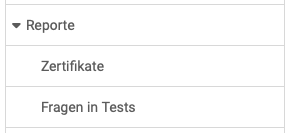

# Reports {: #reports}

{ class="shadow lightbox aside-left-lg" }

Administrators can request reports on the following areas:

---

## Certificates {: #certificates}

Here it is possible to search for specific certificates, e.g. all certificates for a specific date or a specific course. After the search, the matching report can be downloaded. This gives an overview of all people who have passed the certificate for the respective search criteria.

[For more details on certificates >](../../manual_user/learningresources/Course_Settings_Assessment.md#certificate) 
[For more details on recertification>](../../manual_user/learningresources/Course_Settings_Assessment.md#recertification) 
[To the top of the page ^](#reports)

## Questions in tests {: #questions_in_tests}

In the Reports section, administrators can search for specific test questions.
For example, all questions by an author or a specific title can be displayed.

[To the top of the page ^](#reports)