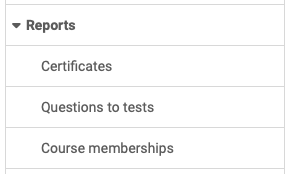

# Reports: Overview {: #reports}

{ class="shadow lightbox aside-left-lg" }

You find the reports in the system administration under: 
`Administration > Reports`

Administrators can request reports on the following areas:

---

## Certificates {: #certificates}

Here it is possible to search for specific certificates, e.g. all certificates for a specific date or a specific course. After the search, the matching report can be downloaded. This gives an overview of all people who have passed the certificate for the respective search criteria.

[For more details on certificates >](../../manual_user/learningresources/Course_Settings_Assessment_Certificate.md#certificate) 
[For more details on recertification>](../../manual_user/learningresources/Course_Settings_Assessment_Certificate.md#recertification) 
[To the top of the page ^](#reports)

## Questions to tests {: #questions_in_tests}

In the Reports section, administrators can search for specific test questions.
For example, all questions by an author or a specific title can be displayed.

[To the top of the page ^](#reports)

## Course memberships {: #course_memberships}

Administrators can export Excel tables here that summarize who is a member of which courses. Tables can be created for participants, coaches and owners (in a summarized table or individually).

[To the top of the page ^](#reports)

---

## Further information {: #further_information}

**Mentioned on this page** 
[Course Settings - Tab Assessment: Certificates and recertification >](../../manual_user/learningresources/Course_Settings_Assessment_Certificate.md)

**Further reading** 
[e-Assessment Administration: Certificates >](e-Assessment_Certificates.md) 
[e-Assessment Administration: Assessment management >](e-Assessment_AssessmentMgmt.md) 
[Members management >](../../manual_user/learningresources/Members_management.md)

[To the top of the page ^](#reports)

