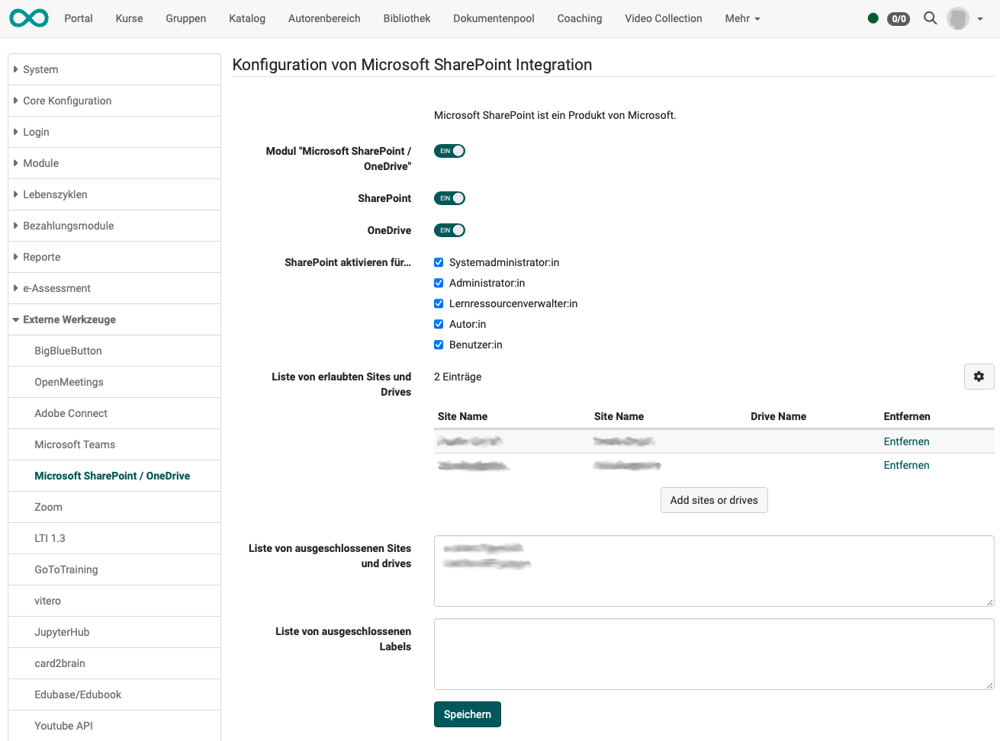

# SharePoint / OneDrive

!!! warning "Achtung"

    Dieser Artikel ist noch in Bearbeitung.

Ab OpenOlat Version 19.0 wird für die Integration von SSO über Microsoft Entra ID, Microsoft Teams Online Meetings und
die Microsoft SharePoint Integration nur noch eine einzige Microsoft Azure App eingerichtet.

Für Unterstützung und Details wenden Sie sich bitte an frentix.

## Voraussetzung

SSO über Microsoft Entra ID (ehemals Microsoft Azure AD Authentication) ist die Voraussetzung für die Nutzung der Microsoft SharePoint Integration in OpenOlat. Dafür wird nur die entsprechende Berechtigung in der Login App ergänzt.

!!! tip "Hinweis"

    Im Rahmen dieser Konfiguration kann auch **Office for the web** aktiviert werden. Diese Einstellung braucht jedoch nicht in der Microsoft Azure App konfiguriert werden, sondern ausschliesslich in der OpenOlat Administration. Diese Konfiguration muss von frentix vorgenommen werden.

## Abfolge der Konfiguration

1. Erstellung Microsoft Azure App-Registrierung
2. Ergänzung Berechtigungen in App-Registrierung für SSO über Microsoft Entra ID und für Microsoft SharePoint Integration
3. Generierung Schlüssel / Geheimnis (Key / Secret) für OpenOlat
4. Aktivierung SSO über Microsoft Azure Authentication (Microsoft Entra ID) in OpenOlat
5. nach Bedarf: Aktivierung der Microsoft SharePoint Integration in OpenOlat

## Aktivierung in der OpenOlat-Administration 

**Beachten Sie:** 
SharePoint und OneDrive können einzeln und unabhängig voneinander eingebunden werden.

{ class="shadow lightbox" }

