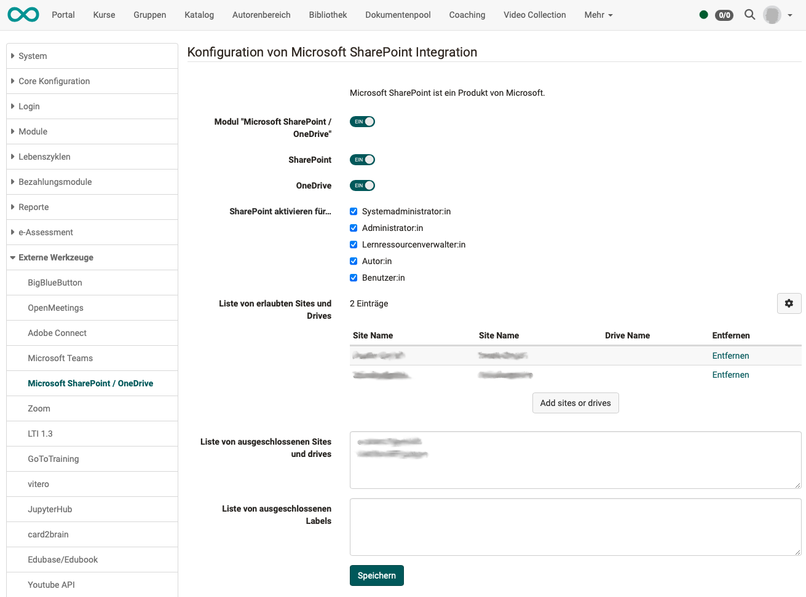

# SharePoint / OneDrive {: #sharepoint_onedrive}

## SharePoint {: #sharepoint}

Only a single Microsoft Azure app is set up for the integration of SSO via Microsoft Entra ID, Microsoft Teams Online Meetings and Microsoft SharePoint integration.

!!! info "Important"

    For support and details, please contact frentix: [contact@frentix.com](mailto:contact@frentix.com)

### Requirements

SSO via Microsoft Entra ID (formerly Microsoft Azure AD Authentication) is a prerequisite for using the Microsoft SharePoint integration in OpenOlat. For this, only the corresponding authorization is added in the login app.

!!! tip "Tip"

    As part of this configuration, **Office for the web** can also be activated. However, this setting does not need to be configured in the Microsoft Azure App, but only in the OpenOlat Administration. This configuration must be carried out by frentix.

### Configuration sequence

1. Creation of Microsoft Azure app registration
2. Addition of authorizations in app registration for SSO via Microsoft Entra ID and for Microsoft SharePoint integration
3. Generation of key / secret for OpenOlat
4. Activation of SSO via Microsoft Azure AD Authentication (Microsoft Entra ID) in OpenOlat
5. As required: Activation of Microsoft SharePoint integration in OpenOlat

### Activation in the OpenOlat administration

You find the configuration in the system administration under: 
`Administration > External tools > Microsoft SharePoint / OneDrive`

**Please note:** 
SharePoint and OneDrive can be integrated individually and independently of each other.

{ class="shadow lightbox" }

---

## OneDrive {: #onedrive}

The integration of OneDrive is very similar to SharePoint and can be carried out in the same way as described above.

