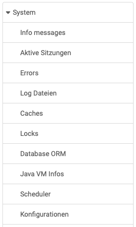

# System {: #system}

{ class="shadow lightbox aside-left-lg" }

Im Bereich "System" der OpenOlat-Administration erhalten Administrator:innen allgemeine Informationen zur System Runtime, wie genutzter Speicher, aktuelle Klickzahlen oder Datenverzeichnisse. 

Die Administrator:innen haben hier Zugriff auf das nebenstehende Menü.

---

## Info messages {: #info_message}

Hier kann im OpenOlat HTML Editor eine Info Message erstellt werden, die auf der **Login-Seite** neben dem eigentlichen Login Zugangsbereich erscheint. 

Auch für Meldungen bezüglich **Wartungsarbeiten** gibt es einen eigenen Bereich. Diese Information erscheint auf allen OpenOlat-Seiten und kann ebenfalls im OpenOlat-Editor erstellt werden. 

Zusätzlich können Dokumente (z.B. weitere Infos in pdf-Form) verlinkt werden. Hierfür steht ein "Static Ordner" zur Verfügung.

[Zum Seitenanfang ^](#system)

## Aktive Sitzungen {: #active_sessions}

Hier werden die aktuell eingeloggten Personen angezeigt.

[Zum Seitenanfang ^](#system)

## Errors {: #errors}

Hier kann nach Fehlernummer und Datum gesucht werden.

[Zum Seitenanfang ^](#system)

## Caches {: #caches}

Hier werden Cache-Einstellungen aufgelistet und OpenOlat-Caches können geleert werden.

[Zum Seitenanfang ^](#system)

## Locks {: #locks}

Hier werden die durch Benutzer gesperrten Objekte angezeigt.

[Zum Seitenanfang ^](#system)

## Database ORM {: #database}

Der Tab "Database ORM" liefert Statistik-Angaben und listet JPA Queries und JPA Entities.

[Zum Seitenanfang ^](#system)

## Java VM Infos {: #java}

Hier finden Administrator:innen Informationen zum Java Speicher, zu Threads und Umgebungsvariablen und können die Java Garbage Collection starten.

[Zum Seitenanfang ^](#system)

## Scheduler {: #scheduler}

Hier finden Administrator:innen eine Übersicht über Scheduler-Jobs.

[Zum Seitenanfang ^](#system)

## Konfigurationen {: #system_config}

Hier finden Administrator:innen eine Auflistung aller Keys der Standard-Variablen und die Modul-Konfigurationen.

[Zum Seitenanfang ^](#system)
