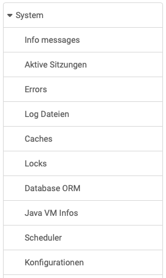

# System {: #system}

{ class="shadow lightbox aside-left-lg" }

Im Bereich "System" der OpenOlat-Administration erhalten Administrator:innen allgemeine Informationen zur Runtime, wie genutzter Speicher, aktuelle Klickzahlen oder Verzeichnisse. 

Die Administrator:innen haben hier Zugriff auf das nebenstehende Menü.

---

## Info messages {: #info_message}

Hier kann im OpenOlat HTML Editor eine Info Message erstellt werden, die auf der **Login-Seite** neben dem eigentlichen Login Zugangsbereich erscheint. 

Auch für Meldungen bezüglich **Wartungsarbeiten** gibt es einen eigenen Bereich. Diese Information erscheint auf allen OpenOlat-Seiten und kann ebenfalls im OpenOlat-Editor erstellt werden. 

Zusätzlich können Dokumente (z.B. weitere Infos in pdf-Form) verlinkt werden. Hierfür steht ein "Static Ordner" zur Verfügung.

[Zum Seitenanfang ^](#system)

## Aktive Sitzungen {: #active_sessions}

Hier werden die aktuell eingeloggten Personen angezeigt.

[Zum Seitenanfang ^](#system)

## Errors {: #errors}

!!! info "frentix-Kund:innen"
    Bei frentix-Kund:innen übernimmt die zuständige Kundenberatung bei frentix die Einstellung "Log levels".

Im Tab "Fehler" suchen Administrator:innen eine Fehlermeldung nach Fehlernummer und Datum.

Im Tab "Log levels" legen Administrator:innen für jeden Logger fest, wie ausführlich OpenOlat protokolliert: "Error", "Warn", "Info" oder "Debug".

[Zum Seitenanfang ^](#system)

## Log Dateien {: #log_files}

!!! info "frentix-Kund:innen"
    Bei frentix-Kund:innen übernimmt die zuständige Kundenberatung bei frentix diese Konfiguration.

Hier finden Administrator:innen die Dateien im Log-Verzeichnis des Servers, je mit Dateiname und Grösse. Ein Klick auf einen Dateinamen lädt die Datei herunter. Die Dateien "olat.log", "catalina.out" und "syncher.log" stehen zuoberst, die übrigen folgen nach dem Datum der letzten Änderung, die neueste zuerst.

[Zum Seitenanfang ^](#system)

## Caches {: #caches}

!!! info "frentix-Kund:innen"
    Bei frentix-Kund:innen übernimmt die zuständige Kundenberatung bei frentix diese Konfiguration.

Hier sehen Administrator:innen die Cache-Einstellungen und leeren die OpenOlat-Caches.

[Zum Seitenanfang ^](#system)

## Locks {: #locks}

Hier sehen Administrator:innen die Objekte, die Benutzer:innen gesperrt haben.

[Zum Seitenanfang ^](#system)

## Database ORM {: #database}

!!! info "frentix-Kund:innen"
    Bei frentix-Kund:innen übernimmt die zuständige Kundenberatung bei frentix diese Konfiguration.

Die Seite "Database ORM" liefert Statistik-Angaben und listet JPA Queries und JPA Entities.

[Zum Seitenanfang ^](#system)

## Java VM Infos {: #java}

Hier finden Administrator:innen Informationen zum Java Speicher, zu Threads und Umgebungsvariablen und können die Java Garbage Collection starten.

[Zum Seitenanfang ^](#system)

## Scheduler {: #scheduler}

Hier finden Administrator:innen eine Übersicht über Scheduler-Jobs.

[Zum Seitenanfang ^](#system)

## Konfigurationen {: #system_config}

!!! info "frentix-Kund:innen"
    Bei frentix-Kund:innen übernimmt die zuständige Kundenberatung bei frentix diese Konfiguration.

Hier finden Administrator:innen eine Auflistung aller Keys der Standard-Variablen und die Modul-Konfigurationen.

[Zum Seitenanfang ^](#system)
