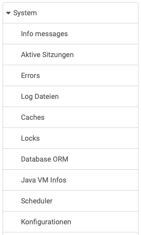

# System

{ class="shadow lightbox aside-left-lg" }

In the "System" area of the OpenOlat administration, administrators receive general information about the system runtime, such as memory used, current click counts or data directories. 

Administrators have access to the adjacent menu here.

---

## Info messages {: #info_message}

Here you can create an info message in the OpenOlat HTML editor which appears on the **login page** next to the login access area.

There is also a separate area for **maintenance messages**. This information, which appears on all OpenOlat pages, can also be created in the OpenOlat Editor.

In addition, documents (e.g. further information in pdf form) can be linked. A "static folder" is available for this purpose.

[To the top of the page ^](#system)

## Active sessions {: #active_sessions}

The currently logged in persons are displayed here.

[To the top of the page ^](#system)

## Errors {: #errors}

Here you can search for error numbers and dates.

[To the top of the page ^](#system)

## Caches {: #caches}

Cache settings are listed here and OpenOlat caches can be emptied.

[To the top of the page ^](#system)

## Locks {: #locks}

The objects saved by users are displayed here.

[To the top of the page ^](#system)

## Database ORM {: #database}

The "Database ORM" tab provides statistical information and lists JPA queries and JPA entities.

[To the top of the page ^](#system)

## Java VM Info {: #java}

Here, administrators can find information about Java memory, threads, and environment variables and can start the Java Garbage Collection.

[To the top of the page ^](#system)

## Scheduler {: #scheduler}

Administrators can find an overview of scheduler jobs here.

[To the top of the page ^](#system)

## Configurations {: #system_config}

Here administrators can find a list of all keys for the standard variables and the module configurations.

[To the top of the page ^](#system)

